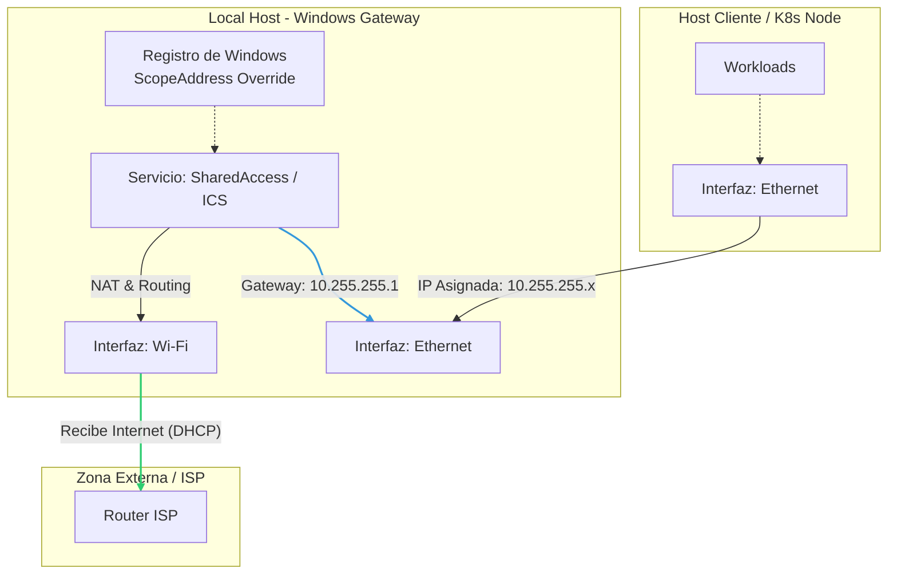

# Contenido de Archivos del $PWD = `/home/dzamo/my-workspace/in_github.com/ops-standards-library`

Fecha de generación: Mon Dec 15 22:10:12 CET 2025

## Estructura del filesystem

```bash
dzamo@aspire-a315-59:/home/dzamo/my-workspace/in_github.com/ops-standards-library$ tree
.
├── 2025-12-10_ops-standards-library_report.md
├── 2025-12-15_filesystem_report.md
├── LICENSE
├── README.md
├── _meta
│   ├── CONTRIBUTING.md
│   └── GOVERNANCE.md
├── cloud
│   ├── aws
│   └── azure
│       ├── SOP-CLOUD-AZ-00_windows-mgmt-station.md
│       ├── SOP-CLOUD-AZ-01_ansible-container-env.md
│       └── SOP-CLOUD-AZ-02_wsl-engineering-station.md
├── generate_md_report.sh -> my-scripts/generate_md_report.sh
├── linux
│   └── SOP-LINUX-ANS-01_ansible-env.md
└── windows
    ├── SOP-WIN-PS-01_ics-configuration.md
    └── scripts
        ├── Enable-CustomICS.ps1
        └── Restore-FactoryNetwork.ps1

8 directories, 14 files
```

## Contenido de archivos

## Contenido archivo: `2025-12-10_ops-standards-library_report.md`

```bash
$ cat 2025-12-10_ops-standards-library_report.md
# Contenido de Archivos del $PWD = `/home/dzamo/my-workspace/in_github.com/ops-standards-library`

Fecha de generación: Tue Dec  9 17:57:49 CET 2025

## Estructura del filesystem

```bash
dzamo@aspire-a315-59:/home/dzamo/my-workspace/in_github.com/ops-standards-library$ tree
.
├── LICENSE
├── README.md
├── _meta
│   ├── CONTRIBUTING.md
│   └── GOVERNANCE.md
├── cloud
│   ├── aws
│   └── azure
│       ├── SOP-CLOUD-AZ-00_windows-mgmt-station.md
│       └── SOP-CLOUD-AZ-01_ansible-container-env.md
├── filesystem_report.md
├── generate_md_report.sh -> my-scripts/generate_md_report.sh
├── linux
│   └── SOP-LINUX-ANS-01_ansible-env.md
└── windows
    ├── SOP-WIN-PS-01_ics-configuration.md
    └── scripts
        ├── Enable-CustomICS.ps1
        └── Restore-FactoryNetwork.ps1

8 directories, 12 files
```

## Contenido de archivos

## Contenido archivo: `README.md`

```bash
$ cat README.md
# Ops Standards Library


Repositorio centralizado de **Procedimientos Operativos Estándar (SOPs)** para el equipo de Operaciones e Infraestructura.
<!--
Repositorio centralizado de **Procedimientos Operativos Estándar (SOPs)**, referencias técnicas y guías de arquitectura para el equipo de Operaciones e Infraestructura.
-->
<!--
Este repositorio tiene como objetivo estandarizar los flujos de trabajo, garantizar la consistencia en los despliegues de *Infrastructure as Code (IaC)* y servir como fuente única de verdad para la configuración de entornos.
-->

---

## 📂 Estructura del Repositorio

| Directorio | Descripción |
| :--- | :--- |
| **`/_meta`** | Gobernanza, **Guía de Contribución**, y templates. |
| **`/linux`** | Estándares para ecosistemas Unix/Linux. |
| **`/windows`** | Estándares para ecosistemas Microsoft. |
| **`/cloud`** | Arquitectura Azure/AWS. |

---

<!--
## 📂 Estructura del Repositorio

La documentación está organizada por dominios tecnológicos para facilitar la navegación y el mantenimiento.

| Directorio | Descripción | Tecnologías Principales |
| :--- | :--- | :--- |
| **`/_meta`** | "Meta-documentación" del repositorio (documentación sobre cómo documentar) | Gobernanza, guías de estilo, plantillas. |
| **`/linux`** | Procedimientos y estándares para sistemas basados en Unix/Linux. | Ubuntu, Debian, RHEL, Bash |
| **`/windows`** | Guías de administración y automatización para ecosistemas Microsoft. | Windows Server, PowerShell, WSL |
| **`/cloud`** | Arquitectura y gestión de proveedores de nube pública. | Azure, AWS, Google Cloud |

---
-->

## 📚 Documentación Destacada

### Linux & Automation

* [**SOP-LINUX-ANS-01**](./linux/SOP-LINUX-ANS-01_ansible-env.md) - Estandarización de Entornos Ansible (Makefile + Venv).
* [**SOP-CLOUD-AZ-01**](./cloud/azure/SOP-CLOUD-AZ-01_ansible-container-env.md) - Procedimiento para aprovisionar un **Entorno de Ejecución Aislado** para la gestión de recursos en Microsoft Azure mediante Ansible.

### Windows & Cloud Infrastructure

* [**SOP-CLOUD-AZ-00**](./cloud/azure/SOP-CLOUD-AZ-00_windows-mgmt-station.md) - Estandarización de la configuración de estaciones de trabajo basadas en Windows para Azure.
* [**SOP-WIN-PS-01**](./windows/SOP-WIN-PS-01_ics-configuration.md) - Configuración automatizada de **Internet Connection Sharing (ICS)** y enrutamiento NAT con direccionamiento IP personalizado.

---

## 🚀 Uso y Contribución

Este repositorio sigue una política estricta de **"Docs as Code"**.
Todos los procedimientos aquí documentados han sido validados en entornos controlados.

1. **Consulta:** Navegue por las carpetas de dominio para encontrar el SOP requerido.
2. **Validación:** Verifique siempre la "Fecha de Revisión" dentro del documento antes de ejecutar comandos en producción.
3. **Issues:** Si encuentra un error en un procedimiento, por favor abra un *Issue* en este repositorio describiendo la discrepancia.

---

## ⚖️ Licencia

Licencia MIT - ver [LICENSE](LICENSE).
```

## Contenido archivo: `_meta/CONTRIBUTING.md`

```bash
$ cat _meta/CONTRIBUTING.md
# GUÍA DE CONTRIBUCIÓN Y GESTIÓN DE ARTEFACTOS DE CÓDIGO

**ESTADO:** Activo / Normativo  
**ÚLTIMA ACTUALIZACIÓN:** 2025-12-09  
**OBJETIVO:** Definir el criterio de separación entre documentación y código automatizado.

---

## 1. PRINCIPIO DE LOCALIDAD DEL CÓDIGO

En el equipo de Operaciones, a menudo surge la duda: *"¿Debo subir este script a este repositorio de SOPs o crear uno nuevo?"*.

Para evitar la proliferación innecesaria de repositorios (*Repo Sprawl*), aplicamos la siguiente **Matriz de Decisión**:

### A. Cuándo incluir el código AQUÍ (In-Repo)

El código debe residir dentro de `ops-standards-library` si cumple las siguientes condiciones:

1. **Es un "Helper" o Utilitario:** Su única función es facilitar la ejecución de un paso descrito en un SOP.
2. **Es Atómico:** Es un único archivo (ej. `.ps1`, `.sh`, `.py`) o un conjunto muy pequeño que no requiere compilación.
3. **Sin Ciclo de Vida Complejo:** No requiere tests unitarios, CI/CD pipelines propios, ni versionado semántico independiente (v1.0, v2.0).
4. **Contexto Específico:** No tiene sentido ejecutarlo fuera del contexto del procedimiento que lo acompaña.

**Ejemplos válidos:**

* Script para configurar IPs estáticas en Windows (`Enable-CustomICS.ps1`).
* Script de limpieza de logs para un servidor Linux.
* Plantilla JSON pequeña de configuración.

### B. Cuándo crear un REPOSITORIO EXTERNO

El código debe tener su propio repositorio (`git init`) si:

1. **Es un "Producto" o "Plataforma":** Es un entorno de trabajo completo (ej. Entorno Ansible, Módulo de Terraform).
2. **Requiere Construcción:** Necesita un `Makefile`, `Dockerfile`, `requirements.txt` o compilación.
3. **Reutilizable:** Está diseñado para ser clonado y usado como base para múltiples proyectos distintos.
4. **Tiene Ciclo de Vida Propio:** Requiere control de versiones estricto, Issues propios y Pull Requests complejos.

**Ejemplos:**

* `ops-ansible-core` (Entorno base de Ansible).
* `ops-terraform-modules` (Librería de módulos).
* Una API REST en Python para monitoreo.

---

## 2. ESTRUCTURA DE ALMACENAMIENTO

Si el código califica para quedarse en este repositorio (Caso A), debe organizarse de la siguiente manera para mantener el orden:

```text
/ (root)
├── [dominio] /           # ej. windows, linux, cloud
│   ├── scripts /         # CARPETA OBLIGATORIA PARA CÓDIGO
│   │   ├── Helper-Script-01.ps1
│   │   └── Utility-Tool.sh
│   └── SOP-DOMINIO-XX.md
```

> **⛔ PROHIBIDO:** Dejar scripts sueltos en la raíz del dominio o mezclados con los archivos `.md` sin una subcarpeta `/scripts`.

---

## 3. ESTÁNDAR DE DOCUMENTACIÓN DE SCRIPTS

Cuando un SOP hace uso de un script alojado en este repositorio, el documento Markdown debe cumplir con el **Patrón de Doble Referencia**:

### 1. Enlace de Descarga (Operatividad)

Debe existir un enlace directo al archivo físico. Esto permite al operador hacer `wget`, `curl` o guardar el archivo sin errores de formato.

> *Ejemplo:*  
> "Descargue el script desde la ruta: [**`./scripts/MiScript.ps1`**](./scripts/MiScript.ps1)"

### 2. Bloque de Auditoría (Seguridad)

Se debe incluir el contenido del script (o su parte crítica) dentro de un bloque desplegable `<details>`. Esto permite validar qué hace el código sin necesidad de abrir el archivo, agilizando la revisión de seguridad.

> *Sintaxis Markdown requerida:*

```markdown
<details>
  <summary><strong>👁️ Ver código fuente (Auditoría)</strong></summary>

\```powershell
# Pegar aquí el contenido del script
Write-Host "Hola Mundo"
\```
</details>
```

---

## 4. SEGURIDAD EN SCRIPTS (HARDCODING)

Cualquier script subido a este repositorio (`ops-standards-library`) tiene clasificación **INTERNA**.

* **⛔ ESTRICTAMENTE PROHIBIDO:** Incluir contraseñas, tokens de API, claves privadas SSH o cadenas de conexión a base de datos dentro de los scripts en `/scripts`.
* **✅ CORRECTO:** Usar parámetros de entrada (`$Password = Read-Host`) o variables de entorno.

Si un script requiere credenciales fijas, **NO** pertenece a este repositorio.
```

## Contenido archivo: `_meta/GOVERNANCE.md`

```bash
$ cat _meta/GOVERNANCE.md
# ESTÁNDAR DE GOBERNANZA DOCUMENTAL Y NOMENCLATURA

**ESTADO:** Borrador / Uso Interno  
**ÚLTIMA ACTUALIZACIÓN:** 2024-11-03  
**ALCANCE:** Editores y contribuidores del repositorio `ops-standards-library`  
  
---

## 1. PRINCIPIOS DE DISEÑO

Este repositorio sigue una filosofía de **"Docs as Code"** y estructura jerárquica agnóstica. El objetivo es mantener una base de conocimiento escalable que cumpla con principios básicos de organización alineados a normas de calidad y seguridad (como ISO 27001 para la clasificación de activos).

## 2. TAXONOMÍA JERÁRQUICA (NOMENCLATURA)

Todo archivo dentro de este repositorio debe seguir estrictamente la siguiente convención de nombres para garantizar su rápida identificación y ordenamiento automático.

**Sintaxis:**
`[TIPO]-[DOMINIO]-[HERRAMIENTA]-[ID]_[descripción-breve].md`

### A. [TIPO] - Categoría del Documento

Define el propósito y estructura de la información.

| Código | Significado | Definición |
| :--- | :--- | :--- |
| **SOP** | *Standard Operating Procedure* | Guía "paso a paso" imperativa para lograr un resultado específico. No admite ambigüedad. |
| **POL** | *Policy* | Normas, reglas o restricciones de cumplimiento obligatorio (ej. Política de contraseñas). |
| **REF** | *Reference* | Tablas, listas de puertos, direccionamiento IP, glosarios. Información estática de consulta. |
| **TSHOOT** | *Troubleshooting* | Guías de diagnóstico y solución de problemas (Causa -> Solución). |
| **ARCH** | *Architecture* | Diagramas de alto nivel, decisiones de diseño y topologías. |

### B. [DOMINIO] - Ámbito Tecnológico

Define el área macro de infraestructura. Permite el filtrado rápido por especialidad.

| Código | Ámbito | Ejemplos |
| :--- | :--- | :--- |
| **LINUX** | Sistemas Unix/Linux | Ubuntu, RHEL, Alpine, Bash scripting. |
| **WIN** | Ecosistema Microsoft | Windows Server, Active Directory, WSL. |
| **CLOUD** | Nube Pública | Azure, AWS, GCP (Infraestructura general). |
| **NET** | Networking | Switches, Firewalls, VPNs, DNS. |
| **SEC** | Seguridad | Certificados, Hacking Ético, Hardening. |
| **DEV** | Desarrollo | Git, CI/CD Pipelines, IDEs. |

### C. [HERRAMIENTA] - Tecnología Específica

Sub-clasificación para la herramienta concreta sobre la que trata el documento.

* **ANS** (Ansible)
* **DKR** (Docker / Containerd)
* **K8S** (Kubernetes)
* **PS** (PowerShell)
* **AZ** (Azure CLI / Portal)
* **AWS** (AWS CLI / Console)
* **TF** (Terraform)
* **GIT** (Git / GitHub / GitLab)

### D. [ID] - Serialización

Contador incremental de dos dígitos (`01`, `02`, `10`) para mantener el orden cronológico o lógico de creación dentro de una misma serie.

---

## 3. EJEMPLOS DE APLICACIÓN

**Caso 1: Guía para instalar Ansible en Linux (El documento actual)**

* **Nombre:** `SOP-LINUX-ANS-01_setup-ansible-core.md`
* *Desglose:* Es un procedimiento (SOP), sobre Linux (LINUX), usando Ansible (ANS), primer documento (01).

**Caso 2: Guía futura para configurar Azure CLI en Windows**

* **Nombre:** `SOP-WIN-AZ-01_azure-cli-setup.md`

**Caso 3: Lista de puertos de Firewall requeridos**

* **Nombre:** `REF-NET-FW-01_puertos-permitidos.md`

---

## 4. CLASIFICACIÓN DE LA INFORMACIÓN

Para alinearnos con buenas prácticas de Seguridad de la Información, cada documento debe incluir en su encabezado (Frontmatter) el nivel de clasificación:

* **Público:** Información segura para divulgar fuera de la organización (Blogs, GitHub público).
* **Interno / Técnico:** (Por defecto en este repo). Solo para el equipo de Operaciones. Puede contener IPs internas o nombres de host, pero **NUNCA** contraseñas ni claves privadas.
* **Confidencial:** Contiene datos sensibles de clientes o negocio. **PROHIBIDO** subir a este repositorio público. Debe residir en bóvedas seguras (Bitwarden, Vault).

## 5. ESTRUCTURA DE DIRECTORIOS

El repositorio no se organiza por "Proyectos" (que son temporales), sino por **Tecnologías** (que son permanentes).

```text
/ (root)
├── _meta/          # Gobernanza, guías de estilo, plantillas.
├── linux/          # Todo lo relacionado con SO Linux.
├── windows/        # Todo lo relacionado con SO Windows.
├── cloud/          # Proveedores Cloud (Azure, AWS).
└── zz-drafts/      # Zona de trabajo sucio (no indexada en README).
```

## Contenido archivo: `cloud/azure/SOP-CLOUD-AZ-00_windows-mgmt-station.md`

```bash
$ cat cloud/azure/SOP-CLOUD-AZ-00_windows-mgmt-station.md
# SOP-CLOUD-AZ-00: Aprovisionamiento de Estación de Gestión Windows

| Datos de Control | Valor |
| :--- | :--- |
| **ID** | SOP-CLOUD-AZ-00 |
| **Dominio** | Cloud Engineering / Workstation |
| **Clasificación** | Uso Interno |
| **Propietario** | SysAdmin & DevOps OpsTeam |
| **Estado** | 🟢 Activo |
| **Última Rev.** | 2025-12-07 |

## 1. Objetivo y Alcance

Este procedimiento define el estándar técnico para la configuración de estaciones de trabajo basadas en Windows dedicadas a la gestión de infraestructura Microsoft Azure.

Establece la obligatoriedad de instalar herramientas CLI específicas y módulos de PowerShell necesarios para interactuar con la API de Azure Resource Manager (ARM), garantizando la consistencia en los entornos locales del equipo de ingeniería.

## 2. Prerrequisitos

* **Sistema Operativo:** Windows 10 (22H2) o Windows 11.
* **Privilegios:** Permisos de Administrador Local requeridos **únicamente** para el aprovisionamiento inicial del software.
* **Red:** Acceso saliente HTTPS (443) hacia `*.microsoft.com`, `*.azure.com`, y `psgallery.com`.

## 3. Procedimiento de Aprovisionamiento

### 3.1. Entorno de Shell (PowerShell 7)

La versión legacy de Windows PowerShell (v5.1) está obsoleta para operaciones en la nube multiplataforma. Se debe instalar PowerShell 7 (Core) como el shell de ejecución predeterminado.

**Ejecución:**

```powershell
winget install --id Microsoft.PowerShell --source winget --accept-package-agreements
```

### 3.2. Interfaz de Línea de Comandos de Azure (CLI)

Aprovisionamiento del binario `az` para la gestión imperativa de recursos e integración con scripts de shell.

**Ejecución:**

```powershell
winget install -e --id Microsoft.AzureCLI --accept-package-agreements
```

### 3.3. Módulo Azure PowerShell (Az)

Instalación de la colección de módulos `Az` desde la Galería de PowerShell (PSGallery). Este paso requiere una Sesión Elevada (Ejecutar como Administrador).

**Ejecución:**

```powershell
# Configurar política de ejecución para permitir scripts firmados remotamente
Set-ExecutionPolicy -ExecutionPolicy RemoteSigned -Scope CurrentUser -Force

# Instalar framework del módulo (Incluir flag -AllowClobber para evitar conflictos)
Install-Module -Name Az -Repository PSGallery -Force -AllowClobber -Scope AllUsers
```

---

## 4. Política de Uso Operativo

Para mantener el Principio de Mínimo Privilegio (PoLP) en la estación de trabajo local:

1. **Operaciones Estándar:** Todas las interacciones con Azure (Inicio de sesión, Creación de recursos, Monitorización) DEBEN realizarse utilizando una sesión de terminal de **Usuario Estándar**.
2. **Operaciones Administrativas:** Los privilegios de Admin Local SOLO son requeridos para la actualización de herramientas (`winget upgrade` o `Update-Module`).

---

## 5. Gestión de Identidad y Acceso (IAM)

La autenticación se basa en tokens OAuth2 generados mediante interacción basada en navegador.

### 5.1. Inicialización de Sesión CLI

Inicializa la configuración JSON en `%USERPROFILE%\.azure`.

```powershell
az login
# Validación: Verificar contexto de suscripción activa
az account show --output table
```

### 5.2. Inicialización de Sesión PowerShell

Inicializa el contexto para cmdlets basados en `.NET`.

```powershell
Connect-AzAccount
# Validación: Verificar contexto
Get-AzContext
```

---

## 6. Control de Calidad (Validación)

Verificación post-instalación para asegurar el cumplimiento con los estándares mínimos de versión.

```powershell
# 1. Verificar Versión Core (Debe ser 7.x+)
$PSVersionTable.PSVersion

# 2. Verificar Versión CLI (Debe mostrar salida JSON)
az version

# 3. Verificar Disponibilidad del Módulo Az
Get-Module -Name Az -ListAvailable
```

## 7. Diagnóstico y Resolución

| Código de Error | Causa Raíz | Resolución |
| :--- | :--- | :--- |
| `az is not recognized` | Variable de entorno PATH no actualizada. | Cerrar y volver a abrir la sesión de terminal completamente. |
| `Connect-AzAccount is not recognized` | Módulo instalado en un alcance (scope) diferente o instalación incompleta. | Verificar instalación con `Get-Module -ListAvailable Az`. Re-ejecutar instalación si está vacío. |
| `Nuget provider is required` | Falta el proveedor de paquetes. | Aceptar el mensaje para instalar NuGet durante la ejecución de `Install-Module`. |
```

## Contenido archivo: `cloud/azure/SOP-CLOUD-AZ-01_ansible-container-env.md`

```bash
$ cat cloud/azure/SOP-CLOUD-AZ-01_ansible-container-env.md
# SOP-CLOUD-AZ-01: Azure Ansible Containerized Environment

| Metadato | Valor |
| :--- | :--- |
| **ID** | SOP-CLOUD-AZ-01 |
| **Dominio** | Cloud Engineering / IaC |
| **Autor** | SysAdmin & DevOps OpsTeam |
| **Estado** | 🟢 Approved |
| **Última Rev.** | 2025-12-06 |

## 1. Objetivo y Alcance

Este procedimiento define el estándar para aprovisionar un **Entorno de Ejecución Aislado** para la gestión de recursos en Microsoft Azure mediante Ansible.

### Problema que resuelve

La instalación nativa de `azure-cli` y las librerías de Python (`azure-sdk`) en el host local suele generar conflictos de dependencias (Dependency Hell) y problemas de compatibilidad entre versiones de Python (ej. 3.12 vs 3.10).

### Solución Arquitectónica

Implementación del patrón **Execution Environment**:

1. **Docker:** Encapsula el motor Ansible, Python 3.10 y la colección `azure.azcollection`.
2. **Credential Passthrough:** El contenedor no almacena credenciales persistentes; monta el token de sesión (`~/.azure`) generado en el host anfitrión.
3. **Ephemeral Runtime:** El contenedor se destruye tras cada ejecución, garantizando un entorno limpio.

---

## 2. Prerrequisitos del Host (Control Node)

El equipo desde donde se ejecutarán las operaciones debe cumplir:

* **Docker Engine:** Runtime de contenedores activo.
* **Azure CLI (`az`):** Instalado en el host para gestión de autenticación.
* **Conectividad:** Acceso a `management.azure.com` (HTTPS/443).

---

## 3. Procedimiento de Construcción (Build)

### 3.1. Definición de Artefactos

Crear un directorio de contexto (ej. `~/builds/ansible-azure`) y generar los siguientes manifiestos.

**Archivo: `requirements.yml`**
Define la colección oficial mantenida por Microsoft/Ansible.

```yaml
---
collections:
  - name: azure.azcollection
    version: 1.19.0
```

**Archivo: `Dockerfile`**
Especificación de la imagen base. Utilizamos Python 3.10-slim por su estabilidad probada con los SDKs de Azure actuales.

```dockerfile
FROM python:3.10-slim

# Supresión de alertas pip root
ENV PIP_ROOT_USER_ACTION=ignore

# 1. Instalación de dependencias de sistema (Compiladores necesarios para SDKs)
RUN apt-get update && apt-get install -y \
    gcc \
    git \
    curl \
    && rm -rf /var/lib/apt/lists/* \
    && pip install --upgrade pip \
    && pip install ansible-core==2.16.0

# 2. Inyección de definición de colecciones
WORKDIR /ansible
COPY requirements.yml .

# 3. Instalación de Colección Azure y Dependencias Python (Paso Crítico)
# Se extrae el requirements.txt interno de la colección para asegurar compatibilidad exacta.
RUN ansible-galaxy install -r requirements.yml \
    && pip install -r ~/.ansible/collections/ansible_collections/azure/azcollection/requirements-azure.txt

# 4. Entrypoint por defecto
CMD ["/bin/bash"]
```

### 3.2. Compilación de la Imagen

Ejecutar el build etiquetando la imagen con versionado semántico.

```bash
docker build -t ansible-azure:v1.0 .
```

---

## 4. Configuración del Runtime (Alias)

Para simplificar la invocación y asegurar el montaje correcto de volúmenes, se debe configurar un alias en el shell del usuario (`~/.bashrc` o `~/.zshrc`).

### Definición del Alias

```bash
alias az-ansible='docker run --rm -it \
  -v $(pwd):/ansible \
  -v $HOME/.azure:/root/.azure \
  ansible-azure:v1.0 ansible-playbook'
```

### Explicación de Montajes

* `-v $(pwd):/ansible`: Monta el directorio de trabajo actual dentro del contenedor. Permite acceder a los playbooks locales.
* `-v $HOME/.azure:/root/.azure`: **Identity Mapping**. Permite al contenedor reutilizar el token de autenticación generado por `az login` en el host.

---

## 5. Flujo de Trabajo Operativo

### 5.1. Autenticación (Paso Previo)

Antes de ejecutar cualquier playbook, renueve el token en el host.

```bash
az login
# Verificar suscripción activa
az account show
```

### 5.2. Ejecución de Playbooks

Navegue al directorio de su proyecto IaC y utilice el alias definido.

```bash
cd ~/my-workspace/projects/azure-migration
az-ansible playbook.yml
```

### 5.3. Validación de Conectividad (Smoke Test)

Crear un playbook de prueba `check_azure.yml`:

```yaml
- name: Azure Connectivity Check
  hosts: localhost
  connection: local
  tasks:
    - name: Get Resource Groups
      azure.azcollection.azure_rm_resourcegroup_info:
      register: rgs
    - debug:
        msg: "Auth OK. Found {{ rgs.resourcegroups | length }} Resource Groups."
```

Ejecutar: `az-ansible check_azure.yml`

---

## 6. Resolución de Problemas (Troubleshooting)

| Síntoma | Causa Probable | Solución |
| :--- | :--- | :--- |
| `Please run 'az login'` dentro del contenedor | El volumen `.azure` no está montado o el token expiró. | Ejecutar `az login` en el host y verificar el mapeo `-v` en el alias. |
| `ModuleNotFoundError` | La imagen Docker no compiló las librerías de Python. | Reconstruir la imagen verificando el paso `pip install -r ...requirements-azure.txt`. |
| Error de Permisos en Docker | El usuario no pertenece al grupo `docker`. | `sudo usermod -aG docker $USER` o usar `sudo` (no recomendado). |
```

## Contenido archivo: `filesystem_report.md`

```bash
$ cat filesystem_report.md
# Contenido de Archivos del $PWD = `/home/dzamo/my-workspace/in_github.com/ops-standards-library`

Fecha de generación: Tue Dec  9 17:57:49 CET 2025

## Estructura del filesystem

```bash
dzamo@aspire-a315-59:/home/dzamo/my-workspace/in_github.com/ops-standards-library$ tree
.
├── LICENSE
├── README.md
├── _meta
│   ├── CONTRIBUTING.md
│   └── GOVERNANCE.md
├── cloud
│   ├── aws
│   └── azure
│       ├── SOP-CLOUD-AZ-00_windows-mgmt-station.md
│       └── SOP-CLOUD-AZ-01_ansible-container-env.md
├── filesystem_report.md
├── generate_md_report.sh -> my-scripts/generate_md_report.sh
├── linux
│   └── SOP-LINUX-ANS-01_ansible-env.md
└── windows
    ├── SOP-WIN-PS-01_ics-configuration.md
    └── scripts
        ├── Enable-CustomICS.ps1
        └── Restore-FactoryNetwork.ps1

8 directories, 12 files
```

## Contenido de archivos

## Contenido archivo: `README.md`

```bash
$ cat README.md
# Ops Standards Library


Repositorio centralizado de **Procedimientos Operativos Estándar (SOPs)** para el equipo de Operaciones e Infraestructura.
<!--
Repositorio centralizado de **Procedimientos Operativos Estándar (SOPs)**, referencias técnicas y guías de arquitectura para el equipo de Operaciones e Infraestructura.
-->
<!--
Este repositorio tiene como objetivo estandarizar los flujos de trabajo, garantizar la consistencia en los despliegues de *Infrastructure as Code (IaC)* y servir como fuente única de verdad para la configuración de entornos.
-->

---

## 📂 Estructura del Repositorio

| Directorio | Descripción |
| :--- | :--- |
| **`/_meta`** | Gobernanza, **Guía de Contribución**, y templates. |
| **`/linux`** | Estándares para ecosistemas Unix/Linux. |
| **`/windows`** | Estándares para ecosistemas Microsoft. |
| **`/cloud`** | Arquitectura Azure/AWS. |

---

<!--
## 📂 Estructura del Repositorio

La documentación está organizada por dominios tecnológicos para facilitar la navegación y el mantenimiento.

| Directorio | Descripción | Tecnologías Principales |
| :--- | :--- | :--- |
| **`/_meta`** | "Meta-documentación" del repositorio (documentación sobre cómo documentar) | Gobernanza, guías de estilo, plantillas. |
| **`/linux`** | Procedimientos y estándares para sistemas basados en Unix/Linux. | Ubuntu, Debian, RHEL, Bash |
| **`/windows`** | Guías de administración y automatización para ecosistemas Microsoft. | Windows Server, PowerShell, WSL |
| **`/cloud`** | Arquitectura y gestión de proveedores de nube pública. | Azure, AWS, Google Cloud |

---
-->

## 📚 Documentación Destacada

### Linux & Automation

* [**SOP-LINUX-ANS-01**](./linux/SOP-LINUX-ANS-01_ansible-env.md) - Estandarización de Entornos Ansible (Makefile + Venv).
* [**SOP-CLOUD-AZ-01**](./cloud/azure/SOP-CLOUD-AZ-01_ansible-container-env.md) - Procedimiento para aprovisionar un **Entorno de Ejecución Aislado** para la gestión de recursos en Microsoft Azure mediante Ansible.

### Windows & Cloud Infrastructure

* [**SOP-CLOUD-AZ-00**](./cloud/azure/SOP-CLOUD-AZ-00_windows-mgmt-station.md) - Estandarización de la configuración de estaciones de trabajo basadas en Windows para Azure.
* [**SOP-WIN-PS-01**](./windows/SOP-WIN-PS-01_ics-configuration.md) - Configuración automatizada de **Internet Connection Sharing (ICS)** y enrutamiento NAT con direccionamiento IP personalizado.

---

## 🚀 Uso y Contribución

Este repositorio sigue una política estricta de **"Docs as Code"**.
Todos los procedimientos aquí documentados han sido validados en entornos controlados.

1. **Consulta:** Navegue por las carpetas de dominio para encontrar el SOP requerido.
2. **Validación:** Verifique siempre la "Fecha de Revisión" dentro del documento antes de ejecutar comandos en producción.
3. **Issues:** Si encuentra un error en un procedimiento, por favor abra un *Issue* en este repositorio describiendo la discrepancia.

---

## ⚖️ Licencia

Licencia MIT - ver [LICENSE](LICENSE).
```

## Contenido archivo: `_meta/CONTRIBUTING.md`

```bash
$ cat _meta/CONTRIBUTING.md
# GUÍA DE CONTRIBUCIÓN Y GESTIÓN DE ARTEFACTOS DE CÓDIGO

**ESTADO:** Activo / Normativo  
**ÚLTIMA ACTUALIZACIÓN:** 2025-12-09  
**OBJETIVO:** Definir el criterio de separación entre documentación y código automatizado.

---

## 1. PRINCIPIO DE LOCALIDAD DEL CÓDIGO

En el equipo de Operaciones, a menudo surge la duda: *"¿Debo subir este script a este repositorio de SOPs o crear uno nuevo?"*.

Para evitar la proliferación innecesaria de repositorios (*Repo Sprawl*), aplicamos la siguiente **Matriz de Decisión**:

### A. Cuándo incluir el código AQUÍ (In-Repo)

El código debe residir dentro de `ops-standards-library` si cumple las siguientes condiciones:

1. **Es un "Helper" o Utilitario:** Su única función es facilitar la ejecución de un paso descrito en un SOP.
2. **Es Atómico:** Es un único archivo (ej. `.ps1`, `.sh`, `.py`) o un conjunto muy pequeño que no requiere compilación.
3. **Sin Ciclo de Vida Complejo:** No requiere tests unitarios, CI/CD pipelines propios, ni versionado semántico independiente (v1.0, v2.0).
4. **Contexto Específico:** No tiene sentido ejecutarlo fuera del contexto del procedimiento que lo acompaña.

**Ejemplos válidos:**

* Script para configurar IPs estáticas en Windows (`Enable-CustomICS.ps1`).
* Script de limpieza de logs para un servidor Linux.
* Plantilla JSON pequeña de configuración.

### B. Cuándo crear un REPOSITORIO EXTERNO

El código debe tener su propio repositorio (`git init`) si:

1. **Es un "Producto" o "Plataforma":** Es un entorno de trabajo completo (ej. Entorno Ansible, Módulo de Terraform).
2. **Requiere Construcción:** Necesita un `Makefile`, `Dockerfile`, `requirements.txt` o compilación.
3. **Reutilizable:** Está diseñado para ser clonado y usado como base para múltiples proyectos distintos.
4. **Tiene Ciclo de Vida Propio:** Requiere control de versiones estricto, Issues propios y Pull Requests complejos.

**Ejemplos:**

* `ops-ansible-core` (Entorno base de Ansible).
* `ops-terraform-modules` (Librería de módulos).
* Una API REST en Python para monitoreo.

---

## 2. ESTRUCTURA DE ALMACENAMIENTO

Si el código califica para quedarse en este repositorio (Caso A), debe organizarse de la siguiente manera para mantener el orden:

```text
/ (root)
├── [dominio] /           # ej. windows, linux, cloud
│   ├── scripts /         # CARPETA OBLIGATORIA PARA CÓDIGO
│   │   ├── Helper-Script-01.ps1
│   │   └── Utility-Tool.sh
│   └── SOP-DOMINIO-XX.md
```

> **⛔ PROHIBIDO:** Dejar scripts sueltos en la raíz del dominio o mezclados con los archivos `.md` sin una subcarpeta `/scripts`.

---

## 3. ESTÁNDAR DE DOCUMENTACIÓN DE SCRIPTS

Cuando un SOP hace uso de un script alojado en este repositorio, el documento Markdown debe cumplir con el **Patrón de Doble Referencia**:

### 1. Enlace de Descarga (Operatividad)

Debe existir un enlace directo al archivo físico. Esto permite al operador hacer `wget`, `curl` o guardar el archivo sin errores de formato.

> *Ejemplo:*  
> "Descargue el script desde la ruta: [**`./scripts/MiScript.ps1`**](./scripts/MiScript.ps1)"

### 2. Bloque de Auditoría (Seguridad)

Se debe incluir el contenido del script (o su parte crítica) dentro de un bloque desplegable `<details>`. Esto permite validar qué hace el código sin necesidad de abrir el archivo, agilizando la revisión de seguridad.

> *Sintaxis Markdown requerida:*

```markdown
<details>
  <summary><strong>👁️ Ver código fuente (Auditoría)</strong></summary>

\```powershell
# Pegar aquí el contenido del script
Write-Host "Hola Mundo"
\```
</details>
```

---

## 4. SEGURIDAD EN SCRIPTS (HARDCODING)

Cualquier script subido a este repositorio (`ops-standards-library`) tiene clasificación **INTERNA**.

* **⛔ ESTRICTAMENTE PROHIBIDO:** Incluir contraseñas, tokens de API, claves privadas SSH o cadenas de conexión a base de datos dentro de los scripts en `/scripts`.
* **✅ CORRECTO:** Usar parámetros de entrada (`$Password = Read-Host`) o variables de entorno.

Si un script requiere credenciales fijas, **NO** pertenece a este repositorio.
```

## Contenido archivo: `_meta/GOVERNANCE.md`

```bash
$ cat _meta/GOVERNANCE.md
# ESTÁNDAR DE GOBERNANZA DOCUMENTAL Y NOMENCLATURA

**ESTADO:** Borrador / Uso Interno  
**ÚLTIMA ACTUALIZACIÓN:** 2024-11-03  
**ALCANCE:** Editores y contribuidores del repositorio `ops-standards-library`  
  
---

## 1. PRINCIPIOS DE DISEÑO

Este repositorio sigue una filosofía de **"Docs as Code"** y estructura jerárquica agnóstica. El objetivo es mantener una base de conocimiento escalable que cumpla con principios básicos de organización alineados a normas de calidad y seguridad (como ISO 27001 para la clasificación de activos).

## 2. TAXONOMÍA JERÁRQUICA (NOMENCLATURA)

Todo archivo dentro de este repositorio debe seguir estrictamente la siguiente convención de nombres para garantizar su rápida identificación y ordenamiento automático.

**Sintaxis:**
`[TIPO]-[DOMINIO]-[HERRAMIENTA]-[ID]_[descripción-breve].md`

### A. [TIPO] - Categoría del Documento

Define el propósito y estructura de la información.

| Código | Significado | Definición |
| :--- | :--- | :--- |
| **SOP** | *Standard Operating Procedure* | Guía "paso a paso" imperativa para lograr un resultado específico. No admite ambigüedad. |
| **POL** | *Policy* | Normas, reglas o restricciones de cumplimiento obligatorio (ej. Política de contraseñas). |
| **REF** | *Reference* | Tablas, listas de puertos, direccionamiento IP, glosarios. Información estática de consulta. |
| **TSHOOT** | *Troubleshooting* | Guías de diagnóstico y solución de problemas (Causa -> Solución). |
| **ARCH** | *Architecture* | Diagramas de alto nivel, decisiones de diseño y topologías. |

### B. [DOMINIO] - Ámbito Tecnológico

Define el área macro de infraestructura. Permite el filtrado rápido por especialidad.

| Código | Ámbito | Ejemplos |
| :--- | :--- | :--- |
| **LINUX** | Sistemas Unix/Linux | Ubuntu, RHEL, Alpine, Bash scripting. |
| **WIN** | Ecosistema Microsoft | Windows Server, Active Directory, WSL. |
| **CLOUD** | Nube Pública | Azure, AWS, GCP (Infraestructura general). |
| **NET** | Networking | Switches, Firewalls, VPNs, DNS. |
| **SEC** | Seguridad | Certificados, Hacking Ético, Hardening. |
| **DEV** | Desarrollo | Git, CI/CD Pipelines, IDEs. |

### C. [HERRAMIENTA] - Tecnología Específica

Sub-clasificación para la herramienta concreta sobre la que trata el documento.

* **ANS** (Ansible)
* **DKR** (Docker / Containerd)
* **K8S** (Kubernetes)
* **PS** (PowerShell)
* **AZ** (Azure CLI / Portal)
* **AWS** (AWS CLI / Console)
* **TF** (Terraform)
* **GIT** (Git / GitHub / GitLab)

### D. [ID] - Serialización

Contador incremental de dos dígitos (`01`, `02`, `10`) para mantener el orden cronológico o lógico de creación dentro de una misma serie.

---

## 3. EJEMPLOS DE APLICACIÓN

**Caso 1: Guía para instalar Ansible en Linux (El documento actual)**

* **Nombre:** `SOP-LINUX-ANS-01_setup-ansible-core.md`
* *Desglose:* Es un procedimiento (SOP), sobre Linux (LINUX), usando Ansible (ANS), primer documento (01).

**Caso 2: Guía futura para configurar Azure CLI en Windows**

* **Nombre:** `SOP-WIN-AZ-01_azure-cli-setup.md`

**Caso 3: Lista de puertos de Firewall requeridos**

* **Nombre:** `REF-NET-FW-01_puertos-permitidos.md`

---

## 4. CLASIFICACIÓN DE LA INFORMACIÓN

Para alinearnos con buenas prácticas de Seguridad de la Información, cada documento debe incluir en su encabezado (Frontmatter) el nivel de clasificación:

* **Público:** Información segura para divulgar fuera de la organización (Blogs, GitHub público).
* **Interno / Técnico:** (Por defecto en este repo). Solo para el equipo de Operaciones. Puede contener IPs internas o nombres de host, pero **NUNCA** contraseñas ni claves privadas.
* **Confidencial:** Contiene datos sensibles de clientes o negocio. **PROHIBIDO** subir a este repositorio público. Debe residir en bóvedas seguras (Bitwarden, Vault).

## 5. ESTRUCTURA DE DIRECTORIOS

El repositorio no se organiza por "Proyectos" (que son temporales), sino por **Tecnologías** (que son permanentes).

```text
/ (root)
├── _meta/          # Gobernanza, guías de estilo, plantillas.
├── linux/          # Todo lo relacionado con SO Linux.
├── windows/        # Todo lo relacionado con SO Windows.
├── cloud/          # Proveedores Cloud (Azure, AWS).
└── zz-drafts/      # Zona de trabajo sucio (no indexada en README).
```

## Contenido archivo: `cloud/azure/SOP-CLOUD-AZ-00_windows-mgmt-station.md`

```bash
$ cat cloud/azure/SOP-CLOUD-AZ-00_windows-mgmt-station.md
# SOP-CLOUD-AZ-00: Aprovisionamiento de Estación de Gestión Windows

| Datos de Control | Valor |
| :--- | :--- |
| **ID** | SOP-CLOUD-AZ-00 |
| **Dominio** | Cloud Engineering / Workstation |
| **Clasificación** | Uso Interno |
| **Propietario** | SysAdmin & DevOps OpsTeam |
| **Estado** | 🟢 Activo |
| **Última Rev.** | 2025-12-07 |

## 1. Objetivo y Alcance

Este procedimiento define el estándar técnico para la configuración de estaciones de trabajo basadas en Windows dedicadas a la gestión de infraestructura Microsoft Azure.

Establece la obligatoriedad de instalar herramientas CLI específicas y módulos de PowerShell necesarios para interactuar con la API de Azure Resource Manager (ARM), garantizando la consistencia en los entornos locales del equipo de ingeniería.

## 2. Prerrequisitos

* **Sistema Operativo:** Windows 10 (22H2) o Windows 11.
* **Privilegios:** Permisos de Administrador Local requeridos **únicamente** para el aprovisionamiento inicial del software.
* **Red:** Acceso saliente HTTPS (443) hacia `*.microsoft.com`, `*.azure.com`, y `psgallery.com`.

## 3. Procedimiento de Aprovisionamiento

### 3.1. Entorno de Shell (PowerShell 7)

La versión legacy de Windows PowerShell (v5.1) está obsoleta para operaciones en la nube multiplataforma. Se debe instalar PowerShell 7 (Core) como el shell de ejecución predeterminado.

**Ejecución:**

```powershell
winget install --id Microsoft.PowerShell --source winget --accept-package-agreements
```

### 3.2. Interfaz de Línea de Comandos de Azure (CLI)

Aprovisionamiento del binario `az` para la gestión imperativa de recursos e integración con scripts de shell.

**Ejecución:**

```powershell
winget install -e --id Microsoft.AzureCLI --accept-package-agreements
```

### 3.3. Módulo Azure PowerShell (Az)

Instalación de la colección de módulos `Az` desde la Galería de PowerShell (PSGallery). Este paso requiere una Sesión Elevada (Ejecutar como Administrador).

**Ejecución:**

```powershell
# Configurar política de ejecución para permitir scripts firmados remotamente
Set-ExecutionPolicy -ExecutionPolicy RemoteSigned -Scope CurrentUser -Force

# Instalar framework del módulo (Incluir flag -AllowClobber para evitar conflictos)
Install-Module -Name Az -Repository PSGallery -Force -AllowClobber -Scope AllUsers
```

---

## 4. Política de Uso Operativo

Para mantener el Principio de Mínimo Privilegio (PoLP) en la estación de trabajo local:

1. **Operaciones Estándar:** Todas las interacciones con Azure (Inicio de sesión, Creación de recursos, Monitorización) DEBEN realizarse utilizando una sesión de terminal de **Usuario Estándar**.
2. **Operaciones Administrativas:** Los privilegios de Admin Local SOLO son requeridos para la actualización de herramientas (`winget upgrade` o `Update-Module`).

---

## 5. Gestión de Identidad y Acceso (IAM)

La autenticación se basa en tokens OAuth2 generados mediante interacción basada en navegador.

### 5.1. Inicialización de Sesión CLI

Inicializa la configuración JSON en `%USERPROFILE%\.azure`.

```powershell
az login
# Validación: Verificar contexto de suscripción activa
az account show --output table
```

### 5.2. Inicialización de Sesión PowerShell

Inicializa el contexto para cmdlets basados en `.NET`.

```powershell
Connect-AzAccount
# Validación: Verificar contexto
Get-AzContext
```

---

## 6. Control de Calidad (Validación)

Verificación post-instalación para asegurar el cumplimiento con los estándares mínimos de versión.

```powershell
# 1. Verificar Versión Core (Debe ser 7.x+)
$PSVersionTable.PSVersion

# 2. Verificar Versión CLI (Debe mostrar salida JSON)
az version

# 3. Verificar Disponibilidad del Módulo Az
Get-Module -Name Az -ListAvailable
```

## 7. Diagnóstico y Resolución

| Código de Error | Causa Raíz | Resolución |
| :--- | :--- | :--- |
| `az is not recognized` | Variable de entorno PATH no actualizada. | Cerrar y volver a abrir la sesión de terminal completamente. |
| `Connect-AzAccount is not recognized` | Módulo instalado en un alcance (scope) diferente o instalación incompleta. | Verificar instalación con `Get-Module -ListAvailable Az`. Re-ejecutar instalación si está vacío. |
| `Nuget provider is required` | Falta el proveedor de paquetes. | Aceptar el mensaje para instalar NuGet durante la ejecución de `Install-Module`. |
```

## Contenido archivo: `cloud/azure/SOP-CLOUD-AZ-01_ansible-container-env.md`

```bash
$ cat cloud/azure/SOP-CLOUD-AZ-01_ansible-container-env.md
# SOP-CLOUD-AZ-01: Azure Ansible Containerized Environment

| Metadato | Valor |
| :--- | :--- |
| **ID** | SOP-CLOUD-AZ-01 |
| **Dominio** | Cloud Engineering / IaC |
| **Autor** | SysAdmin & DevOps OpsTeam |
| **Estado** | 🟢 Approved |
| **Última Rev.** | 2025-12-06 |

## 1. Objetivo y Alcance

Este procedimiento define el estándar para aprovisionar un **Entorno de Ejecución Aislado** para la gestión de recursos en Microsoft Azure mediante Ansible.

### Problema que resuelve

La instalación nativa de `azure-cli` y las librerías de Python (`azure-sdk`) en el host local suele generar conflictos de dependencias (Dependency Hell) y problemas de compatibilidad entre versiones de Python (ej. 3.12 vs 3.10).

### Solución Arquitectónica

Implementación del patrón **Execution Environment**:

1. **Docker:** Encapsula el motor Ansible, Python 3.10 y la colección `azure.azcollection`.
2. **Credential Passthrough:** El contenedor no almacena credenciales persistentes; monta el token de sesión (`~/.azure`) generado en el host anfitrión.
3. **Ephemeral Runtime:** El contenedor se destruye tras cada ejecución, garantizando un entorno limpio.

---

## 2. Prerrequisitos del Host (Control Node)

El equipo desde donde se ejecutarán las operaciones debe cumplir:

* **Docker Engine:** Runtime de contenedores activo.
* **Azure CLI (`az`):** Instalado en el host para gestión de autenticación.
* **Conectividad:** Acceso a `management.azure.com` (HTTPS/443).

---

## 3. Procedimiento de Construcción (Build)

### 3.1. Definición de Artefactos

Crear un directorio de contexto (ej. `~/builds/ansible-azure`) y generar los siguientes manifiestos.

**Archivo: `requirements.yml`**
Define la colección oficial mantenida por Microsoft/Ansible.

```yaml
---
collections:
  - name: azure.azcollection
    version: 1.19.0
```

**Archivo: `Dockerfile`**
Especificación de la imagen base. Utilizamos Python 3.10-slim por su estabilidad probada con los SDKs de Azure actuales.

```dockerfile
FROM python:3.10-slim

# Supresión de alertas pip root
ENV PIP_ROOT_USER_ACTION=ignore

# 1. Instalación de dependencias de sistema (Compiladores necesarios para SDKs)
RUN apt-get update && apt-get install -y \
    gcc \
    git \
    curl \
    && rm -rf /var/lib/apt/lists/* \
    && pip install --upgrade pip \
    && pip install ansible-core==2.16.0

# 2. Inyección de definición de colecciones
WORKDIR /ansible
COPY requirements.yml .

# 3. Instalación de Colección Azure y Dependencias Python (Paso Crítico)
# Se extrae el requirements.txt interno de la colección para asegurar compatibilidad exacta.
RUN ansible-galaxy install -r requirements.yml \
    && pip install -r ~/.ansible/collections/ansible_collections/azure/azcollection/requirements-azure.txt

# 4. Entrypoint por defecto
CMD ["/bin/bash"]
```

### 3.2. Compilación de la Imagen

Ejecutar el build etiquetando la imagen con versionado semántico.

```bash
docker build -t ansible-azure:v1.0 .
```

---

## 4. Configuración del Runtime (Alias)

Para simplificar la invocación y asegurar el montaje correcto de volúmenes, se debe configurar un alias en el shell del usuario (`~/.bashrc` o `~/.zshrc`).

### Definición del Alias

```bash
alias az-ansible='docker run --rm -it \
  -v $(pwd):/ansible \
  -v $HOME/.azure:/root/.azure \
  ansible-azure:v1.0 ansible-playbook'
```

### Explicación de Montajes

* `-v $(pwd):/ansible`: Monta el directorio de trabajo actual dentro del contenedor. Permite acceder a los playbooks locales.
* `-v $HOME/.azure:/root/.azure`: **Identity Mapping**. Permite al contenedor reutilizar el token de autenticación generado por `az login` en el host.

---

## 5. Flujo de Trabajo Operativo

### 5.1. Autenticación (Paso Previo)

Antes de ejecutar cualquier playbook, renueve el token en el host.

```bash
az login
# Verificar suscripción activa
az account show
```

### 5.2. Ejecución de Playbooks

Navegue al directorio de su proyecto IaC y utilice el alias definido.

```bash
cd ~/my-workspace/projects/azure-migration
az-ansible playbook.yml
```

### 5.3. Validación de Conectividad (Smoke Test)

Crear un playbook de prueba `check_azure.yml`:

```yaml
- name: Azure Connectivity Check
  hosts: localhost
  connection: local
  tasks:
    - name: Get Resource Groups
      azure.azcollection.azure_rm_resourcegroup_info:
      register: rgs
    - debug:
        msg: "Auth OK. Found {{ rgs.resourcegroups | length }} Resource Groups."
```

Ejecutar: `az-ansible check_azure.yml`

---

## 6. Resolución de Problemas (Troubleshooting)

| Síntoma | Causa Probable | Solución |
| :--- | :--- | :--- |
| `Please run 'az login'` dentro del contenedor | El volumen `.azure` no está montado o el token expiró. | Ejecutar `az login` en el host y verificar el mapeo `-v` en el alias. |
| `ModuleNotFoundError` | La imagen Docker no compiló las librerías de Python. | Reconstruir la imagen verificando el paso `pip install -r ...requirements-azure.txt`. |
| Error de Permisos en Docker | El usuario no pertenece al grupo `docker`. | `sudo usermod -aG docker $USER` o usar `sudo` (no recomendado). |
```
```

## Contenido archivo: `linux/SOP-LINUX-ANS-01_ansible-env.md`

```bash
$ cat linux/SOP-LINUX-ANS-01_ansible-env.md
# SOP-LINUX-ANS-01 - REFERENCIA TÉCNICA

**PROYECTO:** Estandarización de Entorno de Desarrollo IaC  
**CÓDIGO:** SOP-LINUX-ANS-01  
**FECHA:** 2024-12-06  
**REVISIÓN:** 2.0 (Refactorización Makefile/Secrets)  
**AUTOR:** dzamo/Grp Ops  
**CLASIFICACIÓN:** Interno / Técnico  

## 1. OBJETO

Establecer el procedimiento estándar para la creación, estructura y operación de proyectos de automatización con **Ansible Core**. Este estándar prioriza la automatización del entorno de desarrollo (vía `Makefile`) y la gestión segura de secretos.

## 2. ALCANCE

Aplica a cualquier nuevo repositorio de infraestructura creado por el equipo de Operaciones bajo sistemas **Ubuntu 22.04+** o **WSL2**.

## 3. REQUISITOS DEL SISTEMA

El host de control debe contar con las siguientes herramientas base:

* **OS:** Ubuntu 24.04 LTS o WSL2 equivalente.
* **Paquetes:** `python3`, `python3-venv`, `make`, `git`.
* **Acceso:** Claves SSH configuradas hacia los hosts destino.

## 4. GESTIÓN DE DEPENDENCIAS (SISTEMA)

Para permitir la compilación de librerías Python y la ejecución de tareas automatizadas, se requiere:

```bash
sudo apt update
sudo apt install -y curl git make python3-venv build-essential
```

## 5. ARQUITECTURA DEL PROYECTO

Se define la siguiente estructura de directorios como estándar obligatorio. Esta estructura separa la configuración pública de los secretos locales.

**Ruta base:** `$HOME/projects/<nombre-descriptivo>` (Ej: `ansible-intranet-core`)

```text
<proyecto>/
├── Makefile                # ⚙️ Orquestador (Wrapper)
├── ansible.cfg             # Configuración del motor
├── requirements.yml        # Colecciones (Galaxy)
├── inventory/
│   ├── dev                 # Inventario Desarrollo (IPs Privadas)
│   └── prod                # Inventario Producción (Placeholders)
├── group_vars/
│   ├── all.yml             # Variables Públicas (Sanitizadas)
│   └── secrets.yml         # 🔒 Secretos Reales (GitIgnored)
├── playbook/               # Lógica de ejecución
│   └── deploy.yml          # Playbook principal
└── .gitignore              # Exclusiones de Git
```

## 6. CONFIGURACIÓN DEL MOTOR

### 6.1. Archivo `ansible.cfg`

Se debe utilizar una configuración minimalista y robusta, evitando callbacks que generen conflictos de versión.

```ini
[defaults]
inventory = ./inventory/dev
roles_path = ./roles
collections_path = ./collections
host_key_checking = False
pipelining = True

# Usar formato estándar para evitar errores de plugins externos
stdout_callback = default

# Reducción de ruido visual
deprecation_warnings = False
interpreter_python = auto_silent

[privilege_escalation]
become = True
become_method = sudo
become_user = root
become_ask_pass = False
```

### 6.2. Archivo `.gitignore`

Es crítico bloquear la subida de secretos y entornos virtuales.

```text
.venv/
__pycache__/
*.retry
*.log
.env
# Bloqueo de secretos locales
group_vars/secrets.yml
```

## 7. AUTOMATIZACIÓN DEL ENTORNO (MAKEFILE)

Se prohíbe la gestión manual de entornos virtuales (`source activate`). Todo proyecto debe incluir un `Makefile` en la raíz con las siguientes directivas estándar:

```makefile
.PHONY: setup deploy clean check

VENV := .venv
PIP := $(VENV)/bin/pip
ANSIBLE := $(VENV)/bin/ansible-playbook
GALAXY := $(VENV)/bin/ansible-galaxy

# Inicialización (Setup)
setup:
 python3 -m venv $(VENV)
 $(PIP) install --upgrade pip
 $(PIP) install ansible-core ansible-lint docker
 $(GALAXY) install -r requirements.yml --force

# Despliegue (Deploy)
deploy:
 $(ANSIBLE) playbook/deploy.yml

# Verificación (Lint)
check:
 $(VENV)/bin/ansible-lint playbook/deploy.yml

# Limpieza
clean:
 rm -rf $(VENV) collections/ansible_collections
```

## 8. GESTIÓN DE SECRETOS (PATRÓN DE SOBREESCRITURA)

Para permitir repositorios públicos sin comprometer la seguridad, se utiliza el patrón de doble archivo de variables.

**1. Archivo Público (`group_vars/all.yml`):**
Contiene la estructura y valores por defecto o sanitizados. Se sube a Git.

```yaml
db_pass: "CHANGE_ME"
```

**2. Archivo Privado (`group_vars/secrets.yml`):**
Contiene las contraseñas reales. **NO** se sube a Git (bloqueado por `.gitignore`).

```yaml
db_pass: "SuperSecret123!"
```

**3. Carga en Playbook:**
El playbook debe cargar ambos archivos explícitamente.

```yaml
- hosts: all
  vars_files:
    - "../group_vars/all.yml"
    - "../group_vars/secrets.yml" # Sobreescribe si existe
```

## 9. CICLO DE OPERACIÓN

El operador interactúa con el proyecto exclusivamente a través de `make`:

1. **Clonar repositorio.**
2. **Inicializar:** `make setup`
3. **Configurar Secretos:** Crear `group_vars/secrets.yml` localmente.
4. **Desplegar:** `make deploy`

---
```

## Contenido archivo: `windows/SOP-WIN-PS-01_ics-configuration.md`

```bash
$ cat windows/SOP-WIN-PS-01_ics-configuration.md
# SOP-WIN-PS-01: Configuración de Internet Connection Sharing (ICS)

| Metadato | Valor |
| :--- | :--- |
| **ID** | SOP-WIN-PS-01 |
| **Dominio** | Windows Infrastructure / Networking |
| **Autor** | SysAdmin & DevOps OpsTeam |
| **Estado** | 🟢 Activo |
| **Última Rev.** | 2025-12-09 |

## 1. Objetivo y Alcance

Este procedimiento define el estándar para configurar una estación de trabajo Windows 10/11 como puerta de enlace (Gateway) para una red secundaria conectada vía Ethernet.

El proceso habilita **NAT (Network Address Translation)** y el servicio DHCP nativo de Windows. A diferencia de la configuración gráfica tradicional, este procedimiento fuerza, mediante manipulación del Registro, un rango de red específico (`10.255.255.0/24`) para evitar conflictos con el rango por defecto (`192.168.137.0/24`).

**Alcance de la Topología:**
El procedimiento aplica al host local (Gateway), gestionando el tráfico entre:

* **WAN/Internet:** Adaptador Wireless (Salida).
* **LAN/Privada:** Adaptador Ethernet (Entrada desde dispositivos o clusters locales).

### Diagrama de Topología Lógica



## 2. Prerrequisitos

* **Sistema Operativo:** Windows 10 (22H2) o Windows 11 Pro/Enterprise.
* **Privilegios:** PowerShell 7 (Core) ejecutado con permisos de **Administrador Local**.
* **Identificación de Hardware:** Se deben conocer los nombres exactos de los adaptadores de red (ej. "Wi-Fi" y "Ethernet").
* **Estado del Servicio:** El servicio `SharedAccess` (ICS) no debe estar activo previamente o debe reiniciarse durante el proceso.

## 3. Procedimiento Técnico

La configuración de ICS mediante CLI en Windows requiere el uso de objetos COM (`HNetCfg.HNetShare`) para la gestión de redes y la manipulación del Registro de Windows para definir segmentos IP personalizados.

### 3.1. Ejecución del Script de Automatización

Este procedimiento se apoya en un script utilitario ("Helper") alojado en este repositorio para abstraer la complejidad de los objetos COM.

1. **Ubicación del Script:**
   El archivo fuente se encuentra en la ruta relativa de este directorio:
   👉 [**`./scripts/Enable-CustomICS.ps1`**](./scripts/Enable-CustomICS.ps1)

2. **Ejecución:**
   Abra una terminal de PowerShell como Administrador, navegue a la raíz del directorio Windows y ejecute:

```powershell
# Permitir ejecución de scripts para el proceso actual
Set-ExecutionPolicy -ExecutionPolicy RemoteSigned -Scope Process

# Ejecutar el script helper
.\scripts\Enable-CustomICS.ps1
```

### 3.2. Auditoría del Código (Referencia)

A continuación se despliega el contenido del script para revisión de seguridad y lógica antes de su ejecución.

<details>
  <summary><strong>👁️ Ver código fuente de Enable-CustomICS.ps1</strong></summary>

<br>

```powershell
# ==========================================
# SOP-WIN-PS-01: Script de Configuración ICS
# Autor: OpsTeam
# Versión: 1.2
# ==========================================

# --- 1. BLOQUE INTERACTIVO Y VALIDACIÓN ---
Clear-Host
Write-Host "--- CONFIGURACIÓN DE INTERNET CONNECTION SHARING (ICS) ---" -ForegroundColor Cyan

Write-Host "`nAdaptadores disponibles en el sistema:" -ForegroundColor Yellow
Get-NetAdapter | Select-Object Name, Status, InterfaceDescription | Format-Table -AutoSize

$InputPublic = Read-Host "Nombre de la interfaz con INTERNET (WAN) [Default: Wi-Fi]"
if ([string]::IsNullOrWhiteSpace($InputPublic)) { $PublicAdapterName = "Wi-Fi" } else { $PublicAdapterName = $InputPublic }

$InputPrivate = Read-Host "Nombre de la interfaz para la LAN [Default: Ethernet]"
if ([string]::IsNullOrWhiteSpace($InputPrivate)) { $PrivateAdapterName = "Ethernet" } else { $PrivateAdapterName = $InputPrivate }

# --- 2. CONFIGURACIÓN DEL REGISTRO (IP FIJA) ---
$TargetIPAddress = "10.255.255.1"
$RegPath = "HKLM:\System\CurrentControlSet\Services\SharedAccess\Parameters"

try {
    Write-Host "`n[1/4] Configurando IP $TargetIPAddress en el Registro..."
    New-ItemProperty -Path $RegPath -Name "ScopeAddress" -Value $TargetIPAddress -PropertyType String -Force | Out-Null
    New-ItemProperty -Path $RegPath -Name "StandaloneDhcpAddress" -Value $TargetIPAddress -PropertyType String -Force | Out-Null
}
catch {
    Write-Error "Error modificando el registro. ¿Está ejecutando como Administrador?"
    Exit
}

# --- 3. CONFIGURACIÓN ICS (COM OBJECTS) ---
try {
    Write-Host "[2/4] Instanciando gestor de red (HNetCfg)..."
    $m = New-Object -ComObject HNetCfg.HNetShare
}
catch {
    Write-Error "No se pudo crear el objeto COM HNetCfg.HNetShare."
    Exit
}

# Obtener todas las conexiones (incluso desconectadas)
$connections = $m.EnumEveryConnection
$publicConfig = $null
$privateConfig = $null

foreach ($conn in $connections) {
    $props = $m.NetConnectionProps($conn)
    # Case insensitive check
    if ($props.Name -eq $PublicAdapterName) {
        $publicConfig = $m.INetSharingConfigurationForINetConnection($conn)
    }
    if ($props.Name -eq $PrivateAdapterName) {
        $privateConfig = $m.INetSharingConfigurationForINetConnection($conn)
    }
}

if (-not $publicConfig -or -not $privateConfig) {
    Write-Error "ERROR FATAL: No se encontraron los adaptadores '$PublicAdapterName' o '$PrivateAdapterName'."
    Write-Host "Verifique los nombres listados arriba." -ForegroundColor Red
    Exit
}

# --- 4. APLICAR CAMBIOS ---
Write-Host "[3/4] Reiniciando estado de compartición..."
try { $publicConfig.DisableSharing() } catch {}
try { $privateConfig.DisableSharing() } catch {}

Write-Host "[4/4] Habilitando ICS..."
# 0 = Public (WAN), 1 = Private (LAN)
try {
    $publicConfig.EnableSharing(0)
    $privateConfig.EnableSharing(1)
    Write-Host "      -> Gateway habilitado exitosamente en $PrivateAdapterName" -ForegroundColor Green
    Write-Host "      -> NAT habilitado a través de $PublicAdapterName" -ForegroundColor Green
}
catch {
    Write-Error "Hubo un error al activar ICS. Verifique el servicio SharedAccess."
    Write-Error $_.Exception.Message
}

Write-Host "`n--- CONFIGURACIÓN COMPLETADA ---" -ForegroundColor Cyan
```

</details>

---

## 4. Control de Calidad (Validación)

Una vez ejecutado el procedimiento, realizar las siguientes verificaciones en PowerShell para asegurar que el Gateway está operativo.

**A. Verificar IP en interfaz LAN**
La interfaz Ethernet debe haber tomado la IP del registro forzado.

```powershell
Get-NetIPAddress -InterfaceAlias "Ethernet" -AddressFamily IPv4 | Select-Object IPAddress
# Resultado esperado: 10.255.255.1
```

**B. Verificar Estado del Servicio**
El servicio debe estar en ejecución para mantener el NAT.

```powershell
Get-Service SharedAccess
# Resultado esperado: Status: Running
```

---

## 5. Diagnóstico y Resolución

| Síntoma | Causa Probable | Resolución |
| :--- | :--- | :--- |
| **La IP LAN es `192.168.137.1`** | El registro de Windows se restableció o no se aplicó antes de iniciar ICS. | Detener ICS manualmente desde el panel de control o script, re-ejecutar las claves de registro (`ScopeAddress`) y volver a habilitar ICS. |
| **Error en script: `Access Denied`** | Falta de elevación de privilegios. | Cerrar la terminal y volver a abrir PowerShell haciendo clic derecho -> "Ejecutar como Administrador". |
| **Cliente sin internet** | El servicio DNS de Windows (ICS) falló o el cable está desconectado. | 1. Reiniciar el servicio `SharedAccess`.<br>2. Configurar DNS estático (8.8.8.8) en el cliente conectado.<br>3. Verificar link físico. |
| **Error COM Object Null** | Adaptador de red no encontrado. | Asegúrese de escribir el nombre del adaptador (ej. "Wi-Fi") exactamente como aparece en `Get-NetAdapter`. |
```

## Contenido archivo: `windows/scripts/Enable-CustomICS.ps1`

```bash
$ cat windows/scripts/Enable-CustomICS.ps1
# ==========================================
# SOP-WIN-001: Script de Configuración ICS
# Autor: Daniel Zamo
# Versión: 1.2 (Fix: Permite adaptadores desconectados)
# ==========================================

# --- 1. BLOQUE INTERACTIVO Y VALIDACIÓN ---
Clear-Host
Write-Host "--- CONFIGURACIÓN DE INTERNET CONNECTION SHARING (ICS) ---" -ForegroundColor Cyan

# Mostrar adaptadores actuales para ayudar al usuario
Write-Host "`nAdaptadores disponibles en el sistema:" -ForegroundColor Yellow
Get-NetAdapter | Select-Object Name, Status, InterfaceDescription | Format-Table -AutoSize

# Solicitar nombres (Permite presionar Enter para usar valores por defecto si coinciden)
$InputPublic = Read-Host "Nombre de la interfaz con INTERNET (WAN) [Default: Wi-Fi]"
if ([string]::IsNullOrWhiteSpace($InputPublic)) { $PublicAdapterName = "Wi-Fi" } else { $PublicAdapterName = $InputPublic }

$InputPrivate = Read-Host "Nombre de la interfaz para la LAN (Hacia Victus) [Default: Ethernet]"
if ([string]::IsNullOrWhiteSpace($InputPrivate)) { $PrivateAdapterName = "Ethernet" } else { $PrivateAdapterName = $InputPrivate }

Write-Host "`n--- RESUMEN ---" -ForegroundColor Green
Write-Host "WAN (Internet): $PublicAdapterName"
Write-Host "LAN (Gateway):  $PrivateAdapterName"
Write-Host "IP Objetivo:    10.255.255.1 (Forzada por Registro)"
Write-Host "-----------------"

# Pausa de seguridad
Write-Host "Presione cualquier tecla para aplicar la configuración..."
$null = $Host.UI.RawUI.ReadKey("NoEcho,IncludeKeyDown")

# --- 2. CONFIGURACIÓN DEL REGISTRO (IP FIJA) ---
$TargetIPAddress = "10.255.255.1"
$RegPath = "HKLM:\System\CurrentControlSet\Services\SharedAccess\Parameters"

try {
    Write-Host "`n[1/4] Configurando IP $TargetIPAddress en el Registro..."
    New-ItemProperty -Path $RegPath -Name "ScopeAddress" -Value $TargetIPAddress -PropertyType String -Force | Out-Null
    New-ItemProperty -Path $RegPath -Name "StandaloneDhcpAddress" -Value $TargetIPAddress -PropertyType String -Force | Out-Null
    Write-Host "      -> Registro actualizado." -ForegroundColor Gray
}
catch {
    Write-Error "Error modificando el registro. ¿Está ejecutando como Administrador?"
    Exit
}

# --- 3. CONFIGURACIÓN ICS (COM OBJECTS) ---
try {
    Write-Host "[2/4] Instanciando gestor de red (HNetCfg)..."
    $m = New-Object -ComObject HNetCfg.HNetShare
}
catch {
    Write-Error "No se pudo crear el objeto COM HNetCfg.HNetShare."
    Exit
}

# --- FIX: OBTENER TODAS LAS CONEXIONES (INCLUIDAS LAS DESCONECTADAS) ---
# Ya no filtramos por Status -eq '2'. Obtenemos todo.
$connections = $m.EnumEveryConnection

$publicConfig = $null
$privateConfig = $null

foreach ($conn in $connections) {
    $props = $m.NetConnectionProps($conn)
    
    # Comparamos nombres (Case insensitive)
    if ($props.Name -eq $PublicAdapterName) {
        $publicConfig = $m.INetSharingConfigurationForINetConnection($conn)
        Write-Host "      -> Encontrado Adaptador Público: $($props.Name)" -ForegroundColor Gray
    }
    if ($props.Name -eq $PrivateAdapterName) {
        $privateConfig = $m.INetSharingConfigurationForINetConnection($conn)
        Write-Host "      -> Encontrado Adaptador Privado: $($props.Name)" -ForegroundColor Gray
    }
}

if (-not $publicConfig -or -not $privateConfig) {
    Write-Error "ERROR FATAL: No se encontraron uno o ambos adaptadores con los nombres: '$PublicAdapterName' y '$PrivateAdapterName'."
    Write-Host "Revise la lista de arriba y asegúrese de escribirlos exactamente igual." -ForegroundColor Red
    Exit
}

# --- 4. APLICAR CAMBIOS ---
Write-Host "[3/4] Reiniciando estado de compartición..."
# Deshabilitamos primero para evitar errores si ya estaba activo
try { $publicConfig.DisableSharing() } catch {}
try { $privateConfig.DisableSharing() } catch {}

Write-Host "[4/4] Habilitando ICS..."

# 0 = Public (WAN), 1 = Private (LAN)
try {
    $publicConfig.EnableSharing(0)
    Write-Host "      -> Internet habilitado en $PublicAdapterName" -ForegroundColor Green
    
    $privateConfig.EnableSharing(1)
    Write-Host "      -> Gateway habilitado en $PrivateAdapterName" -ForegroundColor Green
}
catch {
    Write-Error "Hubo un error al activar ICS. A veces Windows requiere un reinicio si el servicio SharedAccess está bloqueado."
    Write-Error $_.Exception.Message
}

Write-Host "`n--- CONFIGURACIÓN COMPLETADA ---" -ForegroundColor Cyan
Write-Host "NOTA: Conecte el cable a 'Victus' ahora. Windows asignará la IP automáticamente."
```

## Contenido archivo: `windows/scripts/Restore-FactoryNetwork.ps1`

```bash
$ cat windows/scripts/Restore-FactoryNetwork.ps1
# ==========================================
# Script de Restauración (Rollback)
# Objetivo: Desactivar ICS y limpiar Registro
# ==========================================

Write-Host "--- INICIANDO RESTAURACIÓN DE RED ---" -ForegroundColor Yellow

# 1. Desactivar ICS (Internet Connection Sharing)
try {
    $m = New-Object -ComObject HNetCfg.HNetShare
    $connections = $m.EnumEveryConnection
    
    foreach ($conn in $connections) {
        $config = $m.INetSharingConfigurationForINetConnection($conn)
        $props = $m.NetConnectionProps($conn)
        
        # Intentar desactivar en todas las interfaces por seguridad
        try {
            $config.DisableSharing()
            Write-Host "ICS desactivado en: $($props.Name)" -ForegroundColor Green
        } catch {
            # Si no estaba compartido, dará error, lo ignoramos
        }
    }
} catch {
    Write-Error "Error accediendo al objeto HNetCfg. Asegúrese de ser Admin."
}

# 2. Limpiar el Registro (Borrar ScopeAddress y StandaloneDhcpAddress)
$RegPath = "HKLM:\System\CurrentControlSet\Services\SharedAccess\Parameters"

try {
    Write-Host "Limpiando claves del Registro..."
    Remove-ItemProperty -Path $RegPath -Name "ScopeAddress" -ErrorAction SilentlyContinue
    Remove-ItemProperty -Path $RegPath -Name "StandaloneDhcpAddress" -ErrorAction SilentlyContinue
    Write-Host "Claves de registro eliminadas (Rango 10.255.x eliminado)." -ForegroundColor Green
} catch {
    Write-Host "No se pudieron borrar las claves o ya no existían." -ForegroundColor Gray
}

# 3. Reiniciar el servicio para aplicar limpieza
Write-Host "Reiniciando servicio SharedAccess..."
Restart-Service SharedAccess -Force

Write-Host "--- LISTO ---" -ForegroundColor Cyan
```


---
*Reporte generado automáticamente por generate_md_report.sh*
*Archivos procesados: 10*
*Archivos excluidos: 4*
*Extensiones incluidas: md ps1*
```

## Contenido archivo: `2025-12-15_filesystem_report.md`

```bash
$ cat 2025-12-15_filesystem_report.md
# Contenido de Archivos del $PWD = `/home/dzamo/my-workspace/in_github.com/ops-standards-library`

Fecha de generación: Mon Dec 15 22:10:12 CET 2025

## Estructura del filesystem

```bash
dzamo@aspire-a315-59:/home/dzamo/my-workspace/in_github.com/ops-standards-library$ tree
.
├── 2025-12-10_ops-standards-library_report.md
├── 2025-12-15_filesystem_report.md
├── LICENSE
├── README.md
├── _meta
│   ├── CONTRIBUTING.md
│   └── GOVERNANCE.md
├── cloud
│   ├── aws
│   └── azure
│       ├── SOP-CLOUD-AZ-00_windows-mgmt-station.md
│       ├── SOP-CLOUD-AZ-01_ansible-container-env.md
│       └── SOP-CLOUD-AZ-02_wsl-engineering-station.md
├── generate_md_report.sh -> my-scripts/generate_md_report.sh
├── linux
│   └── SOP-LINUX-ANS-01_ansible-env.md
└── windows
    ├── SOP-WIN-PS-01_ics-configuration.md
    └── scripts
        ├── Enable-CustomICS.ps1
        └── Restore-FactoryNetwork.ps1

8 directories, 14 files
```

## Contenido de archivos

## Contenido archivo: `2025-12-10_ops-standards-library_report.md`

```bash
$ cat 2025-12-10_ops-standards-library_report.md
# Contenido de Archivos del $PWD = `/home/dzamo/my-workspace/in_github.com/ops-standards-library`

Fecha de generación: Tue Dec  9 17:57:49 CET 2025

## Estructura del filesystem

```bash
dzamo@aspire-a315-59:/home/dzamo/my-workspace/in_github.com/ops-standards-library$ tree
.
├── LICENSE
├── README.md
├── _meta
│   ├── CONTRIBUTING.md
│   └── GOVERNANCE.md
├── cloud
│   ├── aws
│   └── azure
│       ├── SOP-CLOUD-AZ-00_windows-mgmt-station.md
│       └── SOP-CLOUD-AZ-01_ansible-container-env.md
├── filesystem_report.md
├── generate_md_report.sh -> my-scripts/generate_md_report.sh
├── linux
│   └── SOP-LINUX-ANS-01_ansible-env.md
└── windows
    ├── SOP-WIN-PS-01_ics-configuration.md
    └── scripts
        ├── Enable-CustomICS.ps1
        └── Restore-FactoryNetwork.ps1

8 directories, 12 files
```

## Contenido de archivos

## Contenido archivo: `README.md`

```bash
$ cat README.md
# Ops Standards Library


Repositorio centralizado de **Procedimientos Operativos Estándar (SOPs)** para el equipo de Operaciones e Infraestructura.
<!--
Repositorio centralizado de **Procedimientos Operativos Estándar (SOPs)**, referencias técnicas y guías de arquitectura para el equipo de Operaciones e Infraestructura.
-->
<!--
Este repositorio tiene como objetivo estandarizar los flujos de trabajo, garantizar la consistencia en los despliegues de *Infrastructure as Code (IaC)* y servir como fuente única de verdad para la configuración de entornos.
-->

---

## 📂 Estructura del Repositorio

| Directorio | Descripción |
| :--- | :--- |
| **`/_meta`** | Gobernanza, **Guía de Contribución**, y templates. |
| **`/linux`** | Estándares para ecosistemas Unix/Linux. |
| **`/windows`** | Estándares para ecosistemas Microsoft. |
| **`/cloud`** | Arquitectura Azure/AWS. |

---

<!--
## 📂 Estructura del Repositorio

La documentación está organizada por dominios tecnológicos para facilitar la navegación y el mantenimiento.

| Directorio | Descripción | Tecnologías Principales |
| :--- | :--- | :--- |
| **`/_meta`** | "Meta-documentación" del repositorio (documentación sobre cómo documentar) | Gobernanza, guías de estilo, plantillas. |
| **`/linux`** | Procedimientos y estándares para sistemas basados en Unix/Linux. | Ubuntu, Debian, RHEL, Bash |
| **`/windows`** | Guías de administración y automatización para ecosistemas Microsoft. | Windows Server, PowerShell, WSL |
| **`/cloud`** | Arquitectura y gestión de proveedores de nube pública. | Azure, AWS, Google Cloud |

---
-->

## 📚 Documentación Destacada

### Linux & Automation

* [**SOP-LINUX-ANS-01**](./linux/SOP-LINUX-ANS-01_ansible-env.md) - Estandarización de Entornos Ansible (Makefile + Venv).
* [**SOP-CLOUD-AZ-01**](./cloud/azure/SOP-CLOUD-AZ-01_ansible-container-env.md) - Procedimiento para aprovisionar un **Entorno de Ejecución Aislado** para la gestión de recursos en Microsoft Azure mediante Ansible.

### Windows & Cloud Infrastructure

* [**SOP-CLOUD-AZ-00**](./cloud/azure/SOP-CLOUD-AZ-00_windows-mgmt-station.md) - Estandarización de la configuración de estaciones de trabajo basadas en Windows para Azure.
* [**SOP-WIN-PS-01**](./windows/SOP-WIN-PS-01_ics-configuration.md) - Configuración automatizada de **Internet Connection Sharing (ICS)** y enrutamiento NAT con direccionamiento IP personalizado.

---

## 🚀 Uso y Contribución

Este repositorio sigue una política estricta de **"Docs as Code"**.
Todos los procedimientos aquí documentados han sido validados en entornos controlados.

1. **Consulta:** Navegue por las carpetas de dominio para encontrar el SOP requerido.
2. **Validación:** Verifique siempre la "Fecha de Revisión" dentro del documento antes de ejecutar comandos en producción.
3. **Issues:** Si encuentra un error en un procedimiento, por favor abra un *Issue* en este repositorio describiendo la discrepancia.

---

## ⚖️ Licencia

Licencia MIT - ver [LICENSE](LICENSE).
```

## Contenido archivo: `_meta/CONTRIBUTING.md`

```bash
$ cat _meta/CONTRIBUTING.md
# GUÍA DE CONTRIBUCIÓN Y GESTIÓN DE ARTEFACTOS DE CÓDIGO

**ESTADO:** Activo / Normativo  
**ÚLTIMA ACTUALIZACIÓN:** 2025-12-09  
**OBJETIVO:** Definir el criterio de separación entre documentación y código automatizado.

---

## 1. PRINCIPIO DE LOCALIDAD DEL CÓDIGO

En el equipo de Operaciones, a menudo surge la duda: *"¿Debo subir este script a este repositorio de SOPs o crear uno nuevo?"*.

Para evitar la proliferación innecesaria de repositorios (*Repo Sprawl*), aplicamos la siguiente **Matriz de Decisión**:

### A. Cuándo incluir el código AQUÍ (In-Repo)

El código debe residir dentro de `ops-standards-library` si cumple las siguientes condiciones:

1. **Es un "Helper" o Utilitario:** Su única función es facilitar la ejecución de un paso descrito en un SOP.
2. **Es Atómico:** Es un único archivo (ej. `.ps1`, `.sh`, `.py`) o un conjunto muy pequeño que no requiere compilación.
3. **Sin Ciclo de Vida Complejo:** No requiere tests unitarios, CI/CD pipelines propios, ni versionado semántico independiente (v1.0, v2.0).
4. **Contexto Específico:** No tiene sentido ejecutarlo fuera del contexto del procedimiento que lo acompaña.

**Ejemplos válidos:**

* Script para configurar IPs estáticas en Windows (`Enable-CustomICS.ps1`).
* Script de limpieza de logs para un servidor Linux.
* Plantilla JSON pequeña de configuración.

### B. Cuándo crear un REPOSITORIO EXTERNO

El código debe tener su propio repositorio (`git init`) si:

1. **Es un "Producto" o "Plataforma":** Es un entorno de trabajo completo (ej. Entorno Ansible, Módulo de Terraform).
2. **Requiere Construcción:** Necesita un `Makefile`, `Dockerfile`, `requirements.txt` o compilación.
3. **Reutilizable:** Está diseñado para ser clonado y usado como base para múltiples proyectos distintos.
4. **Tiene Ciclo de Vida Propio:** Requiere control de versiones estricto, Issues propios y Pull Requests complejos.

**Ejemplos:**

* `ops-ansible-core` (Entorno base de Ansible).
* `ops-terraform-modules` (Librería de módulos).
* Una API REST en Python para monitoreo.

---

## 2. ESTRUCTURA DE ALMACENAMIENTO

Si el código califica para quedarse en este repositorio (Caso A), debe organizarse de la siguiente manera para mantener el orden:

```text
/ (root)
├── [dominio] /           # ej. windows, linux, cloud
│   ├── scripts /         # CARPETA OBLIGATORIA PARA CÓDIGO
│   │   ├── Helper-Script-01.ps1
│   │   └── Utility-Tool.sh
│   └── SOP-DOMINIO-XX.md
```

> **⛔ PROHIBIDO:** Dejar scripts sueltos en la raíz del dominio o mezclados con los archivos `.md` sin una subcarpeta `/scripts`.

---

## 3. ESTÁNDAR DE DOCUMENTACIÓN DE SCRIPTS

Cuando un SOP hace uso de un script alojado en este repositorio, el documento Markdown debe cumplir con el **Patrón de Doble Referencia**:

### 1. Enlace de Descarga (Operatividad)

Debe existir un enlace directo al archivo físico. Esto permite al operador hacer `wget`, `curl` o guardar el archivo sin errores de formato.

> *Ejemplo:*  
> "Descargue el script desde la ruta: [**`./scripts/MiScript.ps1`**](./scripts/MiScript.ps1)"

### 2. Bloque de Auditoría (Seguridad)

Se debe incluir el contenido del script (o su parte crítica) dentro de un bloque desplegable `<details>`. Esto permite validar qué hace el código sin necesidad de abrir el archivo, agilizando la revisión de seguridad.

> *Sintaxis Markdown requerida:*

```markdown
<details>
  <summary><strong>👁️ Ver código fuente (Auditoría)</strong></summary>

\```powershell
# Pegar aquí el contenido del script
Write-Host "Hola Mundo"
\```
</details>
```

---

## 4. SEGURIDAD EN SCRIPTS (HARDCODING)

Cualquier script subido a este repositorio (`ops-standards-library`) tiene clasificación **INTERNA**.

* **⛔ ESTRICTAMENTE PROHIBIDO:** Incluir contraseñas, tokens de API, claves privadas SSH o cadenas de conexión a base de datos dentro de los scripts en `/scripts`.
* **✅ CORRECTO:** Usar parámetros de entrada (`$Password = Read-Host`) o variables de entorno.

Si un script requiere credenciales fijas, **NO** pertenece a este repositorio.
```

## Contenido archivo: `_meta/GOVERNANCE.md`

```bash
$ cat _meta/GOVERNANCE.md
# ESTÁNDAR DE GOBERNANZA DOCUMENTAL Y NOMENCLATURA

**ESTADO:** Borrador / Uso Interno  
**ÚLTIMA ACTUALIZACIÓN:** 2024-11-03  
**ALCANCE:** Editores y contribuidores del repositorio `ops-standards-library`  
  
---

## 1. PRINCIPIOS DE DISEÑO

Este repositorio sigue una filosofía de **"Docs as Code"** y estructura jerárquica agnóstica. El objetivo es mantener una base de conocimiento escalable que cumpla con principios básicos de organización alineados a normas de calidad y seguridad (como ISO 27001 para la clasificación de activos).

## 2. TAXONOMÍA JERÁRQUICA (NOMENCLATURA)

Todo archivo dentro de este repositorio debe seguir estrictamente la siguiente convención de nombres para garantizar su rápida identificación y ordenamiento automático.

**Sintaxis:**
`[TIPO]-[DOMINIO]-[HERRAMIENTA]-[ID]_[descripción-breve].md`

### A. [TIPO] - Categoría del Documento

Define el propósito y estructura de la información.

| Código | Significado | Definición |
| :--- | :--- | :--- |
| **SOP** | *Standard Operating Procedure* | Guía "paso a paso" imperativa para lograr un resultado específico. No admite ambigüedad. |
| **POL** | *Policy* | Normas, reglas o restricciones de cumplimiento obligatorio (ej. Política de contraseñas). |
| **REF** | *Reference* | Tablas, listas de puertos, direccionamiento IP, glosarios. Información estática de consulta. |
| **TSHOOT** | *Troubleshooting* | Guías de diagnóstico y solución de problemas (Causa -> Solución). |
| **ARCH** | *Architecture* | Diagramas de alto nivel, decisiones de diseño y topologías. |

### B. [DOMINIO] - Ámbito Tecnológico

Define el área macro de infraestructura. Permite el filtrado rápido por especialidad.

| Código | Ámbito | Ejemplos |
| :--- | :--- | :--- |
| **LINUX** | Sistemas Unix/Linux | Ubuntu, RHEL, Alpine, Bash scripting. |
| **WIN** | Ecosistema Microsoft | Windows Server, Active Directory, WSL. |
| **CLOUD** | Nube Pública | Azure, AWS, GCP (Infraestructura general). |
| **NET** | Networking | Switches, Firewalls, VPNs, DNS. |
| **SEC** | Seguridad | Certificados, Hacking Ético, Hardening. |
| **DEV** | Desarrollo | Git, CI/CD Pipelines, IDEs. |

### C. [HERRAMIENTA] - Tecnología Específica

Sub-clasificación para la herramienta concreta sobre la que trata el documento.

* **ANS** (Ansible)
* **DKR** (Docker / Containerd)
* **K8S** (Kubernetes)
* **PS** (PowerShell)
* **AZ** (Azure CLI / Portal)
* **AWS** (AWS CLI / Console)
* **TF** (Terraform)
* **GIT** (Git / GitHub / GitLab)

### D. [ID] - Serialización

Contador incremental de dos dígitos (`01`, `02`, `10`) para mantener el orden cronológico o lógico de creación dentro de una misma serie.

---

## 3. EJEMPLOS DE APLICACIÓN

**Caso 1: Guía para instalar Ansible en Linux (El documento actual)**

* **Nombre:** `SOP-LINUX-ANS-01_setup-ansible-core.md`
* *Desglose:* Es un procedimiento (SOP), sobre Linux (LINUX), usando Ansible (ANS), primer documento (01).

**Caso 2: Guía futura para configurar Azure CLI en Windows**

* **Nombre:** `SOP-WIN-AZ-01_azure-cli-setup.md`

**Caso 3: Lista de puertos de Firewall requeridos**

* **Nombre:** `REF-NET-FW-01_puertos-permitidos.md`

---

## 4. CLASIFICACIÓN DE LA INFORMACIÓN

Para alinearnos con buenas prácticas de Seguridad de la Información, cada documento debe incluir en su encabezado (Frontmatter) el nivel de clasificación:

* **Público:** Información segura para divulgar fuera de la organización (Blogs, GitHub público).
* **Interno / Técnico:** (Por defecto en este repo). Solo para el equipo de Operaciones. Puede contener IPs internas o nombres de host, pero **NUNCA** contraseñas ni claves privadas.
* **Confidencial:** Contiene datos sensibles de clientes o negocio. **PROHIBIDO** subir a este repositorio público. Debe residir en bóvedas seguras (Bitwarden, Vault).

## 5. ESTRUCTURA DE DIRECTORIOS

El repositorio no se organiza por "Proyectos" (que son temporales), sino por **Tecnologías** (que son permanentes).

```text
/ (root)
├── _meta/          # Gobernanza, guías de estilo, plantillas.
├── linux/          # Todo lo relacionado con SO Linux.
├── windows/        # Todo lo relacionado con SO Windows.
├── cloud/          # Proveedores Cloud (Azure, AWS).
└── zz-drafts/      # Zona de trabajo sucio (no indexada en README).
```

## Contenido archivo: `cloud/azure/SOP-CLOUD-AZ-00_windows-mgmt-station.md`

```bash
$ cat cloud/azure/SOP-CLOUD-AZ-00_windows-mgmt-station.md
# SOP-CLOUD-AZ-00: Aprovisionamiento de Estación de Gestión Windows

| Datos de Control | Valor |
| :--- | :--- |
| **ID** | SOP-CLOUD-AZ-00 |
| **Dominio** | Cloud Engineering / Workstation |
| **Clasificación** | Uso Interno |
| **Propietario** | SysAdmin & DevOps OpsTeam |
| **Estado** | 🟢 Activo |
| **Última Rev.** | 2025-12-07 |

## 1. Objetivo y Alcance

Este procedimiento define el estándar técnico para la configuración de estaciones de trabajo basadas en Windows dedicadas a la gestión de infraestructura Microsoft Azure.

Establece la obligatoriedad de instalar herramientas CLI específicas y módulos de PowerShell necesarios para interactuar con la API de Azure Resource Manager (ARM), garantizando la consistencia en los entornos locales del equipo de ingeniería.

## 2. Prerrequisitos

* **Sistema Operativo:** Windows 10 (22H2) o Windows 11.
* **Privilegios:** Permisos de Administrador Local requeridos **únicamente** para el aprovisionamiento inicial del software.
* **Red:** Acceso saliente HTTPS (443) hacia `*.microsoft.com`, `*.azure.com`, y `psgallery.com`.

## 3. Procedimiento de Aprovisionamiento

### 3.1. Entorno de Shell (PowerShell 7)

La versión legacy de Windows PowerShell (v5.1) está obsoleta para operaciones en la nube multiplataforma. Se debe instalar PowerShell 7 (Core) como el shell de ejecución predeterminado.

**Ejecución:**

```powershell
winget install --id Microsoft.PowerShell --source winget --accept-package-agreements
```

### 3.2. Interfaz de Línea de Comandos de Azure (CLI)

Aprovisionamiento del binario `az` para la gestión imperativa de recursos e integración con scripts de shell.

**Ejecución:**

```powershell
winget install -e --id Microsoft.AzureCLI --accept-package-agreements
```

### 3.3. Módulo Azure PowerShell (Az)

Instalación de la colección de módulos `Az` desde la Galería de PowerShell (PSGallery). Este paso requiere una Sesión Elevada (Ejecutar como Administrador).

**Ejecución:**

```powershell
# Configurar política de ejecución para permitir scripts firmados remotamente
Set-ExecutionPolicy -ExecutionPolicy RemoteSigned -Scope CurrentUser -Force

# Instalar framework del módulo (Incluir flag -AllowClobber para evitar conflictos)
Install-Module -Name Az -Repository PSGallery -Force -AllowClobber -Scope AllUsers
```

---

## 4. Política de Uso Operativo

Para mantener el Principio de Mínimo Privilegio (PoLP) en la estación de trabajo local:

1. **Operaciones Estándar:** Todas las interacciones con Azure (Inicio de sesión, Creación de recursos, Monitorización) DEBEN realizarse utilizando una sesión de terminal de **Usuario Estándar**.
2. **Operaciones Administrativas:** Los privilegios de Admin Local SOLO son requeridos para la actualización de herramientas (`winget upgrade` o `Update-Module`).

---

## 5. Gestión de Identidad y Acceso (IAM)

La autenticación se basa en tokens OAuth2 generados mediante interacción basada en navegador.

### 5.1. Inicialización de Sesión CLI

Inicializa la configuración JSON en `%USERPROFILE%\.azure`.

```powershell
az login
# Validación: Verificar contexto de suscripción activa
az account show --output table
```

### 5.2. Inicialización de Sesión PowerShell

Inicializa el contexto para cmdlets basados en `.NET`.

```powershell
Connect-AzAccount
# Validación: Verificar contexto
Get-AzContext
```

---

## 6. Control de Calidad (Validación)

Verificación post-instalación para asegurar el cumplimiento con los estándares mínimos de versión.

```powershell
# 1. Verificar Versión Core (Debe ser 7.x+)
$PSVersionTable.PSVersion

# 2. Verificar Versión CLI (Debe mostrar salida JSON)
az version

# 3. Verificar Disponibilidad del Módulo Az
Get-Module -Name Az -ListAvailable
```

## 7. Diagnóstico y Resolución

| Código de Error | Causa Raíz | Resolución |
| :--- | :--- | :--- |
| `az is not recognized` | Variable de entorno PATH no actualizada. | Cerrar y volver a abrir la sesión de terminal completamente. |
| `Connect-AzAccount is not recognized` | Módulo instalado en un alcance (scope) diferente o instalación incompleta. | Verificar instalación con `Get-Module -ListAvailable Az`. Re-ejecutar instalación si está vacío. |
| `Nuget provider is required` | Falta el proveedor de paquetes. | Aceptar el mensaje para instalar NuGet durante la ejecución de `Install-Module`. |
```

## Contenido archivo: `cloud/azure/SOP-CLOUD-AZ-01_ansible-container-env.md`

```bash
$ cat cloud/azure/SOP-CLOUD-AZ-01_ansible-container-env.md
# SOP-CLOUD-AZ-01: Azure Ansible Containerized Environment

| Metadato | Valor |
| :--- | :--- |
| **ID** | SOP-CLOUD-AZ-01 |
| **Dominio** | Cloud Engineering / IaC |
| **Autor** | SysAdmin & DevOps OpsTeam |
| **Estado** | 🟢 Approved |
| **Última Rev.** | 2025-12-06 |

## 1. Objetivo y Alcance

Este procedimiento define el estándar para aprovisionar un **Entorno de Ejecución Aislado** para la gestión de recursos en Microsoft Azure mediante Ansible.

### Problema que resuelve

La instalación nativa de `azure-cli` y las librerías de Python (`azure-sdk`) en el host local suele generar conflictos de dependencias (Dependency Hell) y problemas de compatibilidad entre versiones de Python (ej. 3.12 vs 3.10).

### Solución Arquitectónica

Implementación del patrón **Execution Environment**:

1. **Docker:** Encapsula el motor Ansible, Python 3.10 y la colección `azure.azcollection`.
2. **Credential Passthrough:** El contenedor no almacena credenciales persistentes; monta el token de sesión (`~/.azure`) generado en el host anfitrión.
3. **Ephemeral Runtime:** El contenedor se destruye tras cada ejecución, garantizando un entorno limpio.

---

## 2. Prerrequisitos del Host (Control Node)

El equipo desde donde se ejecutarán las operaciones debe cumplir:

* **Docker Engine:** Runtime de contenedores activo.
* **Azure CLI (`az`):** Instalado en el host para gestión de autenticación.
* **Conectividad:** Acceso a `management.azure.com` (HTTPS/443).

---

## 3. Procedimiento de Construcción (Build)

### 3.1. Definición de Artefactos

Crear un directorio de contexto (ej. `~/builds/ansible-azure`) y generar los siguientes manifiestos.

**Archivo: `requirements.yml`**
Define la colección oficial mantenida por Microsoft/Ansible.

```yaml
---
collections:
  - name: azure.azcollection
    version: 1.19.0
```

**Archivo: `Dockerfile`**
Especificación de la imagen base. Utilizamos Python 3.10-slim por su estabilidad probada con los SDKs de Azure actuales.

```dockerfile
FROM python:3.10-slim

# Supresión de alertas pip root
ENV PIP_ROOT_USER_ACTION=ignore

# 1. Instalación de dependencias de sistema (Compiladores necesarios para SDKs)
RUN apt-get update && apt-get install -y \
    gcc \
    git \
    curl \
    && rm -rf /var/lib/apt/lists/* \
    && pip install --upgrade pip \
    && pip install ansible-core==2.16.0

# 2. Inyección de definición de colecciones
WORKDIR /ansible
COPY requirements.yml .

# 3. Instalación de Colección Azure y Dependencias Python (Paso Crítico)
# Se extrae el requirements.txt interno de la colección para asegurar compatibilidad exacta.
RUN ansible-galaxy install -r requirements.yml \
    && pip install -r ~/.ansible/collections/ansible_collections/azure/azcollection/requirements-azure.txt

# 4. Entrypoint por defecto
CMD ["/bin/bash"]
```

### 3.2. Compilación de la Imagen

Ejecutar el build etiquetando la imagen con versionado semántico.

```bash
docker build -t ansible-azure:v1.0 .
```

---

## 4. Configuración del Runtime (Alias)

Para simplificar la invocación y asegurar el montaje correcto de volúmenes, se debe configurar un alias en el shell del usuario (`~/.bashrc` o `~/.zshrc`).

### Definición del Alias

```bash
alias az-ansible='docker run --rm -it \
  -v $(pwd):/ansible \
  -v $HOME/.azure:/root/.azure \
  ansible-azure:v1.0 ansible-playbook'
```

### Explicación de Montajes

* `-v $(pwd):/ansible`: Monta el directorio de trabajo actual dentro del contenedor. Permite acceder a los playbooks locales.
* `-v $HOME/.azure:/root/.azure`: **Identity Mapping**. Permite al contenedor reutilizar el token de autenticación generado por `az login` en el host.

---

## 5. Flujo de Trabajo Operativo

### 5.1. Autenticación (Paso Previo)

Antes de ejecutar cualquier playbook, renueve el token en el host.

```bash
az login
# Verificar suscripción activa
az account show
```

### 5.2. Ejecución de Playbooks

Navegue al directorio de su proyecto IaC y utilice el alias definido.

```bash
cd ~/my-workspace/projects/azure-migration
az-ansible playbook.yml
```

### 5.3. Validación de Conectividad (Smoke Test)

Crear un playbook de prueba `check_azure.yml`:

```yaml
- name: Azure Connectivity Check
  hosts: localhost
  connection: local
  tasks:
    - name: Get Resource Groups
      azure.azcollection.azure_rm_resourcegroup_info:
      register: rgs
    - debug:
        msg: "Auth OK. Found {{ rgs.resourcegroups | length }} Resource Groups."
```

Ejecutar: `az-ansible check_azure.yml`

---

## 6. Resolución de Problemas (Troubleshooting)

| Síntoma | Causa Probable | Solución |
| :--- | :--- | :--- |
| `Please run 'az login'` dentro del contenedor | El volumen `.azure` no está montado o el token expiró. | Ejecutar `az login` en el host y verificar el mapeo `-v` en el alias. |
| `ModuleNotFoundError` | La imagen Docker no compiló las librerías de Python. | Reconstruir la imagen verificando el paso `pip install -r ...requirements-azure.txt`. |
| Error de Permisos en Docker | El usuario no pertenece al grupo `docker`. | `sudo usermod -aG docker $USER` o usar `sudo` (no recomendado). |
```

## Contenido archivo: `filesystem_report.md`

```bash
$ cat filesystem_report.md
# Contenido de Archivos del $PWD = `/home/dzamo/my-workspace/in_github.com/ops-standards-library`

Fecha de generación: Tue Dec  9 17:57:49 CET 2025

## Estructura del filesystem

```bash
dzamo@aspire-a315-59:/home/dzamo/my-workspace/in_github.com/ops-standards-library$ tree
.
├── LICENSE
├── README.md
├── _meta
│   ├── CONTRIBUTING.md
│   └── GOVERNANCE.md
├── cloud
│   ├── aws
│   └── azure
│       ├── SOP-CLOUD-AZ-00_windows-mgmt-station.md
│       └── SOP-CLOUD-AZ-01_ansible-container-env.md
├── filesystem_report.md
├── generate_md_report.sh -> my-scripts/generate_md_report.sh
├── linux
│   └── SOP-LINUX-ANS-01_ansible-env.md
└── windows
    ├── SOP-WIN-PS-01_ics-configuration.md
    └── scripts
        ├── Enable-CustomICS.ps1
        └── Restore-FactoryNetwork.ps1

8 directories, 12 files
```

## Contenido de archivos

## Contenido archivo: `README.md`

```bash
$ cat README.md
# Ops Standards Library


Repositorio centralizado de **Procedimientos Operativos Estándar (SOPs)** para el equipo de Operaciones e Infraestructura.
<!--
Repositorio centralizado de **Procedimientos Operativos Estándar (SOPs)**, referencias técnicas y guías de arquitectura para el equipo de Operaciones e Infraestructura.
-->
<!--
Este repositorio tiene como objetivo estandarizar los flujos de trabajo, garantizar la consistencia en los despliegues de *Infrastructure as Code (IaC)* y servir como fuente única de verdad para la configuración de entornos.
-->

---

## 📂 Estructura del Repositorio

| Directorio | Descripción |
| :--- | :--- |
| **`/_meta`** | Gobernanza, **Guía de Contribución**, y templates. |
| **`/linux`** | Estándares para ecosistemas Unix/Linux. |
| **`/windows`** | Estándares para ecosistemas Microsoft. |
| **`/cloud`** | Arquitectura Azure/AWS. |

---

<!--
## 📂 Estructura del Repositorio

La documentación está organizada por dominios tecnológicos para facilitar la navegación y el mantenimiento.

| Directorio | Descripción | Tecnologías Principales |
| :--- | :--- | :--- |
| **`/_meta`** | "Meta-documentación" del repositorio (documentación sobre cómo documentar) | Gobernanza, guías de estilo, plantillas. |
| **`/linux`** | Procedimientos y estándares para sistemas basados en Unix/Linux. | Ubuntu, Debian, RHEL, Bash |
| **`/windows`** | Guías de administración y automatización para ecosistemas Microsoft. | Windows Server, PowerShell, WSL |
| **`/cloud`** | Arquitectura y gestión de proveedores de nube pública. | Azure, AWS, Google Cloud |

---
-->

## 📚 Documentación Destacada

### Linux & Automation

* [**SOP-LINUX-ANS-01**](./linux/SOP-LINUX-ANS-01_ansible-env.md) - Estandarización de Entornos Ansible (Makefile + Venv).
* [**SOP-CLOUD-AZ-01**](./cloud/azure/SOP-CLOUD-AZ-01_ansible-container-env.md) - Procedimiento para aprovisionar un **Entorno de Ejecución Aislado** para la gestión de recursos en Microsoft Azure mediante Ansible.

### Windows & Cloud Infrastructure

* [**SOP-CLOUD-AZ-00**](./cloud/azure/SOP-CLOUD-AZ-00_windows-mgmt-station.md) - Estandarización de la configuración de estaciones de trabajo basadas en Windows para Azure.
* [**SOP-WIN-PS-01**](./windows/SOP-WIN-PS-01_ics-configuration.md) - Configuración automatizada de **Internet Connection Sharing (ICS)** y enrutamiento NAT con direccionamiento IP personalizado.

---

## 🚀 Uso y Contribución

Este repositorio sigue una política estricta de **"Docs as Code"**.
Todos los procedimientos aquí documentados han sido validados en entornos controlados.

1. **Consulta:** Navegue por las carpetas de dominio para encontrar el SOP requerido.
2. **Validación:** Verifique siempre la "Fecha de Revisión" dentro del documento antes de ejecutar comandos en producción.
3. **Issues:** Si encuentra un error en un procedimiento, por favor abra un *Issue* en este repositorio describiendo la discrepancia.

---

## ⚖️ Licencia

Licencia MIT - ver [LICENSE](LICENSE).
```

## Contenido archivo: `_meta/CONTRIBUTING.md`

```bash
$ cat _meta/CONTRIBUTING.md
# GUÍA DE CONTRIBUCIÓN Y GESTIÓN DE ARTEFACTOS DE CÓDIGO

**ESTADO:** Activo / Normativo  
**ÚLTIMA ACTUALIZACIÓN:** 2025-12-09  
**OBJETIVO:** Definir el criterio de separación entre documentación y código automatizado.

---

## 1. PRINCIPIO DE LOCALIDAD DEL CÓDIGO

En el equipo de Operaciones, a menudo surge la duda: *"¿Debo subir este script a este repositorio de SOPs o crear uno nuevo?"*.

Para evitar la proliferación innecesaria de repositorios (*Repo Sprawl*), aplicamos la siguiente **Matriz de Decisión**:

### A. Cuándo incluir el código AQUÍ (In-Repo)

El código debe residir dentro de `ops-standards-library` si cumple las siguientes condiciones:

1. **Es un "Helper" o Utilitario:** Su única función es facilitar la ejecución de un paso descrito en un SOP.
2. **Es Atómico:** Es un único archivo (ej. `.ps1`, `.sh`, `.py`) o un conjunto muy pequeño que no requiere compilación.
3. **Sin Ciclo de Vida Complejo:** No requiere tests unitarios, CI/CD pipelines propios, ni versionado semántico independiente (v1.0, v2.0).
4. **Contexto Específico:** No tiene sentido ejecutarlo fuera del contexto del procedimiento que lo acompaña.

**Ejemplos válidos:**

* Script para configurar IPs estáticas en Windows (`Enable-CustomICS.ps1`).
* Script de limpieza de logs para un servidor Linux.
* Plantilla JSON pequeña de configuración.

### B. Cuándo crear un REPOSITORIO EXTERNO

El código debe tener su propio repositorio (`git init`) si:

1. **Es un "Producto" o "Plataforma":** Es un entorno de trabajo completo (ej. Entorno Ansible, Módulo de Terraform).
2. **Requiere Construcción:** Necesita un `Makefile`, `Dockerfile`, `requirements.txt` o compilación.
3. **Reutilizable:** Está diseñado para ser clonado y usado como base para múltiples proyectos distintos.
4. **Tiene Ciclo de Vida Propio:** Requiere control de versiones estricto, Issues propios y Pull Requests complejos.

**Ejemplos:**

* `ops-ansible-core` (Entorno base de Ansible).
* `ops-terraform-modules` (Librería de módulos).
* Una API REST en Python para monitoreo.

---

## 2. ESTRUCTURA DE ALMACENAMIENTO

Si el código califica para quedarse en este repositorio (Caso A), debe organizarse de la siguiente manera para mantener el orden:

```text
/ (root)
├── [dominio] /           # ej. windows, linux, cloud
│   ├── scripts /         # CARPETA OBLIGATORIA PARA CÓDIGO
│   │   ├── Helper-Script-01.ps1
│   │   └── Utility-Tool.sh
│   └── SOP-DOMINIO-XX.md
```

> **⛔ PROHIBIDO:** Dejar scripts sueltos en la raíz del dominio o mezclados con los archivos `.md` sin una subcarpeta `/scripts`.

---

## 3. ESTÁNDAR DE DOCUMENTACIÓN DE SCRIPTS

Cuando un SOP hace uso de un script alojado en este repositorio, el documento Markdown debe cumplir con el **Patrón de Doble Referencia**:

### 1. Enlace de Descarga (Operatividad)

Debe existir un enlace directo al archivo físico. Esto permite al operador hacer `wget`, `curl` o guardar el archivo sin errores de formato.

> *Ejemplo:*  
> "Descargue el script desde la ruta: [**`./scripts/MiScript.ps1`**](./scripts/MiScript.ps1)"

### 2. Bloque de Auditoría (Seguridad)

Se debe incluir el contenido del script (o su parte crítica) dentro de un bloque desplegable `<details>`. Esto permite validar qué hace el código sin necesidad de abrir el archivo, agilizando la revisión de seguridad.

> *Sintaxis Markdown requerida:*

```markdown
<details>
  <summary><strong>👁️ Ver código fuente (Auditoría)</strong></summary>

\```powershell
# Pegar aquí el contenido del script
Write-Host "Hola Mundo"
\```
</details>
```

---

## 4. SEGURIDAD EN SCRIPTS (HARDCODING)

Cualquier script subido a este repositorio (`ops-standards-library`) tiene clasificación **INTERNA**.

* **⛔ ESTRICTAMENTE PROHIBIDO:** Incluir contraseñas, tokens de API, claves privadas SSH o cadenas de conexión a base de datos dentro de los scripts en `/scripts`.
* **✅ CORRECTO:** Usar parámetros de entrada (`$Password = Read-Host`) o variables de entorno.

Si un script requiere credenciales fijas, **NO** pertenece a este repositorio.
```

## Contenido archivo: `_meta/GOVERNANCE.md`

```bash
$ cat _meta/GOVERNANCE.md
# ESTÁNDAR DE GOBERNANZA DOCUMENTAL Y NOMENCLATURA

**ESTADO:** Borrador / Uso Interno  
**ÚLTIMA ACTUALIZACIÓN:** 2024-11-03  
**ALCANCE:** Editores y contribuidores del repositorio `ops-standards-library`  
  
---

## 1. PRINCIPIOS DE DISEÑO

Este repositorio sigue una filosofía de **"Docs as Code"** y estructura jerárquica agnóstica. El objetivo es mantener una base de conocimiento escalable que cumpla con principios básicos de organización alineados a normas de calidad y seguridad (como ISO 27001 para la clasificación de activos).

## 2. TAXONOMÍA JERÁRQUICA (NOMENCLATURA)

Todo archivo dentro de este repositorio debe seguir estrictamente la siguiente convención de nombres para garantizar su rápida identificación y ordenamiento automático.

**Sintaxis:**
`[TIPO]-[DOMINIO]-[HERRAMIENTA]-[ID]_[descripción-breve].md`

### A. [TIPO] - Categoría del Documento

Define el propósito y estructura de la información.

| Código | Significado | Definición |
| :--- | :--- | :--- |
| **SOP** | *Standard Operating Procedure* | Guía "paso a paso" imperativa para lograr un resultado específico. No admite ambigüedad. |
| **POL** | *Policy* | Normas, reglas o restricciones de cumplimiento obligatorio (ej. Política de contraseñas). |
| **REF** | *Reference* | Tablas, listas de puertos, direccionamiento IP, glosarios. Información estática de consulta. |
| **TSHOOT** | *Troubleshooting* | Guías de diagnóstico y solución de problemas (Causa -> Solución). |
| **ARCH** | *Architecture* | Diagramas de alto nivel, decisiones de diseño y topologías. |

### B. [DOMINIO] - Ámbito Tecnológico

Define el área macro de infraestructura. Permite el filtrado rápido por especialidad.

| Código | Ámbito | Ejemplos |
| :--- | :--- | :--- |
| **LINUX** | Sistemas Unix/Linux | Ubuntu, RHEL, Alpine, Bash scripting. |
| **WIN** | Ecosistema Microsoft | Windows Server, Active Directory, WSL. |
| **CLOUD** | Nube Pública | Azure, AWS, GCP (Infraestructura general). |
| **NET** | Networking | Switches, Firewalls, VPNs, DNS. |
| **SEC** | Seguridad | Certificados, Hacking Ético, Hardening. |
| **DEV** | Desarrollo | Git, CI/CD Pipelines, IDEs. |

### C. [HERRAMIENTA] - Tecnología Específica

Sub-clasificación para la herramienta concreta sobre la que trata el documento.

* **ANS** (Ansible)
* **DKR** (Docker / Containerd)
* **K8S** (Kubernetes)
* **PS** (PowerShell)
* **AZ** (Azure CLI / Portal)
* **AWS** (AWS CLI / Console)
* **TF** (Terraform)
* **GIT** (Git / GitHub / GitLab)

### D. [ID] - Serialización

Contador incremental de dos dígitos (`01`, `02`, `10`) para mantener el orden cronológico o lógico de creación dentro de una misma serie.

---

## 3. EJEMPLOS DE APLICACIÓN

**Caso 1: Guía para instalar Ansible en Linux (El documento actual)**

* **Nombre:** `SOP-LINUX-ANS-01_setup-ansible-core.md`
* *Desglose:* Es un procedimiento (SOP), sobre Linux (LINUX), usando Ansible (ANS), primer documento (01).

**Caso 2: Guía futura para configurar Azure CLI en Windows**

* **Nombre:** `SOP-WIN-AZ-01_azure-cli-setup.md`

**Caso 3: Lista de puertos de Firewall requeridos**

* **Nombre:** `REF-NET-FW-01_puertos-permitidos.md`

---

## 4. CLASIFICACIÓN DE LA INFORMACIÓN

Para alinearnos con buenas prácticas de Seguridad de la Información, cada documento debe incluir en su encabezado (Frontmatter) el nivel de clasificación:

* **Público:** Información segura para divulgar fuera de la organización (Blogs, GitHub público).
* **Interno / Técnico:** (Por defecto en este repo). Solo para el equipo de Operaciones. Puede contener IPs internas o nombres de host, pero **NUNCA** contraseñas ni claves privadas.
* **Confidencial:** Contiene datos sensibles de clientes o negocio. **PROHIBIDO** subir a este repositorio público. Debe residir en bóvedas seguras (Bitwarden, Vault).

## 5. ESTRUCTURA DE DIRECTORIOS

El repositorio no se organiza por "Proyectos" (que son temporales), sino por **Tecnologías** (que son permanentes).

```text
/ (root)
├── _meta/          # Gobernanza, guías de estilo, plantillas.
├── linux/          # Todo lo relacionado con SO Linux.
├── windows/        # Todo lo relacionado con SO Windows.
├── cloud/          # Proveedores Cloud (Azure, AWS).
└── zz-drafts/      # Zona de trabajo sucio (no indexada en README).
```

## Contenido archivo: `cloud/azure/SOP-CLOUD-AZ-00_windows-mgmt-station.md`

```bash
$ cat cloud/azure/SOP-CLOUD-AZ-00_windows-mgmt-station.md
# SOP-CLOUD-AZ-00: Aprovisionamiento de Estación de Gestión Windows

| Datos de Control | Valor |
| :--- | :--- |
| **ID** | SOP-CLOUD-AZ-00 |
| **Dominio** | Cloud Engineering / Workstation |
| **Clasificación** | Uso Interno |
| **Propietario** | SysAdmin & DevOps OpsTeam |
| **Estado** | 🟢 Activo |
| **Última Rev.** | 2025-12-07 |

## 1. Objetivo y Alcance

Este procedimiento define el estándar técnico para la configuración de estaciones de trabajo basadas en Windows dedicadas a la gestión de infraestructura Microsoft Azure.

Establece la obligatoriedad de instalar herramientas CLI específicas y módulos de PowerShell necesarios para interactuar con la API de Azure Resource Manager (ARM), garantizando la consistencia en los entornos locales del equipo de ingeniería.

## 2. Prerrequisitos

* **Sistema Operativo:** Windows 10 (22H2) o Windows 11.
* **Privilegios:** Permisos de Administrador Local requeridos **únicamente** para el aprovisionamiento inicial del software.
* **Red:** Acceso saliente HTTPS (443) hacia `*.microsoft.com`, `*.azure.com`, y `psgallery.com`.

## 3. Procedimiento de Aprovisionamiento

### 3.1. Entorno de Shell (PowerShell 7)

La versión legacy de Windows PowerShell (v5.1) está obsoleta para operaciones en la nube multiplataforma. Se debe instalar PowerShell 7 (Core) como el shell de ejecución predeterminado.

**Ejecución:**

```powershell
winget install --id Microsoft.PowerShell --source winget --accept-package-agreements
```

### 3.2. Interfaz de Línea de Comandos de Azure (CLI)

Aprovisionamiento del binario `az` para la gestión imperativa de recursos e integración con scripts de shell.

**Ejecución:**

```powershell
winget install -e --id Microsoft.AzureCLI --accept-package-agreements
```

### 3.3. Módulo Azure PowerShell (Az)

Instalación de la colección de módulos `Az` desde la Galería de PowerShell (PSGallery). Este paso requiere una Sesión Elevada (Ejecutar como Administrador).

**Ejecución:**

```powershell
# Configurar política de ejecución para permitir scripts firmados remotamente
Set-ExecutionPolicy -ExecutionPolicy RemoteSigned -Scope CurrentUser -Force

# Instalar framework del módulo (Incluir flag -AllowClobber para evitar conflictos)
Install-Module -Name Az -Repository PSGallery -Force -AllowClobber -Scope AllUsers
```

---

## 4. Política de Uso Operativo

Para mantener el Principio de Mínimo Privilegio (PoLP) en la estación de trabajo local:

1. **Operaciones Estándar:** Todas las interacciones con Azure (Inicio de sesión, Creación de recursos, Monitorización) DEBEN realizarse utilizando una sesión de terminal de **Usuario Estándar**.
2. **Operaciones Administrativas:** Los privilegios de Admin Local SOLO son requeridos para la actualización de herramientas (`winget upgrade` o `Update-Module`).

---

## 5. Gestión de Identidad y Acceso (IAM)

La autenticación se basa en tokens OAuth2 generados mediante interacción basada en navegador.

### 5.1. Inicialización de Sesión CLI

Inicializa la configuración JSON en `%USERPROFILE%\.azure`.

```powershell
az login
# Validación: Verificar contexto de suscripción activa
az account show --output table
```

### 5.2. Inicialización de Sesión PowerShell

Inicializa el contexto para cmdlets basados en `.NET`.

```powershell
Connect-AzAccount
# Validación: Verificar contexto
Get-AzContext
```

---

## 6. Control de Calidad (Validación)

Verificación post-instalación para asegurar el cumplimiento con los estándares mínimos de versión.

```powershell
# 1. Verificar Versión Core (Debe ser 7.x+)
$PSVersionTable.PSVersion

# 2. Verificar Versión CLI (Debe mostrar salida JSON)
az version

# 3. Verificar Disponibilidad del Módulo Az
Get-Module -Name Az -ListAvailable
```

## 7. Diagnóstico y Resolución

| Código de Error | Causa Raíz | Resolución |
| :--- | :--- | :--- |
| `az is not recognized` | Variable de entorno PATH no actualizada. | Cerrar y volver a abrir la sesión de terminal completamente. |
| `Connect-AzAccount is not recognized` | Módulo instalado en un alcance (scope) diferente o instalación incompleta. | Verificar instalación con `Get-Module -ListAvailable Az`. Re-ejecutar instalación si está vacío. |
| `Nuget provider is required` | Falta el proveedor de paquetes. | Aceptar el mensaje para instalar NuGet durante la ejecución de `Install-Module`. |
```

## Contenido archivo: `cloud/azure/SOP-CLOUD-AZ-01_ansible-container-env.md`

```bash
$ cat cloud/azure/SOP-CLOUD-AZ-01_ansible-container-env.md
# SOP-CLOUD-AZ-01: Azure Ansible Containerized Environment

| Metadato | Valor |
| :--- | :--- |
| **ID** | SOP-CLOUD-AZ-01 |
| **Dominio** | Cloud Engineering / IaC |
| **Autor** | SysAdmin & DevOps OpsTeam |
| **Estado** | 🟢 Approved |
| **Última Rev.** | 2025-12-06 |

## 1. Objetivo y Alcance

Este procedimiento define el estándar para aprovisionar un **Entorno de Ejecución Aislado** para la gestión de recursos en Microsoft Azure mediante Ansible.

### Problema que resuelve

La instalación nativa de `azure-cli` y las librerías de Python (`azure-sdk`) en el host local suele generar conflictos de dependencias (Dependency Hell) y problemas de compatibilidad entre versiones de Python (ej. 3.12 vs 3.10).

### Solución Arquitectónica

Implementación del patrón **Execution Environment**:

1. **Docker:** Encapsula el motor Ansible, Python 3.10 y la colección `azure.azcollection`.
2. **Credential Passthrough:** El contenedor no almacena credenciales persistentes; monta el token de sesión (`~/.azure`) generado en el host anfitrión.
3. **Ephemeral Runtime:** El contenedor se destruye tras cada ejecución, garantizando un entorno limpio.

---

## 2. Prerrequisitos del Host (Control Node)

El equipo desde donde se ejecutarán las operaciones debe cumplir:

* **Docker Engine:** Runtime de contenedores activo.
* **Azure CLI (`az`):** Instalado en el host para gestión de autenticación.
* **Conectividad:** Acceso a `management.azure.com` (HTTPS/443).

---

## 3. Procedimiento de Construcción (Build)

### 3.1. Definición de Artefactos

Crear un directorio de contexto (ej. `~/builds/ansible-azure`) y generar los siguientes manifiestos.

**Archivo: `requirements.yml`**
Define la colección oficial mantenida por Microsoft/Ansible.

```yaml
---
collections:
  - name: azure.azcollection
    version: 1.19.0
```

**Archivo: `Dockerfile`**
Especificación de la imagen base. Utilizamos Python 3.10-slim por su estabilidad probada con los SDKs de Azure actuales.

```dockerfile
FROM python:3.10-slim

# Supresión de alertas pip root
ENV PIP_ROOT_USER_ACTION=ignore

# 1. Instalación de dependencias de sistema (Compiladores necesarios para SDKs)
RUN apt-get update && apt-get install -y \
    gcc \
    git \
    curl \
    && rm -rf /var/lib/apt/lists/* \
    && pip install --upgrade pip \
    && pip install ansible-core==2.16.0

# 2. Inyección de definición de colecciones
WORKDIR /ansible
COPY requirements.yml .

# 3. Instalación de Colección Azure y Dependencias Python (Paso Crítico)
# Se extrae el requirements.txt interno de la colección para asegurar compatibilidad exacta.
RUN ansible-galaxy install -r requirements.yml \
    && pip install -r ~/.ansible/collections/ansible_collections/azure/azcollection/requirements-azure.txt

# 4. Entrypoint por defecto
CMD ["/bin/bash"]
```

### 3.2. Compilación de la Imagen

Ejecutar el build etiquetando la imagen con versionado semántico.

```bash
docker build -t ansible-azure:v1.0 .
```

---

## 4. Configuración del Runtime (Alias)

Para simplificar la invocación y asegurar el montaje correcto de volúmenes, se debe configurar un alias en el shell del usuario (`~/.bashrc` o `~/.zshrc`).

### Definición del Alias

```bash
alias az-ansible='docker run --rm -it \
  -v $(pwd):/ansible \
  -v $HOME/.azure:/root/.azure \
  ansible-azure:v1.0 ansible-playbook'
```

### Explicación de Montajes

* `-v $(pwd):/ansible`: Monta el directorio de trabajo actual dentro del contenedor. Permite acceder a los playbooks locales.
* `-v $HOME/.azure:/root/.azure`: **Identity Mapping**. Permite al contenedor reutilizar el token de autenticación generado por `az login` en el host.

---

## 5. Flujo de Trabajo Operativo

### 5.1. Autenticación (Paso Previo)

Antes de ejecutar cualquier playbook, renueve el token en el host.

```bash
az login
# Verificar suscripción activa
az account show
```

### 5.2. Ejecución de Playbooks

Navegue al directorio de su proyecto IaC y utilice el alias definido.

```bash
cd ~/my-workspace/projects/azure-migration
az-ansible playbook.yml
```

### 5.3. Validación de Conectividad (Smoke Test)

Crear un playbook de prueba `check_azure.yml`:

```yaml
- name: Azure Connectivity Check
  hosts: localhost
  connection: local
  tasks:
    - name: Get Resource Groups
      azure.azcollection.azure_rm_resourcegroup_info:
      register: rgs
    - debug:
        msg: "Auth OK. Found {{ rgs.resourcegroups | length }} Resource Groups."
```

Ejecutar: `az-ansible check_azure.yml`

---

## 6. Resolución de Problemas (Troubleshooting)

| Síntoma | Causa Probable | Solución |
| :--- | :--- | :--- |
| `Please run 'az login'` dentro del contenedor | El volumen `.azure` no está montado o el token expiró. | Ejecutar `az login` en el host y verificar el mapeo `-v` en el alias. |
| `ModuleNotFoundError` | La imagen Docker no compiló las librerías de Python. | Reconstruir la imagen verificando el paso `pip install -r ...requirements-azure.txt`. |
| Error de Permisos en Docker | El usuario no pertenece al grupo `docker`. | `sudo usermod -aG docker $USER` o usar `sudo` (no recomendado). |
```
```

## Contenido archivo: `linux/SOP-LINUX-ANS-01_ansible-env.md`

```bash
$ cat linux/SOP-LINUX-ANS-01_ansible-env.md
# SOP-LINUX-ANS-01 - REFERENCIA TÉCNICA

**PROYECTO:** Estandarización de Entorno de Desarrollo IaC  
**CÓDIGO:** SOP-LINUX-ANS-01  
**FECHA:** 2024-12-06  
**REVISIÓN:** 2.0 (Refactorización Makefile/Secrets)  
**AUTOR:** dzamo/Grp Ops  
**CLASIFICACIÓN:** Interno / Técnico  

## 1. OBJETO

Establecer el procedimiento estándar para la creación, estructura y operación de proyectos de automatización con **Ansible Core**. Este estándar prioriza la automatización del entorno de desarrollo (vía `Makefile`) y la gestión segura de secretos.

## 2. ALCANCE

Aplica a cualquier nuevo repositorio de infraestructura creado por el equipo de Operaciones bajo sistemas **Ubuntu 22.04+** o **WSL2**.

## 3. REQUISITOS DEL SISTEMA

El host de control debe contar con las siguientes herramientas base:

* **OS:** Ubuntu 24.04 LTS o WSL2 equivalente.
* **Paquetes:** `python3`, `python3-venv`, `make`, `git`.
* **Acceso:** Claves SSH configuradas hacia los hosts destino.

## 4. GESTIÓN DE DEPENDENCIAS (SISTEMA)

Para permitir la compilación de librerías Python y la ejecución de tareas automatizadas, se requiere:

```bash
sudo apt update
sudo apt install -y curl git make python3-venv build-essential
```

## 5. ARQUITECTURA DEL PROYECTO

Se define la siguiente estructura de directorios como estándar obligatorio. Esta estructura separa la configuración pública de los secretos locales.

**Ruta base:** `$HOME/projects/<nombre-descriptivo>` (Ej: `ansible-intranet-core`)

```text
<proyecto>/
├── Makefile                # ⚙️ Orquestador (Wrapper)
├── ansible.cfg             # Configuración del motor
├── requirements.yml        # Colecciones (Galaxy)
├── inventory/
│   ├── dev                 # Inventario Desarrollo (IPs Privadas)
│   └── prod                # Inventario Producción (Placeholders)
├── group_vars/
│   ├── all.yml             # Variables Públicas (Sanitizadas)
│   └── secrets.yml         # 🔒 Secretos Reales (GitIgnored)
├── playbook/               # Lógica de ejecución
│   └── deploy.yml          # Playbook principal
└── .gitignore              # Exclusiones de Git
```

## 6. CONFIGURACIÓN DEL MOTOR

### 6.1. Archivo `ansible.cfg`

Se debe utilizar una configuración minimalista y robusta, evitando callbacks que generen conflictos de versión.

```ini
[defaults]
inventory = ./inventory/dev
roles_path = ./roles
collections_path = ./collections
host_key_checking = False
pipelining = True

# Usar formato estándar para evitar errores de plugins externos
stdout_callback = default

# Reducción de ruido visual
deprecation_warnings = False
interpreter_python = auto_silent

[privilege_escalation]
become = True
become_method = sudo
become_user = root
become_ask_pass = False
```

### 6.2. Archivo `.gitignore`

Es crítico bloquear la subida de secretos y entornos virtuales.

```text
.venv/
__pycache__/
*.retry
*.log
.env
# Bloqueo de secretos locales
group_vars/secrets.yml
```

## 7. AUTOMATIZACIÓN DEL ENTORNO (MAKEFILE)

Se prohíbe la gestión manual de entornos virtuales (`source activate`). Todo proyecto debe incluir un `Makefile` en la raíz con las siguientes directivas estándar:

```makefile
.PHONY: setup deploy clean check

VENV := .venv
PIP := $(VENV)/bin/pip
ANSIBLE := $(VENV)/bin/ansible-playbook
GALAXY := $(VENV)/bin/ansible-galaxy

# Inicialización (Setup)
setup:
 python3 -m venv $(VENV)
 $(PIP) install --upgrade pip
 $(PIP) install ansible-core ansible-lint docker
 $(GALAXY) install -r requirements.yml --force

# Despliegue (Deploy)
deploy:
 $(ANSIBLE) playbook/deploy.yml

# Verificación (Lint)
check:
 $(VENV)/bin/ansible-lint playbook/deploy.yml

# Limpieza
clean:
 rm -rf $(VENV) collections/ansible_collections
```

## 8. GESTIÓN DE SECRETOS (PATRÓN DE SOBREESCRITURA)

Para permitir repositorios públicos sin comprometer la seguridad, se utiliza el patrón de doble archivo de variables.

**1. Archivo Público (`group_vars/all.yml`):**
Contiene la estructura y valores por defecto o sanitizados. Se sube a Git.

```yaml
db_pass: "CHANGE_ME"
```

**2. Archivo Privado (`group_vars/secrets.yml`):**
Contiene las contraseñas reales. **NO** se sube a Git (bloqueado por `.gitignore`).

```yaml
db_pass: "SuperSecret123!"
```

**3. Carga en Playbook:**
El playbook debe cargar ambos archivos explícitamente.

```yaml
- hosts: all
  vars_files:
    - "../group_vars/all.yml"
    - "../group_vars/secrets.yml" # Sobreescribe si existe
```

## 9. CICLO DE OPERACIÓN

El operador interactúa con el proyecto exclusivamente a través de `make`:

1. **Clonar repositorio.**
2. **Inicializar:** `make setup`
3. **Configurar Secretos:** Crear `group_vars/secrets.yml` localmente.
4. **Desplegar:** `make deploy`

---
```

## Contenido archivo: `windows/SOP-WIN-PS-01_ics-configuration.md`

```bash
$ cat windows/SOP-WIN-PS-01_ics-configuration.md
# SOP-WIN-PS-01: Configuración de Internet Connection Sharing (ICS)

| Metadato | Valor |
| :--- | :--- |
| **ID** | SOP-WIN-PS-01 |
| **Dominio** | Windows Infrastructure / Networking |
| **Autor** | SysAdmin & DevOps OpsTeam |
| **Estado** | 🟢 Activo |
| **Última Rev.** | 2025-12-09 |

## 1. Objetivo y Alcance

Este procedimiento define el estándar para configurar una estación de trabajo Windows 10/11 como puerta de enlace (Gateway) para una red secundaria conectada vía Ethernet.

El proceso habilita **NAT (Network Address Translation)** y el servicio DHCP nativo de Windows. A diferencia de la configuración gráfica tradicional, este procedimiento fuerza, mediante manipulación del Registro, un rango de red específico (`10.255.255.0/24`) para evitar conflictos con el rango por defecto (`192.168.137.0/24`).

**Alcance de la Topología:**
El procedimiento aplica al host local (Gateway), gestionando el tráfico entre:

* **WAN/Internet:** Adaptador Wireless (Salida).
* **LAN/Privada:** Adaptador Ethernet (Entrada desde dispositivos o clusters locales).

### Diagrama de Topología Lógica


## 2. Prerrequisitos

* **Sistema Operativo:** Windows 10 (22H2) o Windows 11 Pro/Enterprise.
* **Privilegios:** PowerShell 7 (Core) ejecutado con permisos de **Administrador Local**.
* **Identificación de Hardware:** Se deben conocer los nombres exactos de los adaptadores de red (ej. "Wi-Fi" y "Ethernet").
* **Estado del Servicio:** El servicio `SharedAccess` (ICS) no debe estar activo previamente o debe reiniciarse durante el proceso.

## 3. Procedimiento Técnico

La configuración de ICS mediante CLI en Windows requiere el uso de objetos COM (`HNetCfg.HNetShare`) para la gestión de redes y la manipulación del Registro de Windows para definir segmentos IP personalizados.

### 3.1. Ejecución del Script de Automatización

Este procedimiento se apoya en un script utilitario ("Helper") alojado en este repositorio para abstraer la complejidad de los objetos COM.

1. **Ubicación del Script:**
   El archivo fuente se encuentra en la ruta relativa de este directorio:
   👉 [**`./scripts/Enable-CustomICS.ps1`**](./scripts/Enable-CustomICS.ps1)

2. **Ejecución:**
   Abra una terminal de PowerShell como Administrador, navegue a la raíz del directorio Windows y ejecute:

```powershell
# Permitir ejecución de scripts para el proceso actual
Set-ExecutionPolicy -ExecutionPolicy RemoteSigned -Scope Process

# Ejecutar el script helper
.\scripts\Enable-CustomICS.ps1
```

### 3.2. Auditoría del Código (Referencia)

A continuación se despliega el contenido del script para revisión de seguridad y lógica antes de su ejecución.

<details>
  <summary><strong>👁️ Ver código fuente de Enable-CustomICS.ps1</strong></summary>

<br>

```powershell
# ==========================================
# SOP-WIN-PS-01: Script de Configuración ICS
# Autor: OpsTeam
# Versión: 1.2
# ==========================================

# --- 1. BLOQUE INTERACTIVO Y VALIDACIÓN ---
Clear-Host
Write-Host "--- CONFIGURACIÓN DE INTERNET CONNECTION SHARING (ICS) ---" -ForegroundColor Cyan

Write-Host "`nAdaptadores disponibles en el sistema:" -ForegroundColor Yellow
Get-NetAdapter | Select-Object Name, Status, InterfaceDescription | Format-Table -AutoSize

$InputPublic = Read-Host "Nombre de la interfaz con INTERNET (WAN) [Default: Wi-Fi]"
if ([string]::IsNullOrWhiteSpace($InputPublic)) { $PublicAdapterName = "Wi-Fi" } else { $PublicAdapterName = $InputPublic }

$InputPrivate = Read-Host "Nombre de la interfaz para la LAN [Default: Ethernet]"
if ([string]::IsNullOrWhiteSpace($InputPrivate)) { $PrivateAdapterName = "Ethernet" } else { $PrivateAdapterName = $InputPrivate }

# --- 2. CONFIGURACIÓN DEL REGISTRO (IP FIJA) ---
$TargetIPAddress = "10.255.255.1"
$RegPath = "HKLM:\System\CurrentControlSet\Services\SharedAccess\Parameters"

try {
    Write-Host "`n[1/4] Configurando IP $TargetIPAddress en el Registro..."
    New-ItemProperty -Path $RegPath -Name "ScopeAddress" -Value $TargetIPAddress -PropertyType String -Force | Out-Null
    New-ItemProperty -Path $RegPath -Name "StandaloneDhcpAddress" -Value $TargetIPAddress -PropertyType String -Force | Out-Null
}
catch {
    Write-Error "Error modificando el registro. ¿Está ejecutando como Administrador?"
    Exit
}

# --- 3. CONFIGURACIÓN ICS (COM OBJECTS) ---
try {
    Write-Host "[2/4] Instanciando gestor de red (HNetCfg)..."
    $m = New-Object -ComObject HNetCfg.HNetShare
}
catch {
    Write-Error "No se pudo crear el objeto COM HNetCfg.HNetShare."
    Exit
}

# Obtener todas las conexiones (incluso desconectadas)
$connections = $m.EnumEveryConnection
$publicConfig = $null
$privateConfig = $null

foreach ($conn in $connections) {
    $props = $m.NetConnectionProps($conn)
    # Case insensitive check
    if ($props.Name -eq $PublicAdapterName) {
        $publicConfig = $m.INetSharingConfigurationForINetConnection($conn)
    }
    if ($props.Name -eq $PrivateAdapterName) {
        $privateConfig = $m.INetSharingConfigurationForINetConnection($conn)
    }
}

if (-not $publicConfig -or -not $privateConfig) {
    Write-Error "ERROR FATAL: No se encontraron los adaptadores '$PublicAdapterName' o '$PrivateAdapterName'."
    Write-Host "Verifique los nombres listados arriba." -ForegroundColor Red
    Exit
}

# --- 4. APLICAR CAMBIOS ---
Write-Host "[3/4] Reiniciando estado de compartición..."
try { $publicConfig.DisableSharing() } catch {}
try { $privateConfig.DisableSharing() } catch {}

Write-Host "[4/4] Habilitando ICS..."
# 0 = Public (WAN), 1 = Private (LAN)
try {
    $publicConfig.EnableSharing(0)
    $privateConfig.EnableSharing(1)
    Write-Host "      -> Gateway habilitado exitosamente en $PrivateAdapterName" -ForegroundColor Green
    Write-Host "      -> NAT habilitado a través de $PublicAdapterName" -ForegroundColor Green
}
catch {
    Write-Error "Hubo un error al activar ICS. Verifique el servicio SharedAccess."
    Write-Error $_.Exception.Message
}

Write-Host "`n--- CONFIGURACIÓN COMPLETADA ---" -ForegroundColor Cyan
```

</details>

---

## 4. Control de Calidad (Validación)

Una vez ejecutado el procedimiento, realizar las siguientes verificaciones en PowerShell para asegurar que el Gateway está operativo.

**A. Verificar IP en interfaz LAN**
La interfaz Ethernet debe haber tomado la IP del registro forzado.

```powershell
Get-NetIPAddress -InterfaceAlias "Ethernet" -AddressFamily IPv4 | Select-Object IPAddress
# Resultado esperado: 10.255.255.1
```

**B. Verificar Estado del Servicio**
El servicio debe estar en ejecución para mantener el NAT.

```powershell
Get-Service SharedAccess
# Resultado esperado: Status: Running
```

---

## 5. Diagnóstico y Resolución

| Síntoma | Causa Probable | Resolución |
| :--- | :--- | :--- |
| **La IP LAN es `192.168.137.1`** | El registro de Windows se restableció o no se aplicó antes de iniciar ICS. | Detener ICS manualmente desde el panel de control o script, re-ejecutar las claves de registro (`ScopeAddress`) y volver a habilitar ICS. |
| **Error en script: `Access Denied`** | Falta de elevación de privilegios. | Cerrar la terminal y volver a abrir PowerShell haciendo clic derecho -> "Ejecutar como Administrador". |
| **Cliente sin internet** | El servicio DNS de Windows (ICS) falló o el cable está desconectado. | 1. Reiniciar el servicio `SharedAccess`.<br>2. Configurar DNS estático (8.8.8.8) en el cliente conectado.<br>3. Verificar link físico. |
| **Error COM Object Null** | Adaptador de red no encontrado. | Asegúrese de escribir el nombre del adaptador (ej. "Wi-Fi") exactamente como aparece en `Get-NetAdapter`. |
```

## Contenido archivo: `windows/scripts/Enable-CustomICS.ps1`

```bash
$ cat windows/scripts/Enable-CustomICS.ps1
# ==========================================
# SOP-WIN-001: Script de Configuración ICS
# Autor: Daniel Zamo
# Versión: 1.2 (Fix: Permite adaptadores desconectados)
# ==========================================

# --- 1. BLOQUE INTERACTIVO Y VALIDACIÓN ---
Clear-Host
Write-Host "--- CONFIGURACIÓN DE INTERNET CONNECTION SHARING (ICS) ---" -ForegroundColor Cyan

# Mostrar adaptadores actuales para ayudar al usuario
Write-Host "`nAdaptadores disponibles en el sistema:" -ForegroundColor Yellow
Get-NetAdapter | Select-Object Name, Status, InterfaceDescription | Format-Table -AutoSize

# Solicitar nombres (Permite presionar Enter para usar valores por defecto si coinciden)
$InputPublic = Read-Host "Nombre de la interfaz con INTERNET (WAN) [Default: Wi-Fi]"
if ([string]::IsNullOrWhiteSpace($InputPublic)) { $PublicAdapterName = "Wi-Fi" } else { $PublicAdapterName = $InputPublic }

$InputPrivate = Read-Host "Nombre de la interfaz para la LAN (Hacia Victus) [Default: Ethernet]"
if ([string]::IsNullOrWhiteSpace($InputPrivate)) { $PrivateAdapterName = "Ethernet" } else { $PrivateAdapterName = $InputPrivate }

Write-Host "`n--- RESUMEN ---" -ForegroundColor Green
Write-Host "WAN (Internet): $PublicAdapterName"
Write-Host "LAN (Gateway):  $PrivateAdapterName"
Write-Host "IP Objetivo:    10.255.255.1 (Forzada por Registro)"
Write-Host "-----------------"

# Pausa de seguridad
Write-Host "Presione cualquier tecla para aplicar la configuración..."
$null = $Host.UI.RawUI.ReadKey("NoEcho,IncludeKeyDown")

# --- 2. CONFIGURACIÓN DEL REGISTRO (IP FIJA) ---
$TargetIPAddress = "10.255.255.1"
$RegPath = "HKLM:\System\CurrentControlSet\Services\SharedAccess\Parameters"

try {
    Write-Host "`n[1/4] Configurando IP $TargetIPAddress en el Registro..."
    New-ItemProperty -Path $RegPath -Name "ScopeAddress" -Value $TargetIPAddress -PropertyType String -Force | Out-Null
    New-ItemProperty -Path $RegPath -Name "StandaloneDhcpAddress" -Value $TargetIPAddress -PropertyType String -Force | Out-Null
    Write-Host "      -> Registro actualizado." -ForegroundColor Gray
}
catch {
    Write-Error "Error modificando el registro. ¿Está ejecutando como Administrador?"
    Exit
}

# --- 3. CONFIGURACIÓN ICS (COM OBJECTS) ---
try {
    Write-Host "[2/4] Instanciando gestor de red (HNetCfg)..."
    $m = New-Object -ComObject HNetCfg.HNetShare
}
catch {
    Write-Error "No se pudo crear el objeto COM HNetCfg.HNetShare."
    Exit
}

# --- FIX: OBTENER TODAS LAS CONEXIONES (INCLUIDAS LAS DESCONECTADAS) ---
# Ya no filtramos por Status -eq '2'. Obtenemos todo.
$connections = $m.EnumEveryConnection

$publicConfig = $null
$privateConfig = $null

foreach ($conn in $connections) {
    $props = $m.NetConnectionProps($conn)
    
    # Comparamos nombres (Case insensitive)
    if ($props.Name -eq $PublicAdapterName) {
        $publicConfig = $m.INetSharingConfigurationForINetConnection($conn)
        Write-Host "      -> Encontrado Adaptador Público: $($props.Name)" -ForegroundColor Gray
    }
    if ($props.Name -eq $PrivateAdapterName) {
        $privateConfig = $m.INetSharingConfigurationForINetConnection($conn)
        Write-Host "      -> Encontrado Adaptador Privado: $($props.Name)" -ForegroundColor Gray
    }
}

if (-not $publicConfig -or -not $privateConfig) {
    Write-Error "ERROR FATAL: No se encontraron uno o ambos adaptadores con los nombres: '$PublicAdapterName' y '$PrivateAdapterName'."
    Write-Host "Revise la lista de arriba y asegúrese de escribirlos exactamente igual." -ForegroundColor Red
    Exit
}

# --- 4. APLICAR CAMBIOS ---
Write-Host "[3/4] Reiniciando estado de compartición..."
# Deshabilitamos primero para evitar errores si ya estaba activo
try { $publicConfig.DisableSharing() } catch {}
try { $privateConfig.DisableSharing() } catch {}

Write-Host "[4/4] Habilitando ICS..."

# 0 = Public (WAN), 1 = Private (LAN)
try {
    $publicConfig.EnableSharing(0)
    Write-Host "      -> Internet habilitado en $PublicAdapterName" -ForegroundColor Green
    
    $privateConfig.EnableSharing(1)
    Write-Host "      -> Gateway habilitado en $PrivateAdapterName" -ForegroundColor Green
}
catch {
    Write-Error "Hubo un error al activar ICS. A veces Windows requiere un reinicio si el servicio SharedAccess está bloqueado."
    Write-Error $_.Exception.Message
}

Write-Host "`n--- CONFIGURACIÓN COMPLETADA ---" -ForegroundColor Cyan
Write-Host "NOTA: Conecte el cable a 'Victus' ahora. Windows asignará la IP automáticamente."
```

## Contenido archivo: `windows/scripts/Restore-FactoryNetwork.ps1`

```bash
$ cat windows/scripts/Restore-FactoryNetwork.ps1
# ==========================================
# Script de Restauración (Rollback)
# Objetivo: Desactivar ICS y limpiar Registro
# ==========================================

Write-Host "--- INICIANDO RESTAURACIÓN DE RED ---" -ForegroundColor Yellow

# 1. Desactivar ICS (Internet Connection Sharing)
try {
    $m = New-Object -ComObject HNetCfg.HNetShare
    $connections = $m.EnumEveryConnection
    
    foreach ($conn in $connections) {
        $config = $m.INetSharingConfigurationForINetConnection($conn)
        $props = $m.NetConnectionProps($conn)
        
        # Intentar desactivar en todas las interfaces por seguridad
        try {
            $config.DisableSharing()
            Write-Host "ICS desactivado en: $($props.Name)" -ForegroundColor Green
        } catch {
            # Si no estaba compartido, dará error, lo ignoramos
        }
    }
} catch {
    Write-Error "Error accediendo al objeto HNetCfg. Asegúrese de ser Admin."
}

# 2. Limpiar el Registro (Borrar ScopeAddress y StandaloneDhcpAddress)
$RegPath = "HKLM:\System\CurrentControlSet\Services\SharedAccess\Parameters"

try {
    Write-Host "Limpiando claves del Registro..."
    Remove-ItemProperty -Path $RegPath -Name "ScopeAddress" -ErrorAction SilentlyContinue
    Remove-ItemProperty -Path $RegPath -Name "StandaloneDhcpAddress" -ErrorAction SilentlyContinue
    Write-Host "Claves de registro eliminadas (Rango 10.255.x eliminado)." -ForegroundColor Green
} catch {
    Write-Host "No se pudieron borrar las claves o ya no existían." -ForegroundColor Gray
}

# 3. Reiniciar el servicio para aplicar limpieza
Write-Host "Reiniciando servicio SharedAccess..."
Restart-Service SharedAccess -Force

Write-Host "--- LISTO ---" -ForegroundColor Cyan
```


---
*Reporte generado automáticamente por generate_md_report.sh*
*Archivos procesados: 10*
*Archivos excluidos: 4*
*Extensiones incluidas: md ps1*
```
```

## Contenido archivo: `README.md`

```bash
$ cat README.md
# Ops Standards Library


Repositorio centralizado de **Procedimientos Operativos Estándar (SOPs)** para el equipo de Operaciones e Infraestructura.
<!--
Repositorio centralizado de **Procedimientos Operativos Estándar (SOPs)**, referencias técnicas y guías de arquitectura para el equipo de Operaciones e Infraestructura.
-->
<!--
Este repositorio tiene como objetivo estandarizar los flujos de trabajo, garantizar la consistencia en los despliegues de *Infrastructure as Code (IaC)* y servir como fuente única de verdad para la configuración de entornos.
-->

---

## 📂 Estructura del Repositorio

| Directorio | Descripción |
| :--- | :--- |
| **`/_meta`** | Gobernanza, **Guía de Contribución**, y templates. |
| **`/linux`** | Estándares para ecosistemas Unix/Linux. |
| **`/windows`** | Estándares para ecosistemas Microsoft. |
| **`/cloud`** | Arquitectura Azure/AWS. |

---

<!--
## 📂 Estructura del Repositorio

La documentación está organizada por dominios tecnológicos para facilitar la navegación y el mantenimiento.

| Directorio | Descripción | Tecnologías Principales |
| :--- | :--- | :--- |
| **`/_meta`** | "Meta-documentación" del repositorio (documentación sobre cómo documentar) | Gobernanza, guías de estilo, plantillas. |
| **`/linux`** | Procedimientos y estándares para sistemas basados en Unix/Linux. | Ubuntu, Debian, RHEL, Bash |
| **`/windows`** | Guías de administración y automatización para ecosistemas Microsoft. | Windows Server, PowerShell, WSL |
| **`/cloud`** | Arquitectura y gestión de proveedores de nube pública. | Azure, AWS, Google Cloud |

---
-->

## 📚 Documentación Destacada

### Linux & Automation

* [**SOP-LINUX-ANS-01**](./linux/SOP-LINUX-ANS-01_ansible-env.md) - Estandarización de Entornos Ansible (Makefile + Venv).
* [**SOP-CLOUD-AZ-01**](./cloud/azure/SOP-CLOUD-AZ-01_ansible-container-env.md) - Procedimiento para aprovisionar un **Entorno de Ejecución Aislado** para la gestión de recursos en Microsoft Azure mediante Ansible.

### Windows & Cloud Infrastructure

* [**SOP-CLOUD-AZ-00**](./cloud/azure/SOP-CLOUD-AZ-00_windows-mgmt-station.md) - Estandarización de la configuración de estaciones de trabajo basadas en Windows para Azure.
* [**SOP-WIN-PS-01**](./windows/SOP-WIN-PS-01_ics-configuration.md) - Configuración automatizada de **Internet Connection Sharing (ICS)** y enrutamiento NAT con direccionamiento IP personalizado.
* [SOP-CLOUD-AZ-02](cloud/azure/SOP-CLOUD-AZ-02_wsl-engineering-station.md) - Estandarización de la configuración del subsistema Linux (WSL2) dentro de las estaciones de trabajo Windows que define el método oficial para instalar/configurar **Azure CLI**

---

## 🚀 Uso y Contribución

Este repositorio sigue una política estricta de **"Docs as Code"**.
Todos los procedimientos aquí documentados han sido validados en entornos controlados.

1. **Consulta:** Navegue por las carpetas de dominio para encontrar el SOP requerido.
2. **Validación:** Verifique siempre la "Fecha de Revisión" dentro del documento antes de ejecutar comandos en producción.
3. **Issues:** Si encuentra un error en un procedimiento, por favor abra un *Issue* en este repositorio describiendo la discrepancia.

---

## ⚖️ Licencia

Licencia MIT - ver [LICENSE](LICENSE).
```

## Contenido archivo: `_meta/CONTRIBUTING.md`

```bash
$ cat _meta/CONTRIBUTING.md
# GUÍA DE CONTRIBUCIÓN Y GESTIÓN DE ARTEFACTOS DE CÓDIGO

**ESTADO:** Activo / Normativo  
**ÚLTIMA ACTUALIZACIÓN:** 2025-12-09  
**OBJETIVO:** Definir el criterio de separación entre documentación y código automatizado.

---

## 1. PRINCIPIO DE LOCALIDAD DEL CÓDIGO

En el equipo de Operaciones, a menudo surge la duda: *"¿Debo subir este script a este repositorio de SOPs o crear uno nuevo?"*.

Para evitar la proliferación innecesaria de repositorios (*Repo Sprawl*), aplicamos la siguiente **Matriz de Decisión**:

### A. Cuándo incluir el código AQUÍ (In-Repo)

El código debe residir dentro de `ops-standards-library` si cumple las siguientes condiciones:

1. **Es un "Helper" o Utilitario:** Su única función es facilitar la ejecución de un paso descrito en un SOP.
2. **Es Atómico:** Es un único archivo (ej. `.ps1`, `.sh`, `.py`) o un conjunto muy pequeño que no requiere compilación.
3. **Sin Ciclo de Vida Complejo:** No requiere tests unitarios, CI/CD pipelines propios, ni versionado semántico independiente (v1.0, v2.0).
4. **Contexto Específico:** No tiene sentido ejecutarlo fuera del contexto del procedimiento que lo acompaña.

**Ejemplos válidos:**

* Script para configurar IPs estáticas en Windows (`Enable-CustomICS.ps1`).
* Script de limpieza de logs para un servidor Linux.
* Plantilla JSON pequeña de configuración.

### B. Cuándo crear un REPOSITORIO EXTERNO

El código debe tener su propio repositorio (`git init`) si:

1. **Es un "Producto" o "Plataforma":** Es un entorno de trabajo completo (ej. Entorno Ansible, Módulo de Terraform).
2. **Requiere Construcción:** Necesita un `Makefile`, `Dockerfile`, `requirements.txt` o compilación.
3. **Reutilizable:** Está diseñado para ser clonado y usado como base para múltiples proyectos distintos.
4. **Tiene Ciclo de Vida Propio:** Requiere control de versiones estricto, Issues propios y Pull Requests complejos.

**Ejemplos:**

* `ops-ansible-core` (Entorno base de Ansible).
* `ops-terraform-modules` (Librería de módulos).
* Una API REST en Python para monitoreo.

---

## 2. ESTRUCTURA DE ALMACENAMIENTO

Si el código califica para quedarse en este repositorio (Caso A), debe organizarse de la siguiente manera para mantener el orden:

```text
/ (root)
├── [dominio] /           # ej. windows, linux, cloud
│   ├── scripts /         # CARPETA OBLIGATORIA PARA CÓDIGO
│   │   ├── Helper-Script-01.ps1
│   │   └── Utility-Tool.sh
│   └── SOP-DOMINIO-XX.md
```

> **⛔ PROHIBIDO:** Dejar scripts sueltos en la raíz del dominio o mezclados con los archivos `.md` sin una subcarpeta `/scripts`.

---

## 3. ESTÁNDAR DE DOCUMENTACIÓN DE SCRIPTS

Cuando un SOP hace uso de un script alojado en este repositorio, el documento Markdown debe cumplir con el **Patrón de Doble Referencia**:

### 1. Enlace de Descarga (Operatividad)

Debe existir un enlace directo al archivo físico. Esto permite al operador hacer `wget`, `curl` o guardar el archivo sin errores de formato.

> *Ejemplo:*  
> "Descargue el script desde la ruta: [**`./scripts/MiScript.ps1`**](./scripts/MiScript.ps1)"

### 2. Bloque de Auditoría (Seguridad)

Se debe incluir el contenido del script (o su parte crítica) dentro de un bloque desplegable `<details>`. Esto permite validar qué hace el código sin necesidad de abrir el archivo, agilizando la revisión de seguridad.

> *Sintaxis Markdown requerida:*

```markdown
<details>
  <summary><strong>👁️ Ver código fuente (Auditoría)</strong></summary>

\```powershell
# Pegar aquí el contenido del script
Write-Host "Hola Mundo"
\```
</details>
```

---

## 4. SEGURIDAD EN SCRIPTS (HARDCODING)

Cualquier script subido a este repositorio (`ops-standards-library`) tiene clasificación **INTERNA**.

* **⛔ ESTRICTAMENTE PROHIBIDO:** Incluir contraseñas, tokens de API, claves privadas SSH o cadenas de conexión a base de datos dentro de los scripts en `/scripts`.
* **✅ CORRECTO:** Usar parámetros de entrada (`$Password = Read-Host`) o variables de entorno.

Si un script requiere credenciales fijas, **NO** pertenece a este repositorio.
```

## Contenido archivo: `_meta/GOVERNANCE.md`

```bash
$ cat _meta/GOVERNANCE.md
# ESTÁNDAR DE GOBERNANZA DOCUMENTAL Y NOMENCLATURA

**ESTADO:** Borrador / Uso Interno  
**ÚLTIMA ACTUALIZACIÓN:** 2024-11-03  
**ALCANCE:** Editores y contribuidores del repositorio `ops-standards-library`  
  
---

## 1. PRINCIPIOS DE DISEÑO

Este repositorio sigue una filosofía de **"Docs as Code"** y estructura jerárquica agnóstica. El objetivo es mantener una base de conocimiento escalable que cumpla con principios básicos de organización alineados a normas de calidad y seguridad (como ISO 27001 para la clasificación de activos).

## 2. TAXONOMÍA JERÁRQUICA (NOMENCLATURA)

Todo archivo dentro de este repositorio debe seguir estrictamente la siguiente convención de nombres para garantizar su rápida identificación y ordenamiento automático.

**Sintaxis:**
`[TIPO]-[DOMINIO]-[HERRAMIENTA]-[ID]_[descripción-breve].md`

### A. [TIPO] - Categoría del Documento

Define el propósito y estructura de la información.

| Código | Significado | Definición |
| :--- | :--- | :--- |
| **SOP** | *Standard Operating Procedure* | Guía "paso a paso" imperativa para lograr un resultado específico. No admite ambigüedad. |
| **POL** | *Policy* | Normas, reglas o restricciones de cumplimiento obligatorio (ej. Política de contraseñas). |
| **REF** | *Reference* | Tablas, listas de puertos, direccionamiento IP, glosarios. Información estática de consulta. |
| **TSHOOT** | *Troubleshooting* | Guías de diagnóstico y solución de problemas (Causa -> Solución). |
| **ARCH** | *Architecture* | Diagramas de alto nivel, decisiones de diseño y topologías. |

### B. [DOMINIO] - Ámbito Tecnológico

Define el área macro de infraestructura. Permite el filtrado rápido por especialidad.

| Código | Ámbito | Ejemplos |
| :--- | :--- | :--- |
| **LINUX** | Sistemas Unix/Linux | Ubuntu, RHEL, Alpine, Bash scripting. |
| **WIN** | Ecosistema Microsoft | Windows Server, Active Directory, WSL. |
| **CLOUD** | Nube Pública | Azure, AWS, GCP (Infraestructura general). |
| **NET** | Networking | Switches, Firewalls, VPNs, DNS. |
| **SEC** | Seguridad | Certificados, Hacking Ético, Hardening. |
| **DEV** | Desarrollo | Git, CI/CD Pipelines, IDEs. |

### C. [HERRAMIENTA] - Tecnología Específica

Sub-clasificación para la herramienta concreta sobre la que trata el documento.

* **ANS** (Ansible)
* **DKR** (Docker / Containerd)
* **K8S** (Kubernetes)
* **PS** (PowerShell)
* **AZ** (Azure CLI / Portal)
* **AWS** (AWS CLI / Console)
* **TF** (Terraform)
* **GIT** (Git / GitHub / GitLab)

### D. [ID] - Serialización

Contador incremental de dos dígitos (`01`, `02`, `10`) para mantener el orden cronológico o lógico de creación dentro de una misma serie.

---

## 3. EJEMPLOS DE APLICACIÓN

**Caso 1: Guía para instalar Ansible en Linux (El documento actual)**

* **Nombre:** `SOP-LINUX-ANS-01_setup-ansible-core.md`
* *Desglose:* Es un procedimiento (SOP), sobre Linux (LINUX), usando Ansible (ANS), primer documento (01).

**Caso 2: Guía futura para configurar Azure CLI en Windows**

* **Nombre:** `SOP-WIN-AZ-01_azure-cli-setup.md`

**Caso 3: Lista de puertos de Firewall requeridos**

* **Nombre:** `REF-NET-FW-01_puertos-permitidos.md`

---

## 4. CLASIFICACIÓN DE LA INFORMACIÓN

Para alinearnos con buenas prácticas de Seguridad de la Información, cada documento debe incluir en su encabezado (Frontmatter) el nivel de clasificación:

* **Público:** Información segura para divulgar fuera de la organización (Blogs, GitHub público).
* **Interno / Técnico:** (Por defecto en este repo). Solo para el equipo de Operaciones. Puede contener IPs internas o nombres de host, pero **NUNCA** contraseñas ni claves privadas.
* **Confidencial:** Contiene datos sensibles de clientes o negocio. **PROHIBIDO** subir a este repositorio público. Debe residir en bóvedas seguras (Bitwarden, Vault).

## 5. ESTRUCTURA DE DIRECTORIOS

El repositorio no se organiza por "Proyectos" (que son temporales), sino por **Tecnologías** (que son permanentes).

```text
/ (root)
├── _meta/          # Gobernanza, guías de estilo, plantillas.
├── linux/          # Todo lo relacionado con SO Linux.
├── windows/        # Todo lo relacionado con SO Windows.
├── cloud/          # Proveedores Cloud (Azure, AWS).
└── zz-drafts/      # Zona de trabajo sucio (no indexada en README).
```

## Contenido archivo: `cloud/azure/SOP-CLOUD-AZ-00_windows-mgmt-station.md`

```bash
$ cat cloud/azure/SOP-CLOUD-AZ-00_windows-mgmt-station.md
# SOP-CLOUD-AZ-00: Aprovisionamiento de Estación de Gestión Windows

| Datos de Control | Valor |
| :--- | :--- |
| **ID** | SOP-CLOUD-AZ-00 |
| **Dominio** | Cloud Engineering / Workstation |
| **Clasificación** | Uso Interno |
| **Propietario** | SysAdmin & DevOps OpsTeam |
| **Estado** | 🟢 Activo |
| **Última Rev.** | 2025-12-07 |

## 1. Objetivo y Alcance

Este procedimiento define el estándar técnico para la configuración de estaciones de trabajo basadas en Windows dedicadas a la gestión de infraestructura Microsoft Azure.

Establece la obligatoriedad de instalar herramientas CLI específicas y módulos de PowerShell necesarios para interactuar con la API de Azure Resource Manager (ARM), garantizando la consistencia en los entornos locales del equipo de ingeniería.

## 2. Prerrequisitos

* **Sistema Operativo:** Windows 10 (22H2) o Windows 11.
* **Privilegios:** Permisos de Administrador Local requeridos **únicamente** para el aprovisionamiento inicial del software.
* **Red:** Acceso saliente HTTPS (443) hacia `*.microsoft.com`, `*.azure.com`, y `psgallery.com`.

## 3. Procedimiento de Aprovisionamiento

### 3.1. Entorno de Shell (PowerShell 7)

La versión legacy de Windows PowerShell (v5.1) está obsoleta para operaciones en la nube multiplataforma. Se debe instalar PowerShell 7 (Core) como el shell de ejecución predeterminado.

**Ejecución:**

```powershell
winget install --id Microsoft.PowerShell --source winget --accept-package-agreements
```

### 3.2. Interfaz de Línea de Comandos de Azure (CLI)

Aprovisionamiento del binario `az` para la gestión imperativa de recursos e integración con scripts de shell.

**Ejecución:**

```powershell
winget install -e --id Microsoft.AzureCLI --accept-package-agreements
```

### 3.3. Módulo Azure PowerShell (Az)

Instalación de la colección de módulos `Az` desde la Galería de PowerShell (PSGallery). Este paso requiere una Sesión Elevada (Ejecutar como Administrador).

**Ejecución:**

```powershell
# Configurar política de ejecución para permitir scripts firmados remotamente
Set-ExecutionPolicy -ExecutionPolicy RemoteSigned -Scope CurrentUser -Force

# Instalar framework del módulo (Incluir flag -AllowClobber para evitar conflictos)
Install-Module -Name Az -Repository PSGallery -Force -AllowClobber -Scope AllUsers
```

---

## 4. Política de Uso Operativo

Para mantener el Principio de Mínimo Privilegio (PoLP) en la estación de trabajo local:

1. **Operaciones Estándar:** Todas las interacciones con Azure (Inicio de sesión, Creación de recursos, Monitorización) DEBEN realizarse utilizando una sesión de terminal de **Usuario Estándar**.
2. **Operaciones Administrativas:** Los privilegios de Admin Local SOLO son requeridos para la actualización de herramientas (`winget upgrade` o `Update-Module`).

---

## 5. Gestión de Identidad y Acceso (IAM)

La autenticación se basa en tokens OAuth2 generados mediante interacción basada en navegador.

### 5.1. Inicialización de Sesión CLI

Inicializa la configuración JSON en `%USERPROFILE%\.azure`.

```powershell
az login
# Validación: Verificar contexto de suscripción activa
az account show --output table
```

### 5.2. Inicialización de Sesión PowerShell

Inicializa el contexto para cmdlets basados en `.NET`.

```powershell
Connect-AzAccount
# Validación: Verificar contexto
Get-AzContext
```

---

## 6. Control de Calidad (Validación)

Verificación post-instalación para asegurar el cumplimiento con los estándares mínimos de versión.

```powershell
# 1. Verificar Versión Core (Debe ser 7.x+)
$PSVersionTable.PSVersion

# 2. Verificar Versión CLI (Debe mostrar salida JSON)
az version

# 3. Verificar Disponibilidad del Módulo Az
Get-Module -Name Az -ListAvailable
```

## 7. Diagnóstico y Resolución

| Código de Error | Causa Raíz | Resolución |
| :--- | :--- | :--- |
| `az is not recognized` | Variable de entorno PATH no actualizada. | Cerrar y volver a abrir la sesión de terminal completamente. |
| `Connect-AzAccount is not recognized` | Módulo instalado en un alcance (scope) diferente o instalación incompleta. | Verificar instalación con `Get-Module -ListAvailable Az`. Re-ejecutar instalación si está vacío. |
| `Nuget provider is required` | Falta el proveedor de paquetes. | Aceptar el mensaje para instalar NuGet durante la ejecución de `Install-Module`. |
```

## Contenido archivo: `cloud/azure/SOP-CLOUD-AZ-01_ansible-container-env.md`

```bash
$ cat cloud/azure/SOP-CLOUD-AZ-01_ansible-container-env.md
# SOP-CLOUD-AZ-01: Azure Ansible Containerized Environment

| Metadato | Valor |
| :--- | :--- |
| **ID** | SOP-CLOUD-AZ-01 |
| **Dominio** | Cloud Engineering / IaC |
| **Autor** | SysAdmin & DevOps OpsTeam |
| **Estado** | 🟢 Approved |
| **Última Rev.** | 2025-12-06 |

## 1. Objetivo y Alcance

Este procedimiento define el estándar para aprovisionar un **Entorno de Ejecución Aislado** para la gestión de recursos en Microsoft Azure mediante Ansible.

### Problema que resuelve

La instalación nativa de `azure-cli` y las librerías de Python (`azure-sdk`) en el host local suele generar conflictos de dependencias (Dependency Hell) y problemas de compatibilidad entre versiones de Python (ej. 3.12 vs 3.10).

### Solución Arquitectónica

Implementación del patrón **Execution Environment**:

1. **Docker:** Encapsula el motor Ansible, Python 3.10 y la colección `azure.azcollection`.
2. **Credential Passthrough:** El contenedor no almacena credenciales persistentes; monta el token de sesión (`~/.azure`) generado en el host anfitrión.
3. **Ephemeral Runtime:** El contenedor se destruye tras cada ejecución, garantizando un entorno limpio.

---

## 2. Prerrequisitos del Host (Control Node)

El equipo desde donde se ejecutarán las operaciones debe cumplir:

* **Docker Engine:** Runtime de contenedores activo.
* **Azure CLI (`az`):** Instalado en el host para gestión de autenticación.
* **Conectividad:** Acceso a `management.azure.com` (HTTPS/443).

---

## 3. Procedimiento de Construcción (Build)

### 3.1. Definición de Artefactos

Crear un directorio de contexto (ej. `~/builds/ansible-azure`) y generar los siguientes manifiestos.

**Archivo: `requirements.yml`**
Define la colección oficial mantenida por Microsoft/Ansible.

```yaml
---
collections:
  - name: azure.azcollection
    version: 1.19.0
```

**Archivo: `Dockerfile`**
Especificación de la imagen base. Utilizamos Python 3.10-slim por su estabilidad probada con los SDKs de Azure actuales.

```dockerfile
FROM python:3.10-slim

# Supresión de alertas pip root
ENV PIP_ROOT_USER_ACTION=ignore

# 1. Instalación de dependencias de sistema (Compiladores necesarios para SDKs)
RUN apt-get update && apt-get install -y \
    gcc \
    git \
    curl \
    && rm -rf /var/lib/apt/lists/* \
    && pip install --upgrade pip \
    && pip install ansible-core==2.16.0

# 2. Inyección de definición de colecciones
WORKDIR /ansible
COPY requirements.yml .

# 3. Instalación de Colección Azure y Dependencias Python (Paso Crítico)
# Se extrae el requirements.txt interno de la colección para asegurar compatibilidad exacta.
RUN ansible-galaxy install -r requirements.yml \
    && pip install -r ~/.ansible/collections/ansible_collections/azure/azcollection/requirements-azure.txt

# 4. Entrypoint por defecto
CMD ["/bin/bash"]
```

### 3.2. Compilación de la Imagen

Ejecutar el build etiquetando la imagen con versionado semántico.

```bash
docker build -t ansible-azure:v1.0 .
```

---

## 4. Configuración del Runtime (Alias)

Para simplificar la invocación y asegurar el montaje correcto de volúmenes, se debe configurar un alias en el shell del usuario (`~/.bashrc` o `~/.zshrc`).

### Definición del Alias

```bash
alias az-ansible='docker run --rm -it \
  -v $(pwd):/ansible \
  -v $HOME/.azure:/root/.azure \
  ansible-azure:v1.0 ansible-playbook'
```

### Explicación de Montajes

* `-v $(pwd):/ansible`: Monta el directorio de trabajo actual dentro del contenedor. Permite acceder a los playbooks locales.
* `-v $HOME/.azure:/root/.azure`: **Identity Mapping**. Permite al contenedor reutilizar el token de autenticación generado por `az login` en el host.

---

## 5. Flujo de Trabajo Operativo

### 5.1. Autenticación (Paso Previo)

Antes de ejecutar cualquier playbook, renueve el token en el host.

```bash
az login
# Verificar suscripción activa
az account show
```

### 5.2. Ejecución de Playbooks

Navegue al directorio de su proyecto IaC y utilice el alias definido.

```bash
cd ~/my-workspace/projects/azure-migration
az-ansible playbook.yml
```

### 5.3. Validación de Conectividad (Smoke Test)

Crear un playbook de prueba `check_azure.yml`:

```yaml
- name: Azure Connectivity Check
  hosts: localhost
  connection: local
  tasks:
    - name: Get Resource Groups
      azure.azcollection.azure_rm_resourcegroup_info:
      register: rgs
    - debug:
        msg: "Auth OK. Found {{ rgs.resourcegroups | length }} Resource Groups."
```

Ejecutar: `az-ansible check_azure.yml`

---

## 6. Resolución de Problemas (Troubleshooting)

| Síntoma | Causa Probable | Solución |
| :--- | :--- | :--- |
| `Please run 'az login'` dentro del contenedor | El volumen `.azure` no está montado o el token expiró. | Ejecutar `az login` en el host y verificar el mapeo `-v` en el alias. |
| `ModuleNotFoundError` | La imagen Docker no compiló las librerías de Python. | Reconstruir la imagen verificando el paso `pip install -r ...requirements-azure.txt`. |
| Error de Permisos en Docker | El usuario no pertenece al grupo `docker`. | `sudo usermod -aG docker $USER` o usar `sudo` (no recomendado). |
```

## Contenido archivo: `cloud/azure/SOP-CLOUD-AZ-02_wsl-engineering-station.md`

```bash
$ cat cloud/azure/SOP-CLOUD-AZ-02_wsl-engineering-station.md
# SOP-CLOUD-AZ-02: Estación de Ingeniería Azure en WSL (Ubuntu)

| Datos de Control | Valor |
| :--- | :--- |
| **ID** | SOP-CLOUD-AZ-02 |
| **Dominio** | Cloud Engineering / Workstation |
| **Clasificación** | Uso Interno |
| **Propietario** | SysAdmin & DevOps OpsTeam |
| **Estado** | 🟢 Activo |
| **Última Rev.** | 2025-12-09 |

## 1. Objetivo y Alcance

Este procedimiento estandariza la configuración del subsistema Linux (WSL2) dentro de las estaciones de trabajo Windows. Define el método oficial para instalar y configurar **Azure CLI**, asegurando la paridad entre el entorno de desarrollo local y los agentes de CI/CD basados en Linux.

**Alcance:**
Aplica a cualquier ingeniero que requiera interactuar con la API de Azure (`ARM`) mediante scripts Bash o herramientas nativas de Linux desde una estación Windows.

## 2. Prerrequisitos

* **Host:** Windows 10/11 con WSL2 habilitado.
* **Distribución:** Ubuntu 22.04 LTS o superior (Instancia por defecto).
* **Conectividad:** Acceso a internet para repositorios de Microsoft (`packages.microsoft.com`).

## 3. Arquitectura del Entorno

A diferencia de la gestión vía PowerShell (ver *SOP-CLOUD-AZ-00*), este entorno se centra en la interoperabilidad con herramientas Cloud-Native.

* **Capa de Ejecución:** Ubuntu LTS sobre WSL2.
* **Interfaz de Comandos:** Azure CLI (`az`) instalado vía repositorio oficial (no snap/apt default).
* **Editor:** VS Code ejecutándose en Windows pero conectado remotamente al contexto WSL (`code .`).

---

## 4. Procedimiento de Instalación

### 4.1. Preparación del Sistema Base

Antes de instalar herramientas específicas, se debe asegurar la integridad de la distribución base y las herramientas de seguridad.

```bash
# 1. Actualización de listas y binarios
sudo apt update && sudo apt upgrade -y

# 2. Instalación de dependencias de transporte y seguridad
sudo apt install -y curl ca-certificates gnupg lsb-release
```

### 4.2. Instalación de Azure CLI (Método Microsoft)

:::caution[Restricción de Paquetería]
**NO** utilice el comando `apt install azure-cli` directamente de los repositorios de Ubuntu, ya que suelen distribuir versiones obsoletas. Utilice siempre el script de instalación oficial que configura el repositorio firmado de Microsoft.
:::

Ejecute el siguiente comando para importar las claves GPG y configurar el repositorio:

```bash
curl -sL https://aka.ms/InstallAzureCLIDeb | sudo bash
```

**Validación:**

```bash
az --version
# Output esperado: azure-cli 2.xx.x (core)
```

### 4.3. Configuración de "Calidad de Vida" (Autocompletado)

Dado el volumen de comandos y parámetros en Azure, el autocompletado es mandatorio para la eficiencia operativa.

1. Habilitar el script de compleción en el perfil de Bash:

    ```bash
    echo "source /etc/bash_completion.d/azure-cli" >> ~/.bashrc
    ```

2. Recargar la configuración:

    ```bash
    source ~/.bashrc
    ```

**Prueba:** Escribe `az vm cr` y presiona `TAB`. Debe completarse a `create`.

---

## 5. Integración con VS Code

Para garantizar el flujo de trabajo híbrido, se deben instalar las siguientes extensiones en el contexto **"WSL: Ubuntu"**:

- ~~**Azure Account (ms-vscode.azure-account):** Autenticación centralizada.~~ DEPRECATED - ahora cubierta por **Azure Resources**.
- **Azure Resources (ms-azuretools.vscode-azureresourcegroups):** Navegación visual de recursos.
- **Bicep (ms-azuretools.vscode-bicep):** Soporte para IaC nativo de Azure.

---

## 6. Procedimiento de Autenticación (Handshake)

La autenticación se realiza mediante el flujo de navegador, que conecta el token de WSL con la identidad de Windows.

```bash
# 1. Iniciar flujo OAuth2
az login

# 2. (Opcional) Listar suscripciones disponibles en formato tabla
az account list --output table
```

### Gestión de Suscripciones Múltiples

Si el usuario tiene acceso a múltiples tenants, debe fijar la suscripción de trabajo explícitamente para evitar despliegues en el entorno incorrecto.

```bash
# Establecer contexto activo
az account set --subscription "NOMBRE_O_ID_DE_SUSCRIPCION"
```

---

## 7. Diagnóstico y Resolución

| Código / Error | Causa Raíz | Resolución |
| :--- | :--- | :--- |
| `az: command not found` | El PATH no se ha recargado tras la instalación. | Ejecutar `source ~/.bashrc` o reiniciar la terminal WSL. |
| `Browser not opening` | WSL no puede invocar al navegador de Windows. | Ejecutar `az login --use-device-code` y copiar el código manualmente. |
| `Permission denied` (Config) | Propiedad incorrecta en carpeta `.azure`. | Ejecutar `sudo chown -R $USER:$USER ~/.azure`. |
```

## Contenido archivo: `linux/SOP-LINUX-ANS-01_ansible-env.md`

```bash
$ cat linux/SOP-LINUX-ANS-01_ansible-env.md
# SOP-LINUX-ANS-01 - REFERENCIA TÉCNICA

**PROYECTO:** Estandarización de Entorno de Desarrollo IaC  
**CÓDIGO:** SOP-LINUX-ANS-01  
**FECHA:** 2024-12-06  
**REVISIÓN:** 2.0 (Refactorización Makefile/Secrets)  
**AUTOR:** dzamo/Grp Ops  
**CLASIFICACIÓN:** Interno / Técnico  

## 1. OBJETO

Establecer el procedimiento estándar para la creación, estructura y operación de proyectos de automatización con **Ansible Core**. Este estándar prioriza la automatización del entorno de desarrollo (vía `Makefile`) y la gestión segura de secretos.

## 2. ALCANCE

Aplica a cualquier nuevo repositorio de infraestructura creado por el equipo de Operaciones bajo sistemas **Ubuntu 22.04+** o **WSL2**.

## 3. REQUISITOS DEL SISTEMA

El host de control debe contar con las siguientes herramientas base:

* **OS:** Ubuntu 24.04 LTS o WSL2 equivalente.
* **Paquetes:** `python3`, `python3-venv`, `make`, `git`.
* **Acceso:** Claves SSH configuradas hacia los hosts destino.

## 4. GESTIÓN DE DEPENDENCIAS (SISTEMA)

Para permitir la compilación de librerías Python y la ejecución de tareas automatizadas, se requiere:

```bash
sudo apt update
sudo apt install -y curl git make python3-venv build-essential
```

## 5. ARQUITECTURA DEL PROYECTO

Se define la siguiente estructura de directorios como estándar obligatorio. Esta estructura separa la configuración pública de los secretos locales.

**Ruta base:** `$HOME/projects/<nombre-descriptivo>` (Ej: `ansible-intranet-core`)

```text
<proyecto>/
├── Makefile                # ⚙️ Orquestador (Wrapper)
├── ansible.cfg             # Configuración del motor
├── requirements.yml        # Colecciones (Galaxy)
├── inventory/
│   ├── dev                 # Inventario Desarrollo (IPs Privadas)
│   └── prod                # Inventario Producción (Placeholders)
├── group_vars/
│   ├── all.yml             # Variables Públicas (Sanitizadas)
│   └── secrets.yml         # 🔒 Secretos Reales (GitIgnored)
├── playbook/               # Lógica de ejecución
│   └── deploy.yml          # Playbook principal
└── .gitignore              # Exclusiones de Git
```

## 6. CONFIGURACIÓN DEL MOTOR

### 6.1. Archivo `ansible.cfg`

Se debe utilizar una configuración minimalista y robusta, evitando callbacks que generen conflictos de versión.

```ini
[defaults]
inventory = ./inventory/dev
roles_path = ./roles
collections_path = ./collections
host_key_checking = False
pipelining = True

# Usar formato estándar para evitar errores de plugins externos
stdout_callback = default

# Reducción de ruido visual
deprecation_warnings = False
interpreter_python = auto_silent

[privilege_escalation]
become = True
become_method = sudo
become_user = root
become_ask_pass = False
```

### 6.2. Archivo `.gitignore`

Es crítico bloquear la subida de secretos y entornos virtuales.

```text
.venv/
__pycache__/
*.retry
*.log
.env
# Bloqueo de secretos locales
group_vars/secrets.yml
```

## 7. AUTOMATIZACIÓN DEL ENTORNO (MAKEFILE)

Se prohíbe la gestión manual de entornos virtuales (`source activate`). Todo proyecto debe incluir un `Makefile` en la raíz con las siguientes directivas estándar:

```makefile
.PHONY: setup deploy clean check

VENV := .venv
PIP := $(VENV)/bin/pip
ANSIBLE := $(VENV)/bin/ansible-playbook
GALAXY := $(VENV)/bin/ansible-galaxy

# Inicialización (Setup)
setup:
 python3 -m venv $(VENV)
 $(PIP) install --upgrade pip
 $(PIP) install ansible-core ansible-lint docker
 $(GALAXY) install -r requirements.yml --force

# Despliegue (Deploy)
deploy:
 $(ANSIBLE) playbook/deploy.yml

# Verificación (Lint)
check:
 $(VENV)/bin/ansible-lint playbook/deploy.yml

# Limpieza
clean:
 rm -rf $(VENV) collections/ansible_collections
```

## 8. GESTIÓN DE SECRETOS (PATRÓN DE SOBREESCRITURA)

Para permitir repositorios públicos sin comprometer la seguridad, se utiliza el patrón de doble archivo de variables.

**1. Archivo Público (`group_vars/all.yml`):**
Contiene la estructura y valores por defecto o sanitizados. Se sube a Git.

```yaml
db_pass: "CHANGE_ME"
```

**2. Archivo Privado (`group_vars/secrets.yml`):**
Contiene las contraseñas reales. **NO** se sube a Git (bloqueado por `.gitignore`).

```yaml
db_pass: "SuperSecret123!"
```

**3. Carga en Playbook:**
El playbook debe cargar ambos archivos explícitamente.

```yaml
- hosts: all
  vars_files:
    - "../group_vars/all.yml"
    - "../group_vars/secrets.yml" # Sobreescribe si existe
```

## 9. CICLO DE OPERACIÓN

El operador interactúa con el proyecto exclusivamente a través de `make`:

1. **Clonar repositorio.**
2. **Inicializar:** `make setup`
3. **Configurar Secretos:** Crear `group_vars/secrets.yml` localmente.
4. **Desplegar:** `make deploy`

---
```

## Contenido archivo: `windows/SOP-WIN-PS-01_ics-configuration.md`

```bash
$ cat windows/SOP-WIN-PS-01_ics-configuration.md
# SOP-WIN-PS-01: Configuración de Internet Connection Sharing (ICS)

| Metadato | Valor |
| :--- | :--- |
| **ID** | SOP-WIN-PS-01 |
| **Dominio** | Windows Infrastructure / Networking |
| **Autor** | SysAdmin & DevOps OpsTeam |
| **Estado** | 🟢 Activo |
| **Última Rev.** | 2025-12-09 |

## 1. Objetivo y Alcance

Este procedimiento define el estándar para configurar una estación de trabajo Windows 10/11 como puerta de enlace (Gateway) para una red secundaria conectada vía Ethernet.

El proceso habilita **NAT (Network Address Translation)** y el servicio DHCP nativo de Windows. A diferencia de la configuración gráfica tradicional, este procedimiento fuerza, mediante manipulación del Registro, un rango de red específico (`10.255.255.0/24`) para evitar conflictos con el rango por defecto (`192.168.137.0/24`).

**Alcance de la Topología:**
El procedimiento aplica al host local (Gateway), gestionando el tráfico entre:

* **WAN/Internet:** Adaptador Wireless (Salida).
* **LAN/Privada:** Adaptador Ethernet (Entrada desde dispositivos o clusters locales).

### Diagrama de Topología Lógica


## 2. Prerrequisitos

* **Sistema Operativo:** Windows 10 (22H2) o Windows 11 Pro/Enterprise.
* **Privilegios:** PowerShell 7 (Core) ejecutado con permisos de **Administrador Local**.
* **Identificación de Hardware:** Se deben conocer los nombres exactos de los adaptadores de red (ej. "Wi-Fi" y "Ethernet").
* **Estado del Servicio:** El servicio `SharedAccess` (ICS) no debe estar activo previamente o debe reiniciarse durante el proceso.

## 3. Procedimiento Técnico

La configuración de ICS mediante CLI en Windows requiere el uso de objetos COM (`HNetCfg.HNetShare`) para la gestión de redes y la manipulación del Registro de Windows para definir segmentos IP personalizados.

### 3.1. Ejecución del Script de Automatización

Este procedimiento se apoya en un script utilitario ("Helper") alojado en este repositorio para abstraer la complejidad de los objetos COM.

1. **Ubicación del Script:**
   El archivo fuente se encuentra en la ruta relativa de este directorio:
   👉 [**`./scripts/Enable-CustomICS.ps1`**](./scripts/Enable-CustomICS.ps1)

2. **Ejecución:**
   Abra una terminal de PowerShell como Administrador, navegue a la raíz del directorio Windows y ejecute:

```powershell
# Permitir ejecución de scripts para el proceso actual
Set-ExecutionPolicy -ExecutionPolicy RemoteSigned -Scope Process

# Ejecutar el script helper
.\scripts\Enable-CustomICS.ps1
```

### 3.2. Auditoría del Código (Referencia)

A continuación se despliega el contenido del script para revisión de seguridad y lógica antes de su ejecución.

<details>
  <summary><strong>👁️ Ver código fuente de Enable-CustomICS.ps1</strong></summary>

<br>

```powershell
# ==========================================
# SOP-WIN-PS-01: Script de Configuración ICS
# Autor: OpsTeam
# Versión: 1.2
# ==========================================

# --- 1. BLOQUE INTERACTIVO Y VALIDACIÓN ---
Clear-Host
Write-Host "--- CONFIGURACIÓN DE INTERNET CONNECTION SHARING (ICS) ---" -ForegroundColor Cyan

Write-Host "`nAdaptadores disponibles en el sistema:" -ForegroundColor Yellow
Get-NetAdapter | Select-Object Name, Status, InterfaceDescription | Format-Table -AutoSize

$InputPublic = Read-Host "Nombre de la interfaz con INTERNET (WAN) [Default: Wi-Fi]"
if ([string]::IsNullOrWhiteSpace($InputPublic)) { $PublicAdapterName = "Wi-Fi" } else { $PublicAdapterName = $InputPublic }

$InputPrivate = Read-Host "Nombre de la interfaz para la LAN [Default: Ethernet]"
if ([string]::IsNullOrWhiteSpace($InputPrivate)) { $PrivateAdapterName = "Ethernet" } else { $PrivateAdapterName = $InputPrivate }

# --- 2. CONFIGURACIÓN DEL REGISTRO (IP FIJA) ---
$TargetIPAddress = "10.255.255.1"
$RegPath = "HKLM:\System\CurrentControlSet\Services\SharedAccess\Parameters"

try {
    Write-Host "`n[1/4] Configurando IP $TargetIPAddress en el Registro..."
    New-ItemProperty -Path $RegPath -Name "ScopeAddress" -Value $TargetIPAddress -PropertyType String -Force | Out-Null
    New-ItemProperty -Path $RegPath -Name "StandaloneDhcpAddress" -Value $TargetIPAddress -PropertyType String -Force | Out-Null
}
catch {
    Write-Error "Error modificando el registro. ¿Está ejecutando como Administrador?"
    Exit
}

# --- 3. CONFIGURACIÓN ICS (COM OBJECTS) ---
try {
    Write-Host "[2/4] Instanciando gestor de red (HNetCfg)..."
    $m = New-Object -ComObject HNetCfg.HNetShare
}
catch {
    Write-Error "No se pudo crear el objeto COM HNetCfg.HNetShare."
    Exit
}

# Obtener todas las conexiones (incluso desconectadas)
$connections = $m.EnumEveryConnection
$publicConfig = $null
$privateConfig = $null

foreach ($conn in $connections) {
    $props = $m.NetConnectionProps($conn)
    # Case insensitive check
    if ($props.Name -eq $PublicAdapterName) {
        $publicConfig = $m.INetSharingConfigurationForINetConnection($conn)
    }
    if ($props.Name -eq $PrivateAdapterName) {
        $privateConfig = $m.INetSharingConfigurationForINetConnection($conn)
    }
}

if (-not $publicConfig -or -not $privateConfig) {
    Write-Error "ERROR FATAL: No se encontraron los adaptadores '$PublicAdapterName' o '$PrivateAdapterName'."
    Write-Host "Verifique los nombres listados arriba." -ForegroundColor Red
    Exit
}

# --- 4. APLICAR CAMBIOS ---
Write-Host "[3/4] Reiniciando estado de compartición..."
try { $publicConfig.DisableSharing() } catch {}
try { $privateConfig.DisableSharing() } catch {}

Write-Host "[4/4] Habilitando ICS..."
# 0 = Public (WAN), 1 = Private (LAN)
try {
    $publicConfig.EnableSharing(0)
    $privateConfig.EnableSharing(1)
    Write-Host "      -> Gateway habilitado exitosamente en $PrivateAdapterName" -ForegroundColor Green
    Write-Host "      -> NAT habilitado a través de $PublicAdapterName" -ForegroundColor Green
}
catch {
    Write-Error "Hubo un error al activar ICS. Verifique el servicio SharedAccess."
    Write-Error $_.Exception.Message
}

Write-Host "`n--- CONFIGURACIÓN COMPLETADA ---" -ForegroundColor Cyan
```

</details>

---

## 4. Control de Calidad (Validación)

Una vez ejecutado el procedimiento, realizar las siguientes verificaciones en PowerShell para asegurar que el Gateway está operativo.

**A. Verificar IP en interfaz LAN**
La interfaz Ethernet debe haber tomado la IP del registro forzado.

```powershell
Get-NetIPAddress -InterfaceAlias "Ethernet" -AddressFamily IPv4 | Select-Object IPAddress
# Resultado esperado: 10.255.255.1
```

**B. Verificar Estado del Servicio**
El servicio debe estar en ejecución para mantener el NAT.

```powershell
Get-Service SharedAccess
# Resultado esperado: Status: Running
```

---

## 5. Diagnóstico y Resolución

| Síntoma | Causa Probable | Resolución |
| :--- | :--- | :--- |
| **La IP LAN es `192.168.137.1`** | El registro de Windows se restableció o no se aplicó antes de iniciar ICS. | Detener ICS manualmente desde el panel de control o script, re-ejecutar las claves de registro (`ScopeAddress`) y volver a habilitar ICS. |
| **Error en script: `Access Denied`** | Falta de elevación de privilegios. | Cerrar la terminal y volver a abrir PowerShell haciendo clic derecho -> "Ejecutar como Administrador". |
| **Cliente sin internet** | El servicio DNS de Windows (ICS) falló o el cable está desconectado. | 1. Reiniciar el servicio `SharedAccess`.<br>2. Configurar DNS estático (8.8.8.8) en el cliente conectado.<br>3. Verificar link físico. |
| **Error COM Object Null** | Adaptador de red no encontrado. | Asegúrese de escribir el nombre del adaptador (ej. "Wi-Fi") exactamente como aparece en `Get-NetAdapter`. |
```

## Contenido archivo: `windows/scripts/Enable-CustomICS.ps1`

```bash
$ cat windows/scripts/Enable-CustomICS.ps1
# ==========================================
# SOP-WIN-001: Script de Configuración ICS
# Autor: Daniel Zamo
# Versión: 1.2 (Fix: Permite adaptadores desconectados)
# ==========================================

# --- 1. BLOQUE INTERACTIVO Y VALIDACIÓN ---
Clear-Host
Write-Host "--- CONFIGURACIÓN DE INTERNET CONNECTION SHARING (ICS) ---" -ForegroundColor Cyan

# Mostrar adaptadores actuales para ayudar al usuario
Write-Host "`nAdaptadores disponibles en el sistema:" -ForegroundColor Yellow
Get-NetAdapter | Select-Object Name, Status, InterfaceDescription | Format-Table -AutoSize

# Solicitar nombres (Permite presionar Enter para usar valores por defecto si coinciden)
$InputPublic = Read-Host "Nombre de la interfaz con INTERNET (WAN) [Default: Wi-Fi]"
if ([string]::IsNullOrWhiteSpace($InputPublic)) { $PublicAdapterName = "Wi-Fi" } else { $PublicAdapterName = $InputPublic }

$InputPrivate = Read-Host "Nombre de la interfaz para la LAN (Hacia Victus) [Default: Ethernet]"
if ([string]::IsNullOrWhiteSpace($InputPrivate)) { $PrivateAdapterName = "Ethernet" } else { $PrivateAdapterName = $InputPrivate }

Write-Host "`n--- RESUMEN ---" -ForegroundColor Green
Write-Host "WAN (Internet): $PublicAdapterName"
Write-Host "LAN (Gateway):  $PrivateAdapterName"
Write-Host "IP Objetivo:    10.255.255.1 (Forzada por Registro)"
Write-Host "-----------------"

# Pausa de seguridad
Write-Host "Presione cualquier tecla para aplicar la configuración..."
$null = $Host.UI.RawUI.ReadKey("NoEcho,IncludeKeyDown")

# --- 2. CONFIGURACIÓN DEL REGISTRO (IP FIJA) ---
$TargetIPAddress = "10.255.255.1"
$RegPath = "HKLM:\System\CurrentControlSet\Services\SharedAccess\Parameters"

try {
    Write-Host "`n[1/4] Configurando IP $TargetIPAddress en el Registro..."
    New-ItemProperty -Path $RegPath -Name "ScopeAddress" -Value $TargetIPAddress -PropertyType String -Force | Out-Null
    New-ItemProperty -Path $RegPath -Name "StandaloneDhcpAddress" -Value $TargetIPAddress -PropertyType String -Force | Out-Null
    Write-Host "      -> Registro actualizado." -ForegroundColor Gray
}
catch {
    Write-Error "Error modificando el registro. ¿Está ejecutando como Administrador?"
    Exit
}

# --- 3. CONFIGURACIÓN ICS (COM OBJECTS) ---
try {
    Write-Host "[2/4] Instanciando gestor de red (HNetCfg)..."
    $m = New-Object -ComObject HNetCfg.HNetShare
}
catch {
    Write-Error "No se pudo crear el objeto COM HNetCfg.HNetShare."
    Exit
}

# --- FIX: OBTENER TODAS LAS CONEXIONES (INCLUIDAS LAS DESCONECTADAS) ---
# Ya no filtramos por Status -eq '2'. Obtenemos todo.
$connections = $m.EnumEveryConnection

$publicConfig = $null
$privateConfig = $null

foreach ($conn in $connections) {
    $props = $m.NetConnectionProps($conn)
    
    # Comparamos nombres (Case insensitive)
    if ($props.Name -eq $PublicAdapterName) {
        $publicConfig = $m.INetSharingConfigurationForINetConnection($conn)
        Write-Host "      -> Encontrado Adaptador Público: $($props.Name)" -ForegroundColor Gray
    }
    if ($props.Name -eq $PrivateAdapterName) {
        $privateConfig = $m.INetSharingConfigurationForINetConnection($conn)
        Write-Host "      -> Encontrado Adaptador Privado: $($props.Name)" -ForegroundColor Gray
    }
}

if (-not $publicConfig -or -not $privateConfig) {
    Write-Error "ERROR FATAL: No se encontraron uno o ambos adaptadores con los nombres: '$PublicAdapterName' y '$PrivateAdapterName'."
    Write-Host "Revise la lista de arriba y asegúrese de escribirlos exactamente igual." -ForegroundColor Red
    Exit
}

# --- 4. APLICAR CAMBIOS ---
Write-Host "[3/4] Reiniciando estado de compartición..."
# Deshabilitamos primero para evitar errores si ya estaba activo
try { $publicConfig.DisableSharing() } catch {}
try { $privateConfig.DisableSharing() } catch {}

Write-Host "[4/4] Habilitando ICS..."

# 0 = Public (WAN), 1 = Private (LAN)
try {
    $publicConfig.EnableSharing(0)
    Write-Host "      -> Internet habilitado en $PublicAdapterName" -ForegroundColor Green
    
    $privateConfig.EnableSharing(1)
    Write-Host "      -> Gateway habilitado en $PrivateAdapterName" -ForegroundColor Green
}
catch {
    Write-Error "Hubo un error al activar ICS. A veces Windows requiere un reinicio si el servicio SharedAccess está bloqueado."
    Write-Error $_.Exception.Message
}

Write-Host "`n--- CONFIGURACIÓN COMPLETADA ---" -ForegroundColor Cyan
Write-Host "NOTA: Conecte el cable a 'Victus' ahora. Windows asignará la IP automáticamente."
```

## Contenido archivo: `windows/scripts/Restore-FactoryNetwork.ps1`

```bash
$ cat windows/scripts/Restore-FactoryNetwork.ps1
# ==========================================
# Script de Restauración (Rollback)
# Objetivo: Desactivar ICS y limpiar Registro
# ==========================================

Write-Host "--- INICIANDO RESTAURACIÓN DE RED ---" -ForegroundColor Yellow

# 1. Desactivar ICS (Internet Connection Sharing)
try {
    $m = New-Object -ComObject HNetCfg.HNetShare
    $connections = $m.EnumEveryConnection
    
    foreach ($conn in $connections) {
        $config = $m.INetSharingConfigurationForINetConnection($conn)
        $props = $m.NetConnectionProps($conn)
        
        # Intentar desactivar en todas las interfaces por seguridad
        try {
            $config.DisableSharing()
            Write-Host "ICS desactivado en: $($props.Name)" -ForegroundColor Green
        } catch {
            # Si no estaba compartido, dará error, lo ignoramos
        }
    }
} catch {
    Write-Error "Error accediendo al objeto HNetCfg. Asegúrese de ser Admin."
}

# 2. Limpiar el Registro (Borrar ScopeAddress y StandaloneDhcpAddress)
$RegPath = "HKLM:\System\CurrentControlSet\Services\SharedAccess\Parameters"

try {
    Write-Host "Limpiando claves del Registro..."
    Remove-ItemProperty -Path $RegPath -Name "ScopeAddress" -ErrorAction SilentlyContinue
    Remove-ItemProperty -Path $RegPath -Name "StandaloneDhcpAddress" -ErrorAction SilentlyContinue
    Write-Host "Claves de registro eliminadas (Rango 10.255.x eliminado)." -ForegroundColor Green
} catch {
    Write-Host "No se pudieron borrar las claves o ya no existían." -ForegroundColor Gray
}

# 3. Reiniciar el servicio para aplicar limpieza
Write-Host "Reiniciando servicio SharedAccess..."
Restart-Service SharedAccess -Force

Write-Host "--- LISTO ---" -ForegroundColor Cyan
```


---
*Reporte generado automáticamente por generate_md_report.sh*
*Archivos procesados: 12*
*Archivos excluidos: 3*
*Extensiones incluidas: md ps1*
