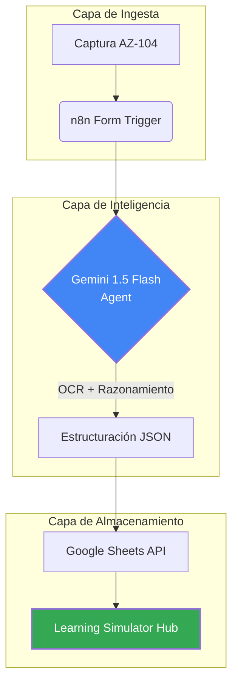

# SOP-CLOUD-AZ-03: Procesamiento de Exámenes mediante IA Multimodal

| Datos de Control | Valor |
| :--- | :--- |
| **ID** | SOP-CLOUD-AZ-03 |
| **Dominio** | Cloud Engineering / AI-Ops |
| **Clasificación** | Uso Interno / Técnico |
| **Propietario** | SysAdmin & DevOps OpsTeam |
| **Estado** | 🟢 Activo |
| **Última Rev.** | 2026-01-09 |

## 1. Objetivo y Alcance

Este procedimiento define el estándar para la ingesta, análisis y almacenamiento estructurado de conocimiento técnico proveniente de capturas de pantalla de la certificación **AZ-104**.

El objetivo es eliminar la "deuda de aprendizaje" manual mediante una pipeline de **AI-Ops** que automatiza la corrección técnica y la categorización de recursos de Azure, permitiendo que el equipo de operaciones mantenga un simulador dinámico actualizado en tiempo real.

## 2. Arquitectura de la Solución

El flujo se basa en un modelo de orquestación centralizada en **n8n (Self-hosted)** que actúa como puente entre la capa de entrada (captura de imagen) y la capa de razonamiento (LLM).

### Diagrama de Flujo Lógico



---

## 3. Prerrequisitos de Infraestructura

Para la correcta ejecución de este estándar, el sistema debe contar con:

1.  **Instancia n8n:** Motor de automatización desplegado bajo el estándar `deployments/automation/n8n-stack`.
2.  **Google AI Studio API Key:** Credenciales activas para el modelo `gemini-1.5-flash`.
3.  **Google Cloud Project:** Configuración OAuth2 para acceso de escritura en Google Sheets.
4.  **Repositorio IaC:** Acceso al archivo `workflow.json` en `infrastructure-as-code/automations/workflows/az104-ai-processor/`.

---

## 4. Procedimiento de Implementación

### 4.1. Importación del Flujo lógico

El operador debe importar la topología definida en el repositorio de IaC.

```bash
# Referencia del activo de código
URL: https://github.com/daniel-zamo/infrastructure-as-code/blob/main/automations/workflows/az104-ai-processor/workflow.json
```

### 4.2. Configuración del Agente de IA (Prompt Engineering)

El nodo de Gemini debe estar configurado con el rol de **Senior Azure Solutions Architect**. El prompt estándar integrado en este SOP exige:

*   Identificación de recursos implicados (VNet, RBAC, Storage).
*   Justificación técnica de la respuesta correcta.
*   Análisis de por qué los distractores no aplican al escenario.

### 4.3. Mantenimiento de Credenciales

Para asegurar la soberanía de datos y operatividad:
1.  **Soberanía:** n8n debe ejecutarse en infraestructura propia (`acme.net`).
2.  **Rotación:** Las claves de API deben renovarse cada 90 días o según política interna de seguridad.

---

## 5. Ciclo de Operación Diaria

1.  **Disparador:** Acceder a la URL pública del formulario de n8n.
2.  **Carga:** Subir la captura de pantalla del examen (formatos .png, .jpg).
3.  **Validación:** Tras la confirmación del flujo, verificar en la hoja `AZ-104 Simulator` que los campos `Question_Analysis` y `References` se hayan poblado correctamente.

---

## 6. Control de Calidad y Validación

| Criterio | Validación |
| :--- | :--- |
| **Respuesta Técnica** | Debe contener al menos un link a docs.microsoft.com. |
| **Tiempo de Respuesta** | La pipeline debe completar el ciclo en < 20 segundos. |
| **Estructura** | El campo `Explanation` debe estar formateado en Markdown dentro de la celda. |

---

## 7. Diagnóstico y Resolución

| Síntoma | Causa Probable | Resolución |
| :--- | :--- | :--- |
| **Error 429 (Rate Limit)** | Agotamiento de cuota en Gemini API. | Verificar el uso en Google AI Studio y escalar a modelo "Pro" si es necesario. |
| **Error de Autenticación** | Token de Google Sheets expirado. | Re-autorizar el nodo OAuth2 en la interfaz de credenciales de n8n. |
| **OCR Ilegible** | Imagen de baja resolución o ruido visual. | Re-capturar el escenario asegurando contraste alto y texto nítido. |

---

*Este SOP es parte integral de la biblioteca de estándares de Daniel Zamo.*

