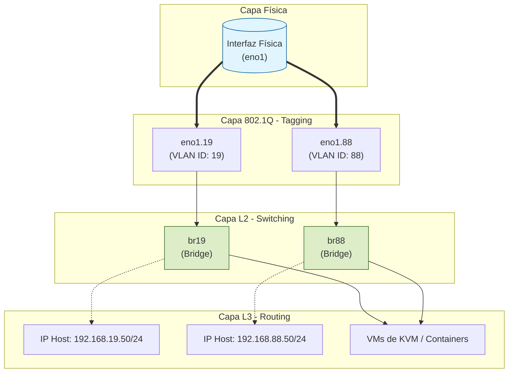

# SOP-LINUX-NM-01: Configuración de Bridges y VLANs (802.1Q)

| Datos de Control | Valor |
| :--- | :--- |
| **ID** | SOP-LINUX-NM-01 |
| **Dominio** | Linux / Networking |
| **Herramienta** | NetworkManager (`nmcli`) |
| **Clasificación** | Interno / Técnico |
| **Estado** | 🟢 Activo |
| **Última Rev.** | 2025-12-15 |

## 1. Objetivo y Alcance

Este procedimiento define el estándar para la configuración de interfaces de red avanzadas en servidores Linux que actúan como **Hypervisores KVM**.

El objetivo es permitir que una única interfaz física (`eno1`) transporte tráfico de múltiples segmentos de red aislados (VLANs), entregándolos a las Máquinas Virtuales a través de Bridges virtuales (Linux Bridges).

**Alcance:**

* Servidores físicos o bare-metal con distribuciones basadas en Debian/Ubuntu o RHEL/Fedora.
* Gestión de red realizada exclusivamente mediante **NetworkManager** (`nmcli`).

## 2. Arquitectura de Conexiones

La configuración invierte la lógica tradicional: la IP de gestión no reside en la interfaz física ni en la VLAN, sino en el **Bridge**. Esto permite que el host y las VMs compartan el mismo segmento L2.

### Diagrama Lógico



## 3. Prerrequisitos

* **Acceso:** Privilegios de `root` o `sudo`.
* **Hardware:** Cable Ethernet conectado a `eno1` y switch configurado en modo **Trunk** (o con las VLANs taggeadas hacia este puerto).
* **Kernel:** Soporte para 802.1q habilitado.

### 3.1. Carga del Módulo Kernel

Asegurar que el módulo de VLAN esté cargado y sea persistente tras reiniciar.

```bash
# Cargar temporalmente
sudo modprobe 8021q

# Hacer persistente
echo "8021q" | sudo tee /etc/modules-load.d/8021q.conf
```

## 4. Procedimiento de Configuración

Se utilizará `nmcli` para asegurar la persistencia en `/etc/NetworkManager/system-connections/`.

:::warning[Advertencia de Conectividad]
Si está configurando esto de forma remota (SSH), asegúrese de tener una interfaz de gestión fuera de banda (OOB/IPMI) o ejecute los comandos en un script en bloque, ya que la manipulación de la interfaz física podría cortar la conexión momentáneamente.
:::

### 4.1. Configuración VLAN 19 (Gestión/Servicios)

**Paso A: Crear la interfaz VLAN (Transporte)**
Esta interfaz *desempaqueta* el tráfico etiquetado. **No debe tener IP asignada**.

```bash
sudo nmcli connection add type vlan \
    con-name vlan19 \
    ifname eno1.19 \
    dev eno1 \
    id 19 \
    ipv4.method disabled \
    ipv6.method disabled \
    connection.autoconnect yes
```

**Paso B: Crear el Bridge (Lógica L2 + IP)**
Este dispositivo actuará como switch virtual y endpoint L3 para el host.

```bash
sudo nmcli connection add type bridge \
    con-name br19 \
    ifname br19 \
    ipv4.method manual \
    ipv4.addresses 192.168.19.50/24 \
    ipv4.route-metric 119 \
    connection.autoconnect yes
```

**Paso C: Enlazar VLAN al Bridge**
Se define a `br19` como el maestro de `vlan19`.

```bash
sudo nmcli connection modify vlan19 master br19
```

### 4.2. Configuración VLAN 88 (Laboratorio/Segundaria)

Repetición del patrón para la segunda red.

```bash
# 1. Interfaz VLAN
sudo nmcli connection add type vlan \
    con-name vlan88 \
    ifname eno1.88 \
    dev eno1 \
    id 88 \
    ipv4.method disabled \
    ipv6.method disabled \
    connection.autoconnect yes

# 2. Bridge con direccionamiento IP
sudo nmcli connection add type bridge \
    con-name br88 \
    ifname br88 \
    ipv4.method manual \
    ipv4.addresses 192.168.88.50/24 \
    ipv4.route-metric 188 \
    connection.autoconnect yes

# 3. Enlace
sudo nmcli connection modify vlan88 master br88
```

### 4.3. Activación de Perfiles

Es crítico levantar las interfaces en el orden correcto (L2 -> L3).

```bash
# Levantar VLANs (Capa física/enlace)
sudo nmcli connection up vlan19
sudo nmcli connection up vlan88

# Levantar Bridges (Capa lógica)
sudo nmcli connection up br19
sudo nmcli connection up br88
```

## 5. Validación y Control de Calidad

### 5.1. Verificar Estado de NetworkManager

Todos los dispositivos deben aparecer en verde (`connected`).

```bash
nmcli connection show --active
```

*Salida esperada:*

```text
NAME      UUID      TYPE      DEVICE
br19      ...       bridge    br19
br88      ...       bridge    br88
vlan19    ...       vlan      eno1.19
vlan88    ...       vlan      eno1.88
eno1      ...       ethernet  eno1
```

### 5.2. Verificar Enrutamiento e IPs

Confirmar que las IPs residen en los bridges y no en las interfaces físicas o vlan.

```bash
ip addr show br19
# Debe mostrar: inet 192.168.19.50/24 ...

ip addr show eno1.19
# NO debe tener línea "inet"
```

### 5.3. Verificar Asociación de Puertos (Bridge Link)

Confirmar que las interfaces VLAN son "esclavas" (master) de sus respectivos bridges.

```bash
bridge link show
```

*Salida esperada:*
> `eno1.19 state UP ... master br19`
> `eno1.88 state UP ... master br88`

## 6. Resolución de Problemas (Troubleshooting)

| Síntoma | Causa Probable | Solución |
| :--- | :--- | :--- |
| **Error `unknown device type vlan`** | Módulo de kernel no cargado. | Ejecutar `modprobe 8021q` y reintentar. |
| **VMs sin red** | La VM no está conectada al bridge `br19` o `br88`. | Verificar XML de KVM o configuración de red de la VM para apuntar al bridge correcto. |
| **Pérdida de conectividad al activar** | Conflicto de IPs o rutas. | Verificar que `eno1` (física) no tenga una IP asignada por DHCP que compita con los bridges. |
