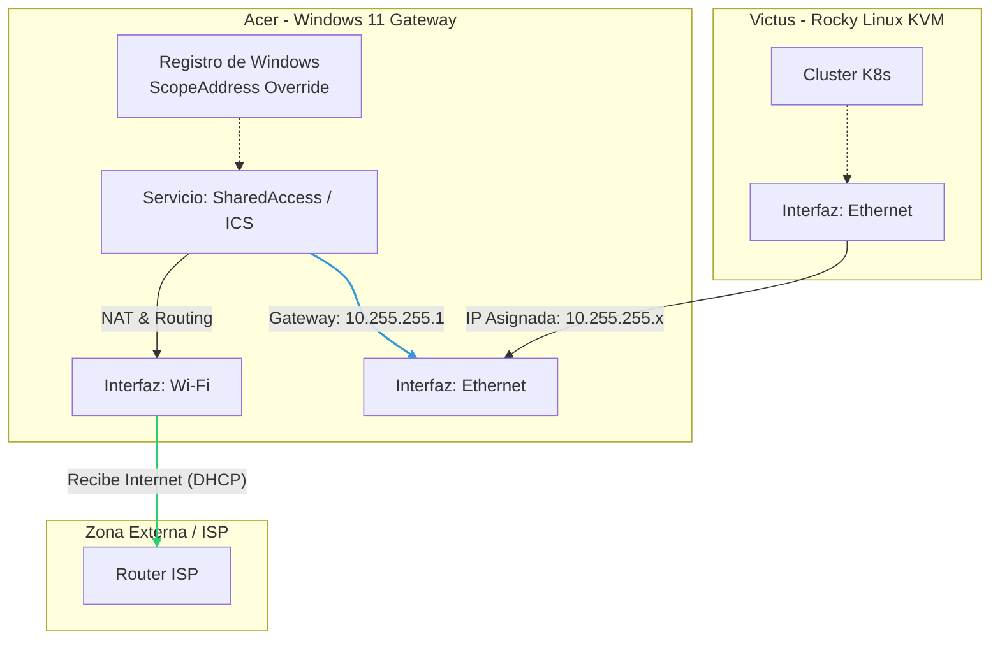

# SOP-WIN-ICS-00

Configuración Automatizada de ICS en Windows 11*

| Metadato | Detalle |
| :--- | :--- |
| **Autor** | Daniel Zamo |
| **Fecha de Creación** | 2023-10-XX |
| **Estado** | Activo |
| **Versión** | 1.0 |
| **Contexto** | Lab CKA - Host Acer (Gateway) |

## 1. Objetivo

Establecer al host local (Windows 11) como puerta de enlace (Gateway) para una red secundaria conectada vía Ethernet. El procedimiento habilita NAT (Network Address Translation) y DHCP server nativo de Windows, forzando un rango de red específico (`10.255.255.0/24`) diferente al predeterminado de Windows (`192.168.137.0/24`).

## 2. Alcance

Este procedimiento aplica al host `acer`, afectando:

- Interfaz de entrada (WAN/Internet): Adaptador Wireless (IP estática en `10.2.2.0/24`).
- Interfaz de salida (LAN/Privada): Adaptador Gigabit Ethernet.

### 2.1 Diagrama de Topología Lógica



## 3. Prerrequisitos

- **Powershell 7** ejecutado con privilegios de Administrador.
- Identificar los nombres exactos de los adaptadores de red (ej. "Wi-Fi" y "Ethernet").
- El servicio `SharedAccess` (ICS) no debe estar activo previamente o debe reiniciarse.

## 4. Procedimiento Técnico

La configuración de ICS mediante CLI en Windows requiere el uso de objetos COM (`HNetCfg.HNetShare`), ya que no existen cmdlets nativos directos para esta función específica. Además, para personalizar la IP, se requiere manipulación del Registro de Windows.

### 4.1 Script de Automatización (PowerShell)

Guarde el siguiente bloque como `Enable-CustomICS.ps1` o ejecute directamente en la terminal.

```powershell
# --- CONFIGURACIÓN DE VARIABLES ---
# Ajustar estos nombres según el resultado de 'Get-NetAdapter'
$PublicAdapterName = "Wi-Fi"       # La interfaz que TIENE internet
$PrivateAdapterName = "Ethernet"   # La interfaz que COMPARTE internet (hacia Victus)

# Configuración de Red Deseada para la LAN interna
$TargetIPAddress = "10.255.255.1"
$TargetSubnetMask = "255.255.255.0"

Write-Host "--- Iniciando Configuración de ICS ---" -ForegroundColor Cyan

# 1. Modificar el Registro para forzar el rango IP deseado
# Windows usa por defecto 192.168.137.1. Cambiamos esto en SharedAccess.
$RegPath = "HKLM:\System\CurrentControlSet\Services\SharedAccess\Parameters"

try {
    Write-Host "Configurando rango IP en el Registro..."
    # ScopeAddress: La IP del Gateway (este equipo)
    New-ItemProperty -Path $RegPath -Name "ScopeAddress" -Value $TargetIPAddress -PropertyType String -Force | Out-Null
    # StandaloneDhcpAddress: La IP base para el servidor DHCP
    New-ItemProperty -Path $RegPath -Name "StandaloneDhcpAddress" -Value $TargetIPAddress -PropertyType String -Force | Out-Null
    
    Write-Host "Registro actualizado correctamente ($TargetIPAddress)." -ForegroundColor Green
}
catch {
    Write-Error "Error modificando el registro. Asegúrese de correr como Administrador."
    Break
}

# 2. Instanciar el Gestor de ICS (HNetCfg)
try {
    $m = New-Object -ComObject HNetCfg.HNetShare
}
catch {
    Write-Error "No se pudo crear el objeto COM HNetCfg.HNetShare."
    Break
}

# 3. Identificar conexiones
$c = $m.EnumEveryConnection | ? { $m.NetConnectionProps($_).Status -eq '2' } # Status 2 = Conectado

$publicConfig = $null
$privateConfig = $null

foreach ($conn in $c) {
    $props = $m.NetConnectionProps($conn)
    if ($props.Name -eq $PublicAdapterName) {
        $publicConfig = $m.INetSharingConfigurationForINetConnection($conn)
    }
    if ($props.Name -eq $PrivateAdapterName) {
        $privateConfig = $m.INetSharingConfigurationForINetConnection($conn)
    }
}

if (-not $publicConfig -or -not $privateConfig) {
    Write-Error "No se encontraron los adaptadores especificados: $PublicAdapterName o $PrivateAdapterName."
    Break
}

# 4. Deshabilitar ICS si ya estaba activo (para aplicar cambios de IP limpiamente)
Write-Host "Reiniciando configuraciones previas..."
$publicConfig.DisableSharing()
$privateConfig.DisableSharing()

# 5. Habilitar ICS
# 0 = Public, 1 = Private
Write-Host "Habilitando ICS en $PublicAdapterName (Público)..."
$publicConfig.EnableSharing(0)

Write-Host "Habilitando ICS en $PrivateAdapterName (Privado)..."
$privateConfig.EnableSharing(1)

Write-Host "--- Configuración Completada ---" -ForegroundColor Cyan
Write-Host "Por favor, reinicie el equipo o el servicio SharedAccess si la IP no cambia inmediatamente."
```

### 4.2 Verificación

Una vez ejecutado el script, realizar las siguientes validaciones en Powershell:

1. **Verificar IP en interfaz Ethernet:**

    ```powershell
    Get-NetIPAddress -InterfaceAlias "Ethernet" -AddressFamily IPv4
    ```

    *Resultado esperado:* `IPAddress` debe ser `10.255.255.1`.

2. **Verificar Estado de ICS:**

    ```powershell
    Get-Service SharedAccess
    ```

    *Resultado esperado:* `Status: Running`.

## 5. Notas de Resolución de Problemas (Troubleshooting)

- **Persistencia:** En algunas actualizaciones de Windows, el valor del registro `ScopeAddress` puede restablecerse. Si la red 10.255.255.0/24 deja de responder, verificar el registro y re-ejecutar el script.
- **Servicio DHCP:** Windows actuará como servidor DHCP para el host conectado (`victus`). No configure un servidor DHCP adicional en la subred `10.255.255.0/24`.
