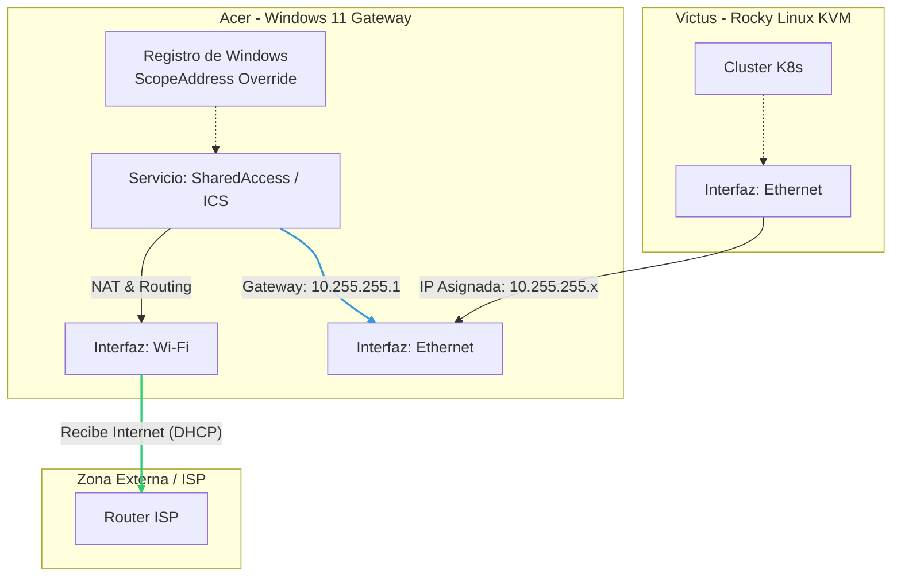

# SOP-WIN-ICS-00

Configuración Automatizada de ICS en Windows 11*

| Metadato | Detalle |
| :--- | :--- |
| **Autor** | Daniel Zamo |
| **Fecha de Creación** | 2023-10-XX |
| **Estado** | Activo |
| **Versión** | 1.0 |
| **Contexto** | Lab CKA - Host Acer (Gateway) |

## 1. Objetivo

Establecer al host local (Windows 11) como puerta de enlace (Gateway) para una red secundaria conectada vía Ethernet. El procedimiento habilita NAT (Network Address Translation) y DHCP server nativo de Windows, forzando un rango de red específico (`10.255.255.0/24`) diferente al predeterminado de Windows (`192.168.137.0/24`).

## 2. Alcance

Este procedimiento aplica al host `acer`, afectando:

- Interfaz de entrada (WAN/Internet): Adaptador Wireless (IP estática en `10.2.2.0/24`).
- Interfaz de salida (LAN/Privada): Adaptador Gigabit Ethernet.

### 2.1 Diagrama de Topología Lógica



## 3. Prerrequisitos

- **Powershell 7** ejecutado con privilegios de Administrador.
- Identificar los nombres exactos de los adaptadores de red (ej. "Wi-Fi" y "Ethernet").
- El servicio `SharedAccess` (ICS) no debe estar activo previamente o debe reiniciarse.

## 4. Procedimiento Técnico

La configuración de ICS mediante CLI en Windows requiere el uso de objetos COM (`HNetCfg.HNetShare`), ya que no existen cmdlets nativos directos para esta función específica. Además, para personalizar la IP, se requiere manipulación del Registro de Windows.

## 4.1 Ejecución del Script de Automatización

Este procedimiento utiliza un script de PowerShell desarrollado para configurar los objetos COM y el Registro de Windows automáticamente.

1. El script se encuentra disponible en este repositorio bajo en la ruta [./scripts/Enable-CustomICS.ps1](./scripts/Enable-CustomICS.ps1).
2. Descargue o ubique el archivo en su entorno local.
3. Ejecute el siguiente comando en PowerShell como Administrador:

```powershell
# Permitir ejecución de scripts (si está restringido)
Set-ExecutionPolicy -ExecutionPolicy RemoteSigned -Scope Process

# Ejecutar el script
.\scripts\Enable-CustomICS.ps1
```

### 4.2 Código Fuente de Referencia

A continuación se muestra el contenido del script para auditoría rápida sin necesidad de navegar a la carpeta de scripts.

<details>
  <summary><strong>Clic aquí para desplegar/ver el código fuente completo (Enable-CustomICS.ps1)</strong></summary>

<br>

```powershell
# ==========================================
# SOP-WIN-001: Script de Configuración ICS
# Autor: Daniel Zamo
# Versión: 1.2 (Fix: Permite adaptadores desconectados)
# ==========================================

# --- 1. BLOQUE INTERACTIVO Y VALIDACIÓN ---
Clear-Host
Write-Host "--- CONFIGURACIÓN DE INTERNET CONNECTION SHARING (ICS) ---" -ForegroundColor Cyan

# Mostrar adaptadores actuales para ayudar al usuario
Write-Host "`nAdaptadores disponibles en el sistema:" -ForegroundColor Yellow
Get-NetAdapter | Select-Object Name, Status, InterfaceDescription | Format-Table -AutoSize

# Solicitar nombres (Permite presionar Enter para usar valores por defecto si coinciden)
$InputPublic = Read-Host "Nombre de la interfaz con INTERNET (WAN) [Default: Wi-Fi]"
if ([string]::IsNullOrWhiteSpace($InputPublic)) { $PublicAdapterName = "Wi-Fi" } else { $PublicAdapterName = $InputPublic }

$InputPrivate = Read-Host "Nombre de la interfaz para la LAN (Hacia Victus) [Default: Ethernet]"
if ([string]::IsNullOrWhiteSpace($InputPrivate)) { $PrivateAdapterName = "Ethernet" } else { $PrivateAdapterName = $InputPrivate }

Write-Host "`n--- RESUMEN ---" -ForegroundColor Green
Write-Host "WAN (Internet): $PublicAdapterName"
Write-Host "LAN (Gateway):  $PrivateAdapterName"
Write-Host "IP Objetivo:    10.255.255.1 (Forzada por Registro)"
Write-Host "-----------------"

# Pausa de seguridad
Write-Host "Presione cualquier tecla para aplicar la configuración..."
$null = $Host.UI.RawUI.ReadKey("NoEcho,IncludeKeyDown")

# --- 2. CONFIGURACIÓN DEL REGISTRO (IP FIJA) ---
$TargetIPAddress = "10.255.255.1"
$RegPath = "HKLM:\System\CurrentControlSet\Services\SharedAccess\Parameters"

try {
    Write-Host "`n[1/4] Configurando IP $TargetIPAddress en el Registro..."
    New-ItemProperty -Path $RegPath -Name "ScopeAddress" -Value $TargetIPAddress -PropertyType String -Force | Out-Null
    New-ItemProperty -Path $RegPath -Name "StandaloneDhcpAddress" -Value $TargetIPAddress -PropertyType String -Force | Out-Null
    Write-Host "      -> Registro actualizado." -ForegroundColor Gray
}
catch {
    Write-Error "Error modificando el registro. ¿Está ejecutando como Administrador?"
    Exit
}

# --- 3. CONFIGURACIÓN ICS (COM OBJECTS) ---
try {
    Write-Host "[2/4] Instanciando gestor de red (HNetCfg)..."
    $m = New-Object -ComObject HNetCfg.HNetShare
}
catch {
    Write-Error "No se pudo crear el objeto COM HNetCfg.HNetShare."
    Exit
}

# --- FIX: OBTENER TODAS LAS CONEXIONES (INCLUIDAS LAS DESCONECTADAS) ---
# Ya no filtramos por Status -eq '2'. Obtenemos todo.
$connections = $m.EnumEveryConnection

$publicConfig = $null
$privateConfig = $null

foreach ($conn in $connections) {
    $props = $m.NetConnectionProps($conn)
    
    # Comparamos nombres (Case insensitive)
    if ($props.Name -eq $PublicAdapterName) {
        $publicConfig = $m.INetSharingConfigurationForINetConnection($conn)
        Write-Host "      -> Encontrado Adaptador Público: $($props.Name)" -ForegroundColor Gray
    }
    if ($props.Name -eq $PrivateAdapterName) {
        $privateConfig = $m.INetSharingConfigurationForINetConnection($conn)
        Write-Host "      -> Encontrado Adaptador Privado: $($props.Name)" -ForegroundColor Gray
    }
}

if (-not $publicConfig -or -not $privateConfig) {
    Write-Error "ERROR FATAL: No se encontraron uno o ambos adaptadores con los nombres: '$PublicAdapterName' y '$PrivateAdapterName'."
    Write-Host "Revise la lista de arriba y asegúrese de escribirlos exactamente igual." -ForegroundColor Red
    Exit
}

# --- 4. APLICAR CAMBIOS ---
Write-Host "[3/4] Reiniciando estado de compartición..."
# Deshabilitamos primero para evitar errores si ya estaba activo
try { $publicConfig.DisableSharing() } catch {}
try { $privateConfig.DisableSharing() } catch {}

Write-Host "[4/4] Habilitando ICS..."

# 0 = Public (WAN), 1 = Private (LAN)
try {
    $publicConfig.EnableSharing(0)
    Write-Host "      -> Internet habilitado en $PublicAdapterName" -ForegroundColor Green
    
    $privateConfig.EnableSharing(1)
    Write-Host "      -> Gateway habilitado en $PrivateAdapterName" -ForegroundColor Green
}
catch {
    Write-Error "Hubo un error al activar ICS. A veces Windows requiere un reinicio si el servicio SharedAccess está bloqueado."
    Write-Error $_.Exception.Message
}

Write-Host "`n--- CONFIGURACIÓN COMPLETADA ---" -ForegroundColor Cyan
Write-Host "NOTA: Conecte el cable a 'Victus' ahora. Windows asignará la IP automáticamente."
```

</details>

### 4.2 Verificación

Una vez ejecutado el script, realizar las siguientes validaciones en Powershell:

1. **Verificar IP en interfaz Ethernet:**

    ```powershell
    Get-NetIPAddress -InterfaceAlias "Ethernet" -AddressFamily IPv4
    ```

    *Resultado esperado:* `IPAddress` debe ser `10.255.255.1`.

2. **Verificar Estado de ICS:**

    ```powershell
    Get-Service SharedAccess
    ```

    *Resultado esperado:* `Status: Running`.

## 5. Notas de Resolución de Problemas (Troubleshooting)

- **Persistencia:** En algunas actualizaciones de Windows, el valor del registro `ScopeAddress` puede restablecerse. Si la red 10.255.255.0/24 deja de responder, verificar el registro y re-ejecutar el script.
- **Servicio DHCP:** Windows actuará como servidor DHCP para el host conectado (`victus`). No configure un servidor DHCP adicional en la subred `10.255.255.0/24`.
