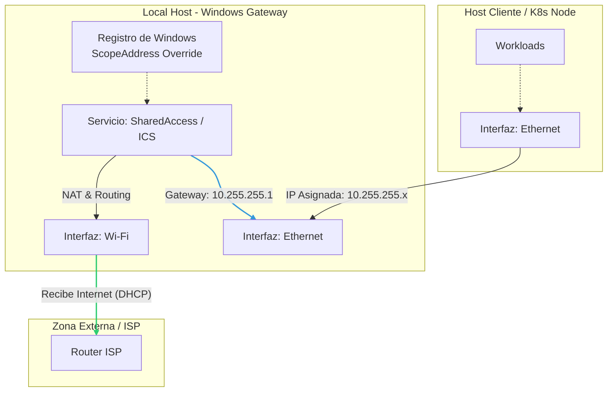

# SOP-WIN-PS-01: Configuración de Internet Connection Sharing (ICS)

| Metadato | Valor |
| :--- | :--- |
| **ID** | SOP-WIN-PS-01 |
| **Dominio** | Windows Infrastructure / Networking |
| **Autor** | SysAdmin & DevOps OpsTeam |
| **Estado** | 🟢 Activo |
| **Última Rev.** | 2025-12-09 |

## 1. Objetivo y Alcance

Este procedimiento define el estándar para configurar una estación de trabajo Windows 11 como puerta de enlace (Gateway) para una red secundaria.

Habilita NAT (Network Address Translation) y el servidor DHCP nativo de Windows, forzando mediante manipulación del Registro un rango de red específico (`10.255.255.0/24`) para evitar conflictos con el rango por defecto (`192.168.137.0/24`).

**Alcance de la Topología:**
El procedimiento aplica al host local (Gateway), gestionando el tráfico entre:

* **WAN/Internet:** Adaptador Wireless (Salida).
* **LAN/Privada:** Adaptador Ethernet (Entrada desde dispositivos o clusters locales).

### Diagrama de Topología Lógica



## 2. Prerrequisitos

* **Sistema Operativo:** Windows 10/11 Pro o Enterprise.
* **Privilegios:** PowerShell 7 (Core) ejecutado como **Administrador**.
* **Identificación de Hardware:** Conocer los nombres exactos de los adaptadores de red (ej. "Wi-Fi" y "Ethernet").
* **Estado del Servicio:** El servicio `SharedAccess` (ICS) no debe estar activo previamente o debe reiniciarse durante el proceso.

## 3. Procedimiento Técnico

La configuración de ICS mediante CLI en Windows requiere el uso de objetos COM (`HNetCfg.HNetShare`) y la manipulación del Registro de Windows para definir segmentos IP personalizados.

### 3.1. Ejecución del Script de Automatización

Este procedimiento utiliza un script de PowerShell desarrollado para configurar los objetos COM y el Registro de Windows automáticamente.

1. Localice el script en la ruta del repositorio: `windows/scripts/Enable-CustomICS.ps1`.
2. Ejecute el siguiente comando en una terminal elevada:

```powershell
# Permitir ejecución de scripts para el proceso actual
Set-ExecutionPolicy -ExecutionPolicy RemoteSigned -Scope Process

# Ejecutar el script (Asegúrese de estar en la raíz del repo o ajuste la ruta)
.\windows\scripts\Enable-CustomICS.ps1
```

### 3.2. Referencia del Código Fuente

A efectos de auditoría y *Troubleshooting*, se detalla la lógica implementada en el script.

<details>
  <summary><strong>Clic aquí para desplegar el código fuente (Enable-CustomICS.ps1)</strong></summary>

<br>

```powershell
# ==========================================
# SOP-WIN-PS-01: Script de Configuración ICS
# Autor: OpsTeam
# Versión: 1.2
# ==========================================

# --- 1. BLOQUE INTERACTIVO Y VALIDACIÓN ---
Clear-Host
Write-Host "--- CONFIGURACIÓN DE INTERNET CONNECTION SHARING (ICS) ---" -ForegroundColor Cyan

Write-Host "`nAdaptadores disponibles en el sistema:" -ForegroundColor Yellow
Get-NetAdapter | Select-Object Name, Status, InterfaceDescription | Format-Table -AutoSize

$InputPublic = Read-Host "Nombre de la interfaz con INTERNET (WAN) [Default: Wi-Fi]"
if ([string]::IsNullOrWhiteSpace($InputPublic)) { $PublicAdapterName = "Wi-Fi" } else { $PublicAdapterName = $InputPublic }

$InputPrivate = Read-Host "Nombre de la interfaz para la LAN [Default: Ethernet]"
if ([string]::IsNullOrWhiteSpace($InputPrivate)) { $PrivateAdapterName = "Ethernet" } else { $PrivateAdapterName = $InputPrivate }

# --- 2. CONFIGURACIÓN DEL REGISTRO (IP FIJA) ---
$TargetIPAddress = "10.255.255.1"
$RegPath = "HKLM:\System\CurrentControlSet\Services\SharedAccess\Parameters"

try {
    Write-Host "`n[1/4] Configurando IP $TargetIPAddress en el Registro..."
    New-ItemProperty -Path $RegPath -Name "ScopeAddress" -Value $TargetIPAddress -PropertyType String -Force | Out-Null
    New-ItemProperty -Path $RegPath -Name "StandaloneDhcpAddress" -Value $TargetIPAddress -PropertyType String -Force | Out-Null
}
catch {
    Write-Error "Error modificando el registro. ¿Está ejecutando como Administrador?"
    Exit
}

# --- 3. CONFIGURACIÓN ICS (COM OBJECTS) ---
try {
    Write-Host "[2/4] Instanciando gestor de red (HNetCfg)..."
    $m = New-Object -ComObject HNetCfg.HNetShare
}
catch {
    Write-Error "No se pudo crear el objeto COM HNetCfg.HNetShare."
    Exit
}

$connections = $m.EnumEveryConnection
$publicConfig = $null
$privateConfig = $null

foreach ($conn in $connections) {
    $props = $m.NetConnectionProps($conn)
    if ($props.Name -eq $PublicAdapterName) {
        $publicConfig = $m.INetSharingConfigurationForINetConnection($conn)
    }
    if ($props.Name -eq $PrivateAdapterName) {
        $privateConfig = $m.INetSharingConfigurationForINetConnection($conn)
    }
}

if (-not $publicConfig -or -not $privateConfig) {
    Write-Error "ERROR FATAL: No se encontraron los adaptadores '$PublicAdapterName' o '$PrivateAdapterName'."
    Exit
}

# --- 4. APLICAR CAMBIOS ---
Write-Host "[3/4] Reiniciando estado de compartición..."
try { $publicConfig.DisableSharing() } catch {}
try { $privateConfig.DisableSharing() } catch {}

Write-Host "[4/4] Habilitando ICS..."
# 0 = Public (WAN), 1 = Private (LAN)
try {
    $publicConfig.EnableSharing(0)
    $privateConfig.EnableSharing(1)
    Write-Host "      -> Gateway habilitado exitosamente." -ForegroundColor Green
}
catch {
    Write-Error "Hubo un error al activar ICS. Verifique el servicio SharedAccess."
    Write-Error $_.Exception.Message
}
```

</details>

---

## 4. Control de Calidad (Validación)

Una vez ejecutado el procedimiento, realizar las siguientes verificaciones en PowerShell:

**A. Verificar IP en interfaz LAN**
La interfaz Ethernet debe haber tomado la IP del registro forzado.

```powershell
Get-NetIPAddress -InterfaceAlias "Ethernet" -AddressFamily IPv4 | Select-Object IPAddress
# Resultado esperado: 10.255.255.1
```

**B. Verificar Estado del Servicio**
El servicio debe estar en ejecución para mantener el NAT.

```powershell
Get-Service SharedAccess
# Resultado esperado: Status: Running
```

---

## 5. Diagnóstico y Resolución

| Síntoma | Causa Probable | Resolución |
| :--- | :--- | :--- |
| **La IP LAN es `192.168.137.1`** | El registro de Windows se restableció o no se aplicó antes de iniciar ICS. | Detener ICS, re-ejecutar las claves de registro (`ScopeAddress`) y volver a habilitar ICS. |
| **Error en script: `Access Denied`** | Falta de elevación de privilegios. | Ejecutar PowerShell como Administrador. |
| **Cliente sin internet** | El servicio DNS de Windows (ICS) falló. | Reiniciar el servicio `SharedAccess` en el host o configurar DNS estático (8.8.8.8) en el cliente. |
